# 譜面定数 10+

## 10.7

| ジャケット | 難易 | 曲 | パック・初出 |
| :---: | :--- | :--- | :--- |
|  | FTR | [ouroboros-twin stroke of the end-](<../pack/12_Groove Coaster Collaboration Pack/ouroboros -twin stroke of the end-.md>) | Groove Coaster Collaboration Pack 1.9.0(19/01/09) |
| 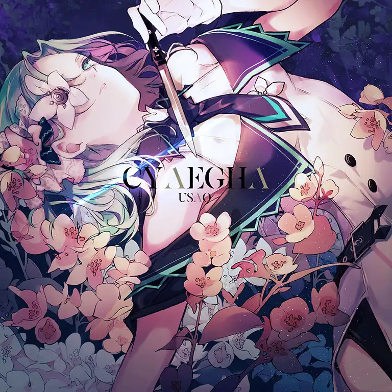 | FTR | [Cyaegha](<../pack/13_Absolute Reason Pack/Cyaegha.md>) | Absolute Reason Pack 2.0.0(19/03/21) |
|  | FTR | [World Vanquisher](<../pack/14_CHUNITHM Collaboration Pack/World Vanquisher.md>) | CHUNITHM Collaboration Pack 2.1.0(19/05/23) |
|  | FTR | [Tempestissimo](<../pack/18_Black Fate Pack/Tempestissimo.md>) | Black Fate Pack 3.0.0(20/05/27) |
|  | FTR | [AMAZING MIGHTYYYY!!!!](<../pack/21_maimai Collaboration Pack/AMAZING MIGHTYYYY!!!!.md>) | maimai Collaboration Pack 3.4.1(21/01/08) |
| 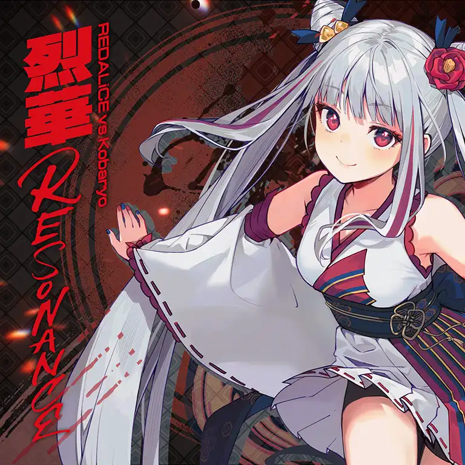 | FTR | [烈華RESONANCE](<../pack/04_Memory Archive/烈華RESONANCE.md>) | Memory Archive 3.6.4(21/06/30) |
|  | FTR | [NULL APOPHENIA](<../pack/04_Memory Archive/NULL APOPHENIA.md>) | Memory Archive 4.2.0(23/01/26) |
|  | ETR | [Inverted World](<../pack/32_Rotaeno Collaboration Pack/Inverted World.md>) | Rotaeno Collaboration Pack 5.10.0(24/08/29) |
|  | ETR | [Don't Fight The Music](<../pack/20_O.N.G.E.K.I. Collaboration Pack/Don't Fight The Music.md>) | O.N.G.E.K.I. Collaboration Pack 6.0.0(24/11/21) |
| 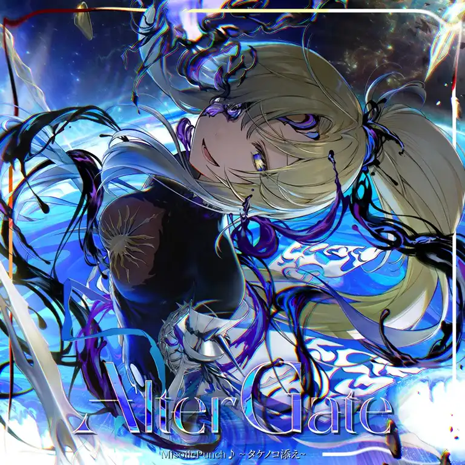 | FTR | [AlterGate](<../pack/36_Extant Anima Pack/AlterGate.md>) | Extant Anima Pack 6.8.0(25/08/21) |
| 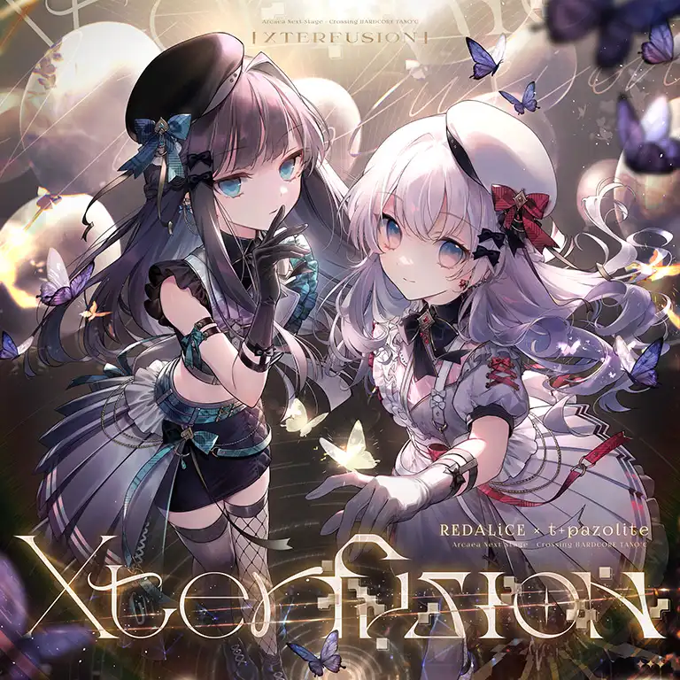 | ETR | [Xterfusion](<../pack/04_Memory Archive/Xterfusion.md>) | Memory Archive 6.10.0(25/10/30) |
| 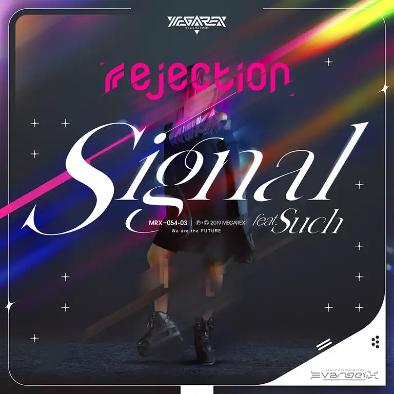 | ETR | [Signal](<../pack/40_MEGAREX Collaboration Pack/Signal.md>) | MEGAREX Collaboration Pack 6.12.0(26/01/29) |

## 10.8

| ジャケット | 難易 | 曲 | パック・初出 |
| :---: | :--- | :--- | :--- |
| 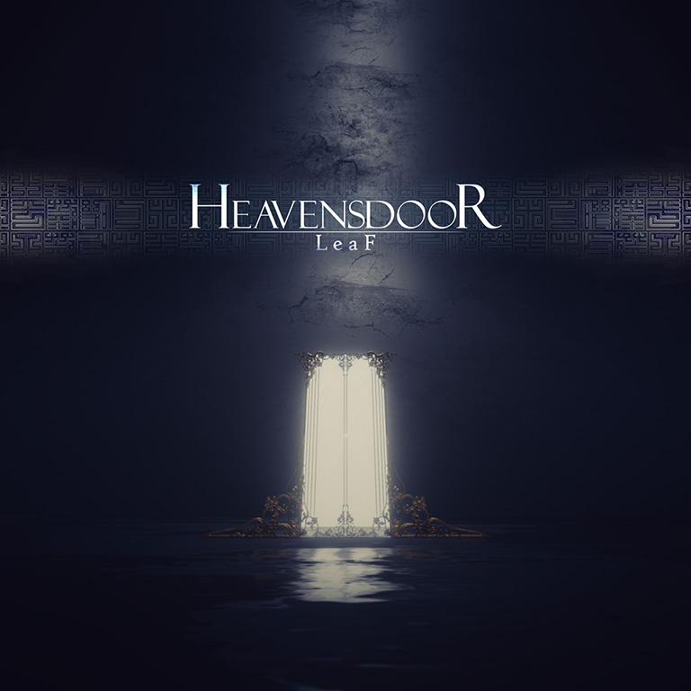 | BYD | [Heavensdoor](<../pack/15_Adverse Prelude Pack/Heavensdoor.md>) | Adverse Prelude Pack 2.2.0(19/07/18) |
|  | FTR | [Ringed Genesis](<../pack/15_Adverse Prelude Pack/Ringed Genesis.md>) | Adverse Prelude Pack 2.2.0(19/07/18) |
| 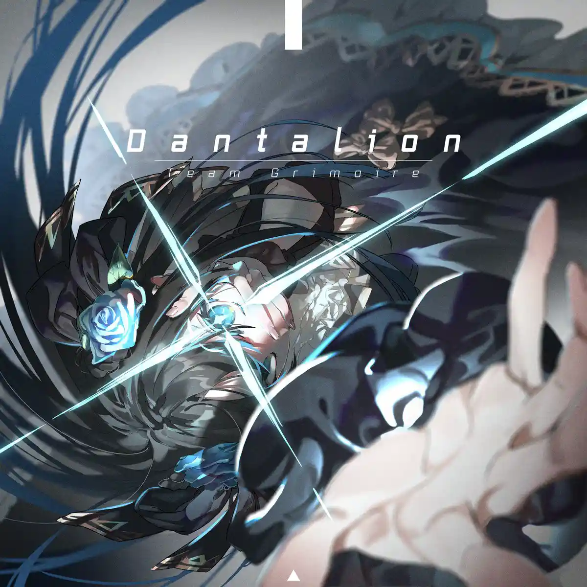 | FTR | [Dantalion](<../pack/18_Black Fate Pack/Dantalion.md>) | Black Fate Pack 3.0.0(20/05/27) |
|  | FTR | [BUCHiGiRE Berserker](<../pack/04_Memory Archive/BUCHiGiRE Berserker.md>) | Memory Archive 3.2.0(20/09/16) |
| 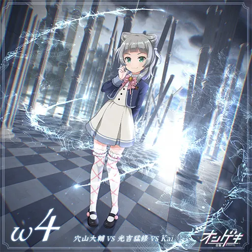 | FTR | [ω4](<../pack/20_O.N.G.E.K.I. Collaboration Pack/ω4.md>) | O.N.G.E.K.I. Collaboration Pack 3.4.0(20/12/17) |
|  | FTR | [光速神授説- Divine Light of Myriad -](<../pack/22_Esoteric Order Pack/光速神授説 - Divine Light of Myriad -.md>) | Esoteric Order Pack 3.7.0(21/07/21) |
| 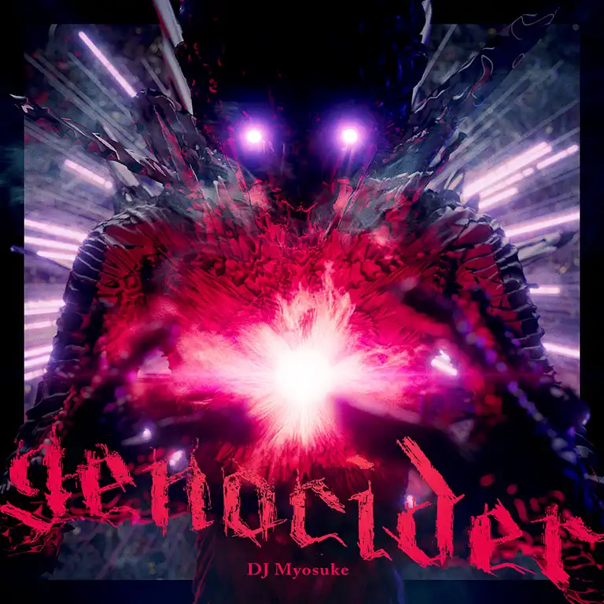 | FTR | [GENOCIDER](<../pack/23_WACCA Collaboration Pack/GENOCIDER.md>) | WACCA Collaboration Pack 3.8.0(21/08/10) |
| 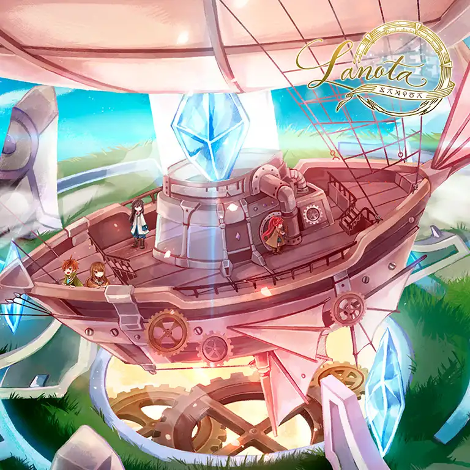 | FTR | [Stasis](<../pack/08_Lanota Collaboration Pack/Stasis.md>) | Lanota Collaboration Pack 3.12.8(22/04/28) |
|  | FTR | [PRIMITIVE LIGHTS](<../pack/04_Memory Archive/PRIMITIVE LIGHTS.md>) | Memory Archive 4.3.2(23/03/09) |
| 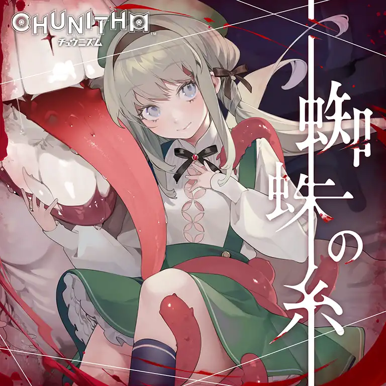 | FTR | [蜘蛛の糸](<../pack/14_CHUNITHM Collaboration Pack/蜘蛛の糸.md>) | CHUNITHM Collaboration Pack 4.4.0(23/03/23) |
| 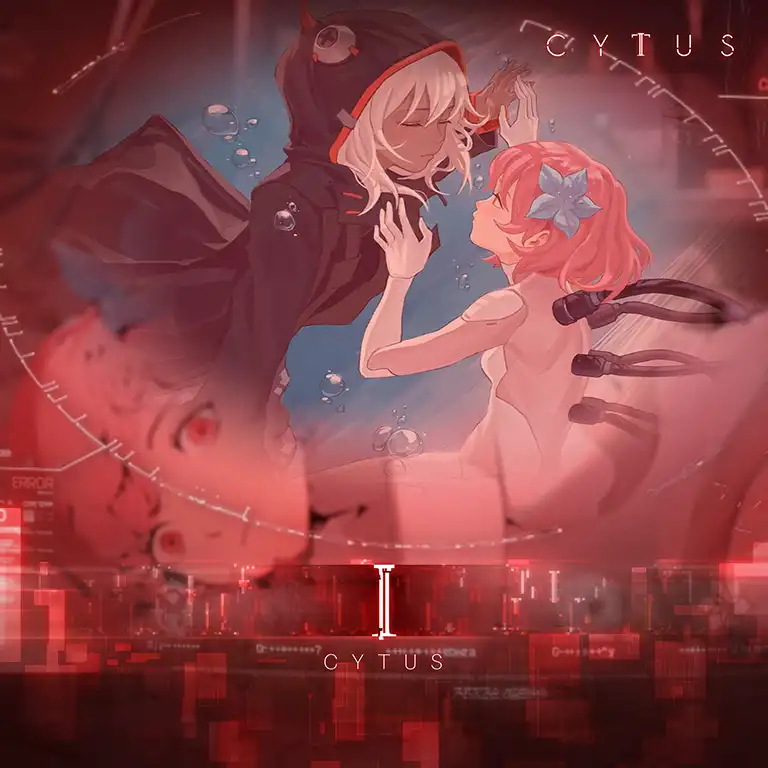 | FTR | [͟͝͞Ⅱ́̕](<../pack/28_Cytus II Collaboration Pack/Ⅱ.md>) | Cytus II Collaboration Pack 4.6.0(23/07/19) |
| 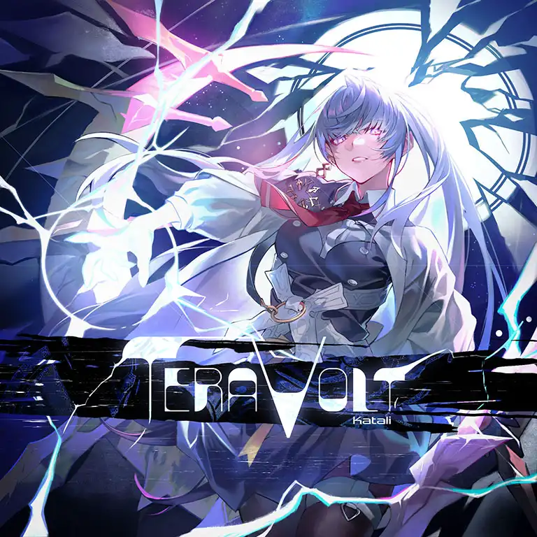 | FTR | [TeraVolt](<../pack/29_Lasting Eden Pack/TeraVolt.md>) | Lasting Eden Pack 5.1.0(23/10/26) |
|  | ETR | [Distorted Fate](<../pack/04_Memory Archive/Distorted Fate.md>) | Memory Archive 5.6.0(24/04/26) |
| 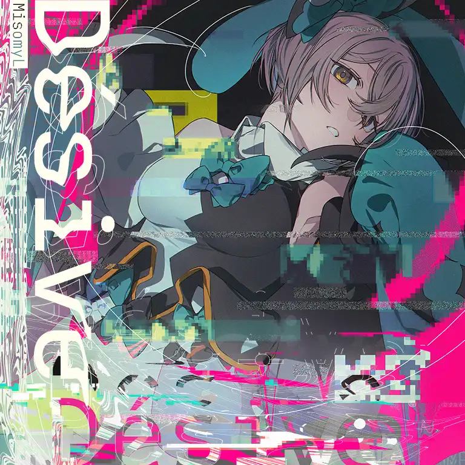 | ETR | [Désive](<../pack/04_Memory Archive/Désive.md>) | Memory Archive 5.6.0(24/04/26) |
|  | FTR | [Black MInD](<../pack/12_Groove Coaster Collaboration Pack/Black MInD.md>) | Groove Coaster Collaboration Pack 5.8.0(24/06/27) |
| 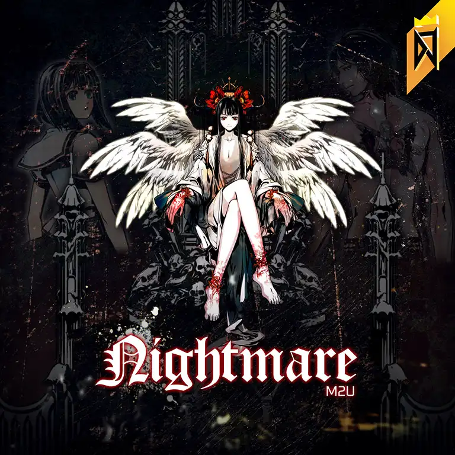 | ETR | [Nightmare](<../pack/35_DJMAX Collaboration Pack/Nightmare.md>) | DJMAX Collaboration Pack 6.5.0(25/05/22) |
| 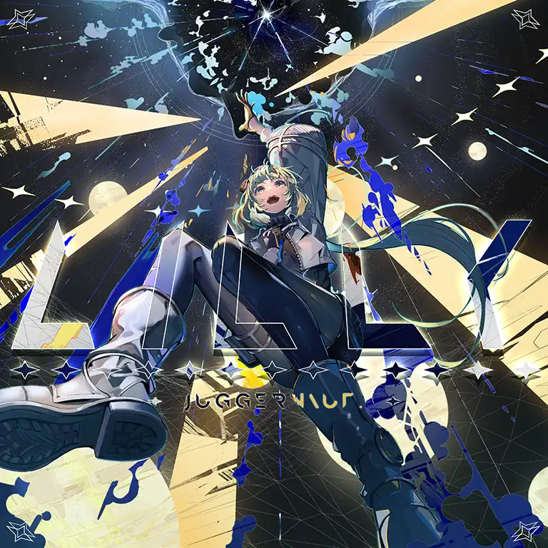 | ETR | [Lilly](<../pack/36_Extant Anima Pack/Lilly.md>) | Extant Anima Pack 6.7.0(25/07/24) |
| 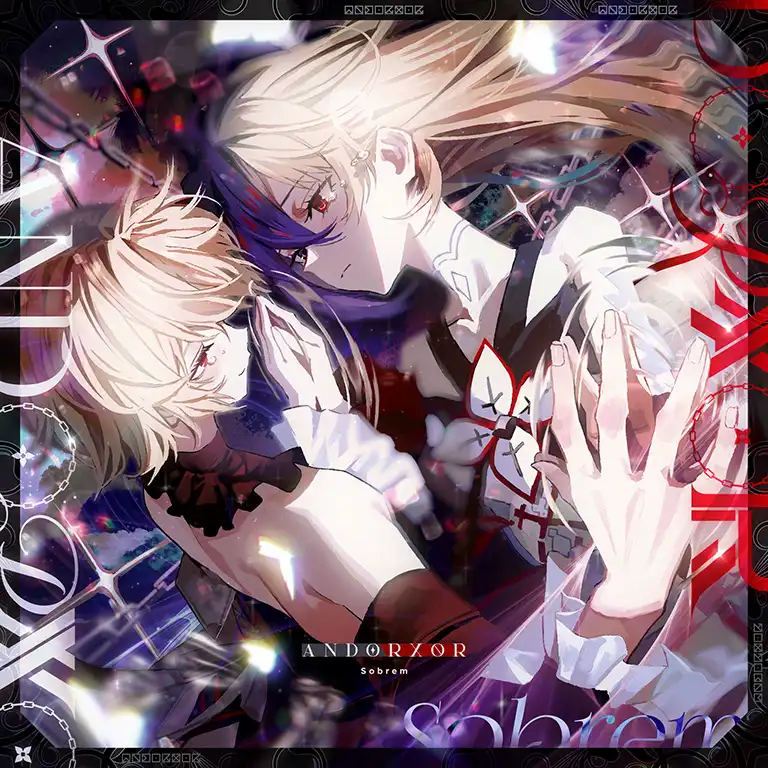 | ETR | [ANDORXOR](<../pack/37_Liminal Eclipse Pack/ANDORXOR.md>) | Liminal Eclipse Pack 6.9.0(25/10/02) |
|  | ETR | [MARENYX](<../pack/39_Arcaea Next Stage Pack/MARENYX.md>) | Arcaea Next Stage Pack 6.10.8(25/11/22) |

## 10.9

| ジャケット | 難易 | 曲 | パック・初出 |
| :---: | :--- | :--- | :--- |
| 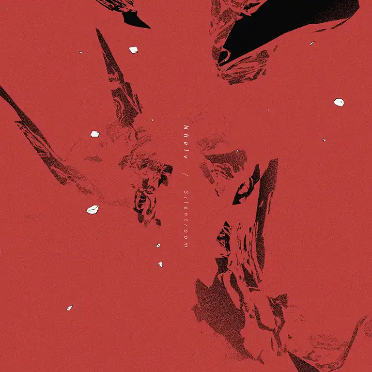 | BYD | [Nhelv](<../pack/01_Arcaea Pack/Nhelv.md>) | Arcaea Pack 1.7.2(18/08/13) |
|  | BYD | [Heavenly caress](<../pack/04_Memory Archive/Heavenly caress.md>) | Memory Archive 2.4.3(19/10/26) |
|  | BYD | [Einherjar Joker](<../pack/04_Memory Archive/Einherjar Joker.md>) | Memory Archive 2.5.0(20/01/21) |
|  | FTR | [業 -善なる神とこの世の悪について-](<../pack/14_CHUNITHM Collaboration Pack/業 -善なる神とこの世の悪について-.md>) | CHUNITHM Collaboration Pack 3.5.0(21/01/21) |
|  | BYD | [Infinite Strife,](<../pack/26_Final Verdict Pack/Infinite Strife,.md>) | Final Verdict Pack 4.0.0(22/07/07) |
|  | FTR | [Testify](<../pack/26_Final Verdict Pack/Testify.md>) | Final Verdict Pack 4.0.0(22/07/07) |
| 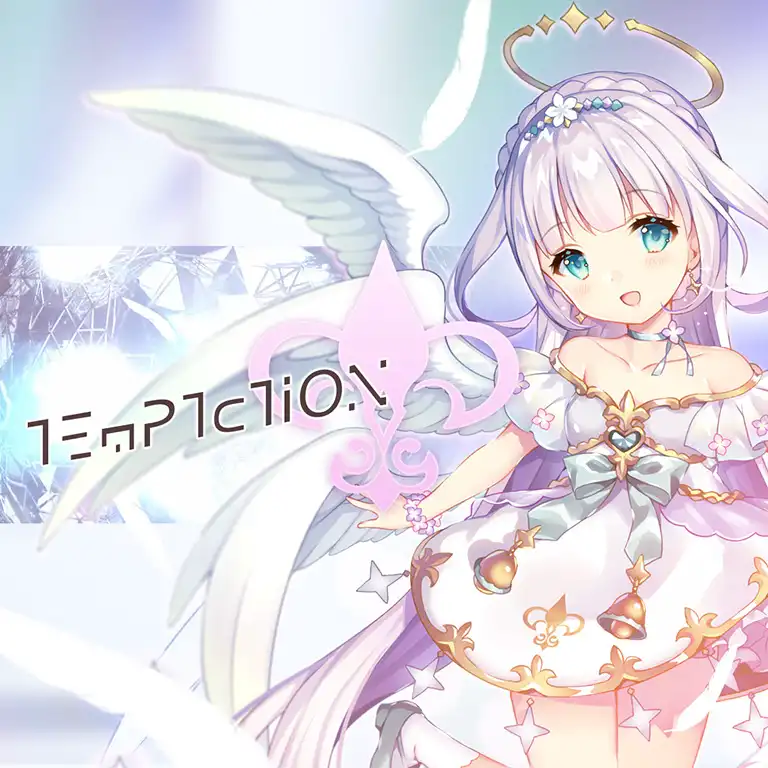 | FTR | [TEmPTaTiON](<../pack/21_maimai Collaboration Pack/TEmPTaTiON.md>) | maimai Collaboration Pack 4.3.0(23/03/02) |
| 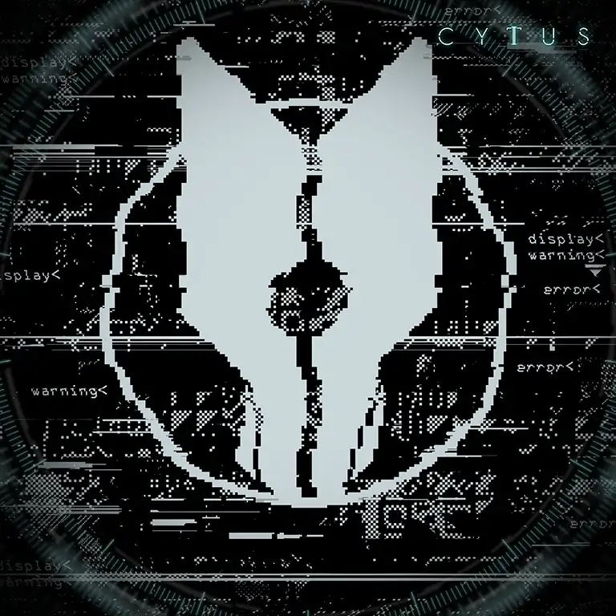 | FTR | [CHAOS](<../pack/28_Cytus II Collaboration Pack/CHAOS.md>) | Cytus II Collaboration Pack 4.5.0(23/06/28) |
| 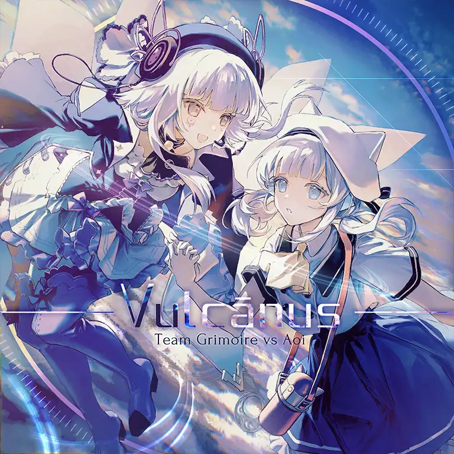 | FTR | [Vulcānus](<../pack/32_Rotaeno Collaboration Pack/Vulcānus.md>) | Rotaeno Collaboration Pack 5.10.0(24/08/29) |
|  | BYD | [Breach of Faith](<../pack/33_Lucent Historia Pack/Breach of Faith.md>) | Lucent Historia Pack 6.0.0(24/11/21) |
|  | FTR | [And Revive The Melody](<../pack/20_O.N.G.E.K.I. Collaboration Pack/And Revive The Melody.md>) | O.N.G.E.K.I. Collaboration Pack 6.0.0(24/11/21) |
|  | FTR | [Designant.](<../pack/33_Lucent Historia Pack/Designant.md>) | Lucent Historia Pack 6.0.0(24/11/21) |
|  | FTR | [DA'AT -The First Seeker of Souls-](<../pack/14_CHUNITHM Collaboration Pack/DA'AT -The First Seeker of Souls-.md>) | CHUNITHM Collaboration Pack 6.1.0(24/12/19) |
| 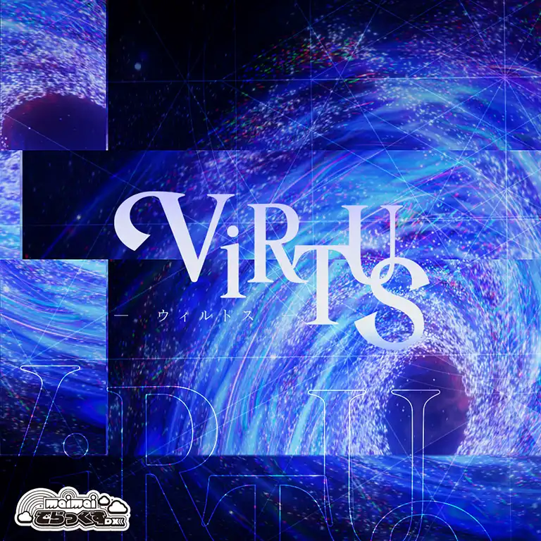 | ETR | [ViRTUS](<../pack/21_maimai Collaboration Pack/ViRTUS.md>) | maimai Collaboration Pack 6.2.0(25/01/23) |
|  | ETR | [MEGALOVANIA(Camellia Remix)](<../pack/04_Memory Archive/MEGALOVANIA (Camellia Remix).md>) | Memory Archive 6.3.0(25/03/09) |
|  | ETR | [We're All Gonna Die](<../pack/35_DJMAX Collaboration Pack/We're All Gonna Die.md>) | DJMAX Collaboration Pack 6.6.0(25/06/26) |
|  | ETR | [Welcome, Queen of Fiction.](<../pack/36_Extant Anima Pack/Welcome, Queen of Fiction.md>) | Extant Anima Pack 6.8.0(25/08/21) |
|  | ETR | [Code: Oblivion](<../pack/39_Arcaea Next Stage Pack/Code： Oblivion.md>) | Arcaea Next Stage Pack 6.10.8(25/11/22) |

