# 譜面定数 10

## 10.0

| ジャケット | 難易 | 曲 | パック・初出 |
| :---: | :--- | :--- | :--- |
|  | BYD | [Bookmaker (2D Version)](<../pack/01_Arcaea Pack/Bookmaker (2D Version).md>) | Arcaea Pack 1.7.0(18/07/16) |
| 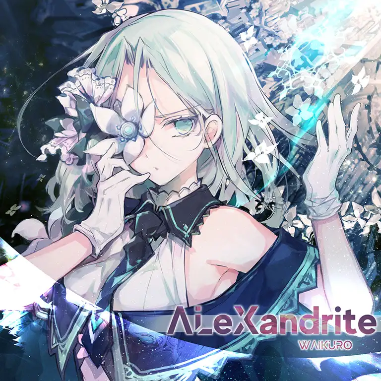 | FTR | [Alexandrite](<../pack/04_Memory Archive/Alexandrite.md>) | Memory Archive 1.7.5(18/09/17) |
|  | FTR | [Scarlet Lance](<../pack/12_Groove Coaster Collaboration Pack/Scarlet Lance.md>) | Groove Coaster Collaboration Pack 1.9.0(19/01/09) |
|  | FTR | [Vicious Heroism](<../pack/13_Absolute Reason Pack/Vicious Heroism.md>) | Absolute Reason Pack 2.0.0(19/03/21) |
|  | BYD | [La'qryma of the Wasteland](<../pack/04_Memory Archive/La'qryma of the Wasteland.md>) | Memory Archive 2.5.0(20/01/21) |
| 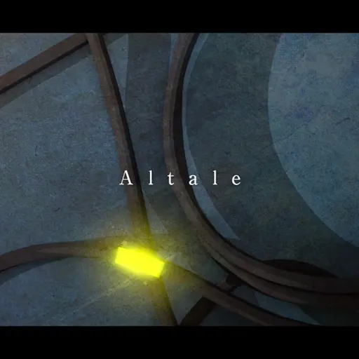 | BYD | [Altale](<../pack/04_Memory Archive/Altale.md>) | Memory Archive 3.0.0(20/05/27) |
| 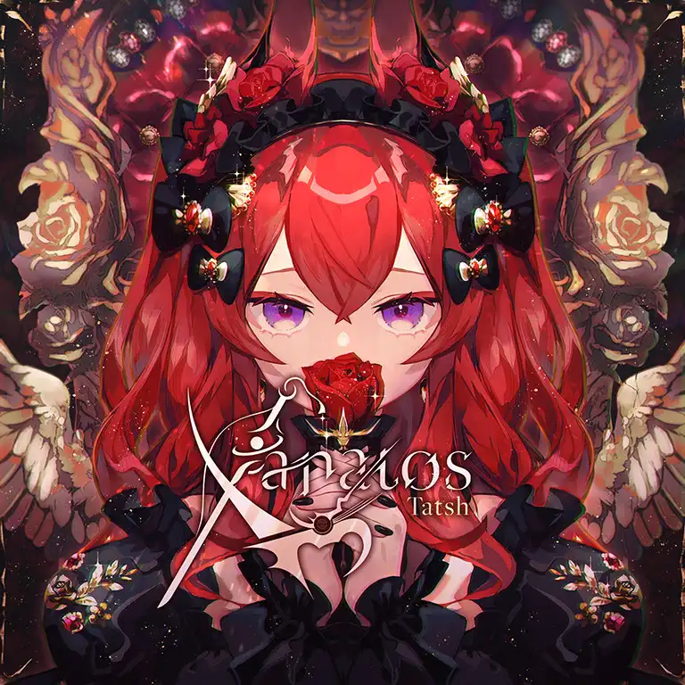 | FTR | [Xanatos](<../pack/04_Memory Archive/Xanatos.md>) | Memory Archive 3.2.3(20/11/19) |
|  | FTR | [Oshama Scramble!](<../pack/21_maimai Collaboration Pack/Oshama Scramble!.md>) | maimai Collaboration Pack 3.4.1(21/01/08) |
| 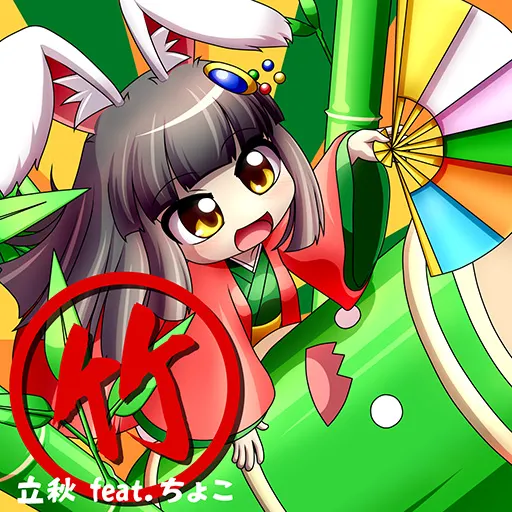 | FTR | [竹](<../pack/17_Extend Archive 1－ Visions Pack/竹.md>) | Extend Archive 1－ Visions Pack 3.5.1(21/02/11) |
| 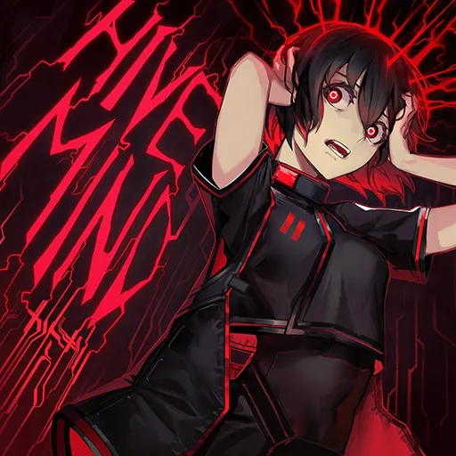 | FTR | [HIVEMIND](<../pack/17_Extend Archive 1－ Visions Pack/HIVEMIND.md>) | Extend Archive 1－ Visions Pack 3.7.0(21/07/21) |
| 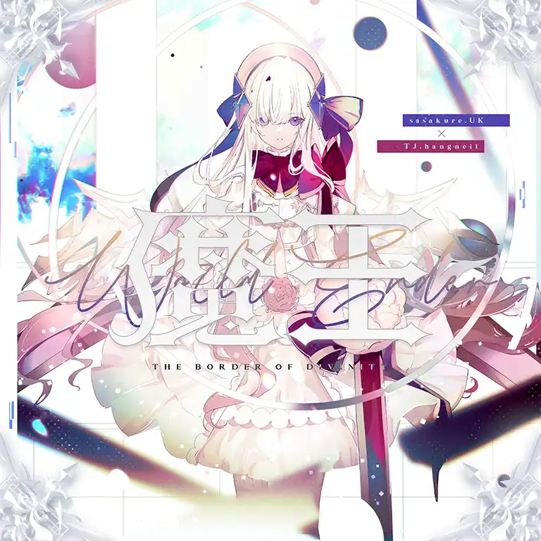 | FTR | [魔王](<../pack/26_Final Verdict Pack/魔王.md>) | Final Verdict Pack 4.0.0(22/07/07) |
|  | FTR | [Free Myself](<../pack/04_Memory Archive/Free Myself.md>) | Memory Archive 4.1.4(22/11/10) |
|  | FTR | [Masquerade Legion](<../pack/04_Memory Archive/Masquerade Legion.md>) | Memory Archive 5.4.0(24/03/08) |
| 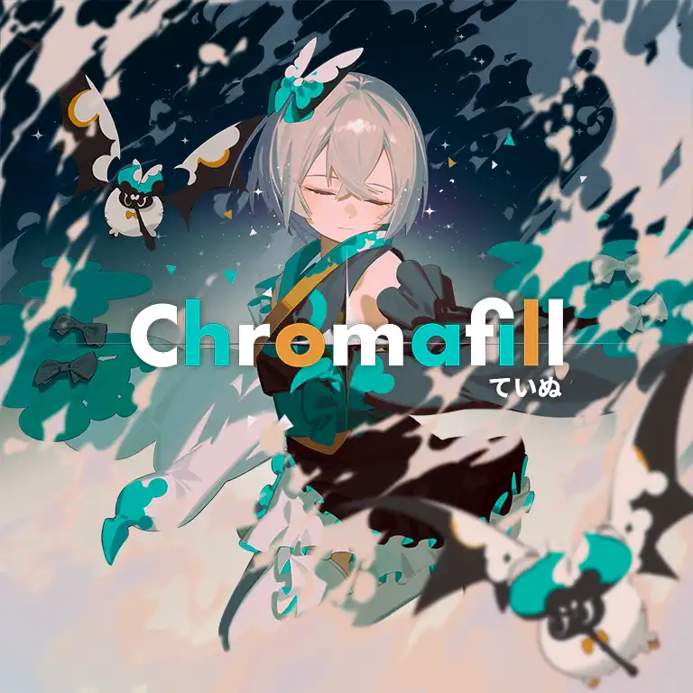 | FTR | [Chromafill](<../pack/04_Memory Archive/Chromafill.md>) | Memory Archive 5.6.0(24/04/26) |
|  | ETR | [Third Sun](<../pack/04_Memory Archive/Third Sun.md>) | Memory Archive 5.10.6(24/10/24) |
| 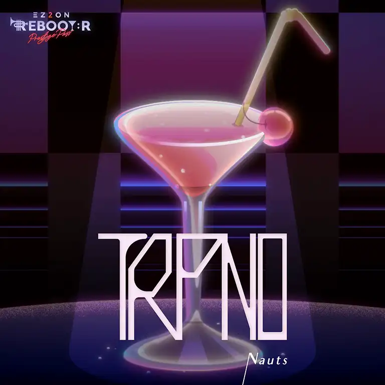 | FTR | [TRPNO](<../pack/30_Extend Archive 3－ Illusions Pack/TRPNO.md>) | Extend Archive 3－ Illusions Pack 6.3.2(25/03/27) |
| 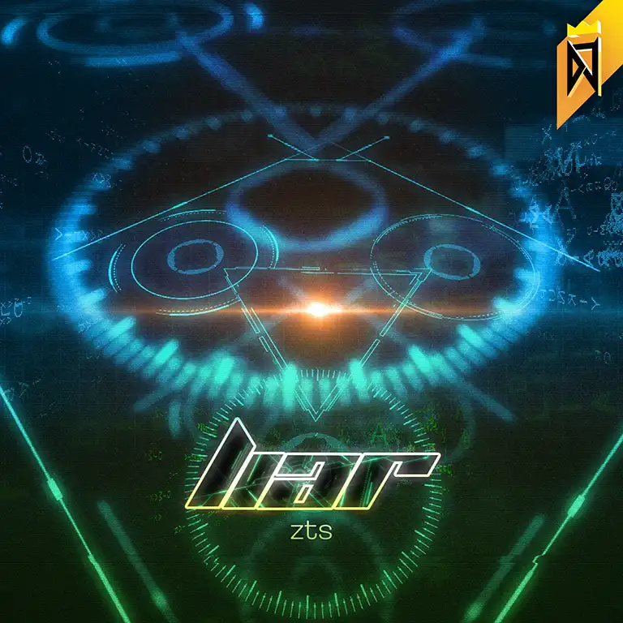 | FTR | [Liar](<../pack/35_DJMAX Collaboration Pack/Liar.md>) | DJMAX Collaboration Pack 6.6.0(25/06/26) |
| 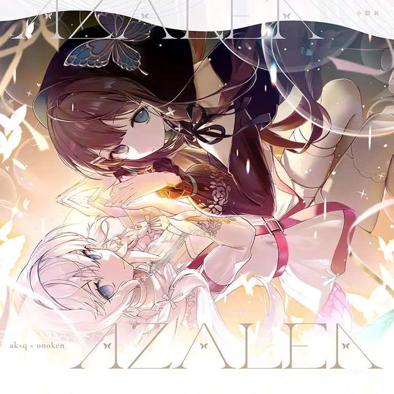 | ETR | [ΛZΛLEΛ](<../pack/39_Arcaea Next Stage Pack/ΛZΛLEΛ.md>) | Arcaea Next Stage Pack 6.10.8(25/11/22) |

## 10.1

| ジャケット | 難易 | 曲 | パック・初出 |
| :---: | :--- | :--- | :--- |
| 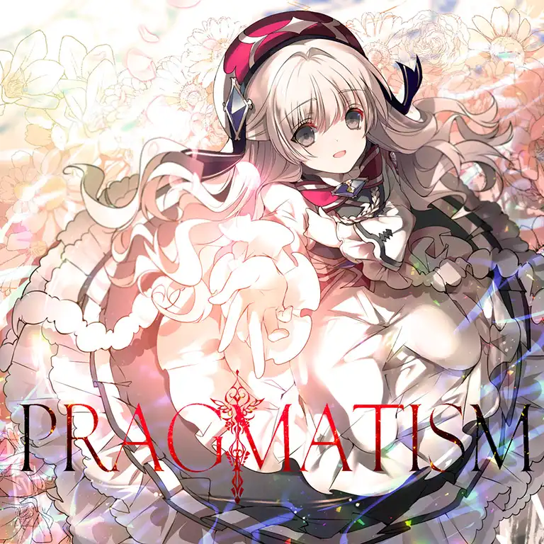 | FTR | [PRAGMATISM](<../pack/02_Eternal Core Pack/PRAGMATISM.md>) | Eternal Core Pack 1.0.5(17/03/09) |
|  | FTR | [G e n g a o z o](<../pack/17_Extend Archive 1－ Visions Pack/G e n g a o z o.md>) | Extend Archive 1－ Visions Pack 3.8.6(21/09/29) |
| 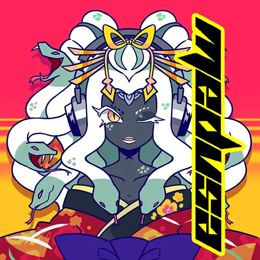 | FTR | [Medusa](<../pack/25_Muse Dash Collaboration Pack/Medusa.md>) | Muse Dash Collaboration Pack 3.11.0(21/12/24) |
| 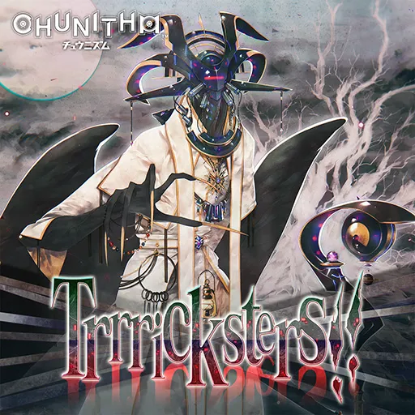 | FTR | [Trrricksters!!](<../pack/14_CHUNITHM Collaboration Pack/Trrricksters!!.md>) | CHUNITHM Collaboration Pack 4.4.0(23/03/23) |
|  | FTR | [患部で止まってすぐ溶ける～ 狂気の優曇華院](<../pack/04_Memory Archive/患部で止まってすぐ溶ける　～ 狂気の優曇華院.md>) | Memory Archive 5.2.2(23/12/21) |
| 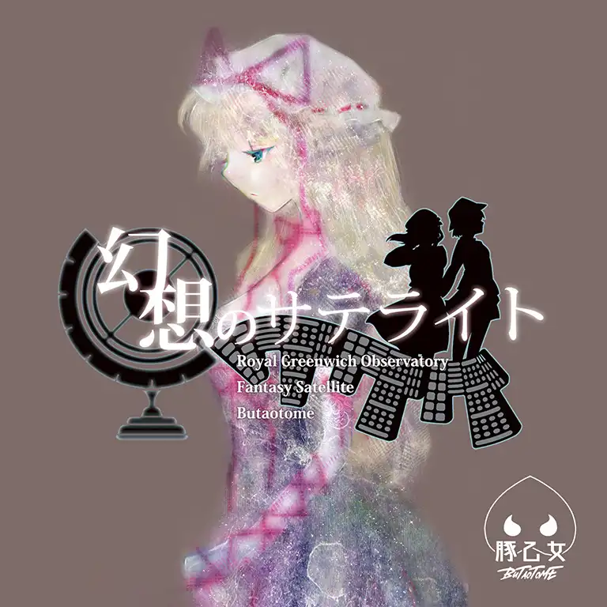 | ETR | [幻想のサテライト](<../pack/04_Memory Archive/幻想のサテライト.md>) | Memory Archive 5.10.4(24/09/26) |
|  | ETR | [BlazinG AIR](<../pack/14_CHUNITHM Collaboration Pack/BlazinG AIR.md>) | CHUNITHM Collaboration Pack 6.1.0(24/12/19) |
|  | ETR | [Don't Die](<../pack/04_Memory Archive/Don't Die.md>) | Memory Archive 6.5.0(25/05/22) |
| 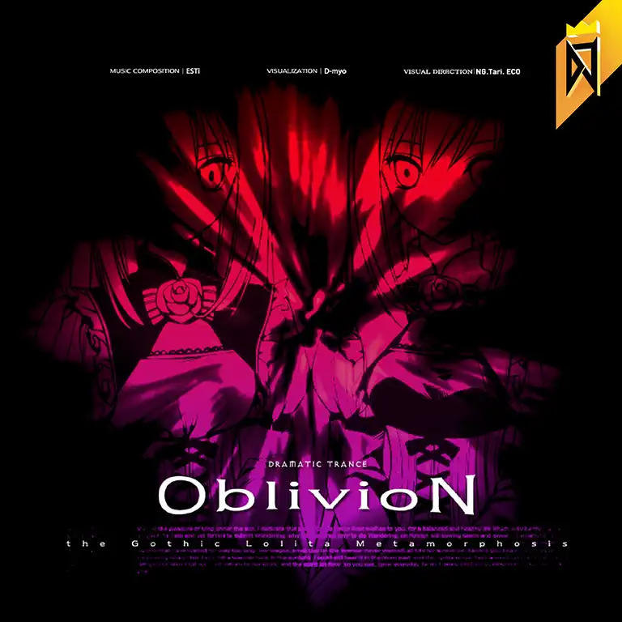 | ETR | [OBLIVION](<../pack/35_DJMAX Collaboration Pack/OBLIVION.md>) | DJMAX Collaboration Pack 6.5.0(25/05/22) |
|  | FTR | [We're All Gonna Die](<../pack/35_DJMAX Collaboration Pack/We're All Gonna Die.md>) | DJMAX Collaboration Pack 6.6.0(25/06/26) |
|  | FTR | [Welcome, Queen of Fiction.](<../pack/36_Extant Anima Pack/Welcome, Queen of Fiction.md>) | Extant Anima Pack 6.8.0(25/08/21) |
|  | FTR | [Undying Macula](<../pack/37_Liminal Eclipse Pack/Undying Macula.md>) | Liminal Eclipse Pack 6.9.0(25/10/02) |
|  | ETR | [INFINITE DIMENSION](<../pack/39_Arcaea Next Stage Pack/INFINITE DIMENSION.md>) | Arcaea Next Stage Pack 6.10.8(25/11/22) |
|  | ETR | [My life is mine alone!](<../pack/40_MEGAREX Collaboration Pack/My life is mine alone!.md>) | MEGAREX Collaboration Pack 6.12.0(26/01/29) |
| 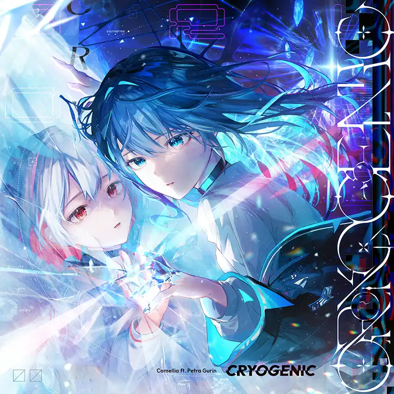 | ETR | [Cryogenic](<../pack/04_Memory Archive/Cryogenic.md>) | Memory Archive 6.13.0(26/03/09) |

## 10.2

| ジャケット | 難易 | 曲 | パック・初出 |
| :---: | :--- | :--- | :--- |
|  | FTR | [Nirv lucE](<../pack/03_Crimson Solace Pack/Nirv lucE.md>) | Crimson Solace Pack 1.0.11(17/05/11) |
| 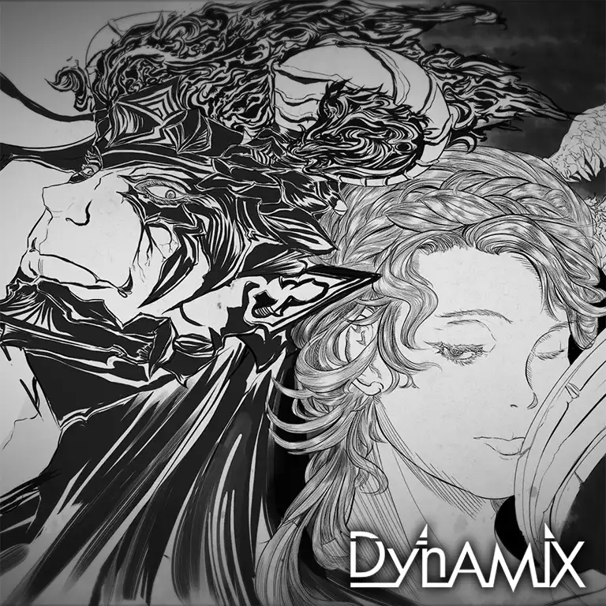 | FTR | [αterlβus](<../pack/05_Dynamix Collaboration Pack/αterlβus.md>) | Dynamix Collaboration Pack 1.1.2(17/06/23) |
|  | BYD | [Red and Blue and Green](<../pack/01_Arcaea Pack/Red and Blue and Green.md>) | Arcaea Pack 1.5.0(17/11/03) |
| 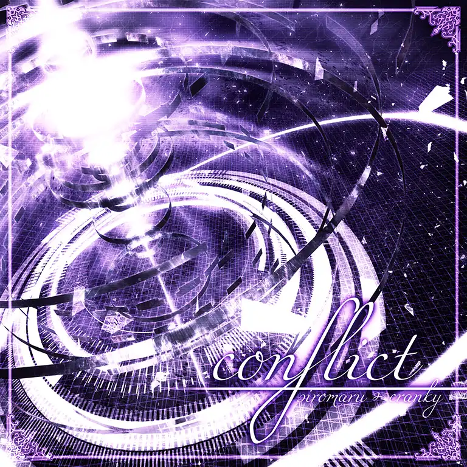 | FTR | [conflict](<../pack/07_Vicious Labyrinth Pack/conflict.md>) | Vicious Labyrinth Pack 1.5.0(17/11/03) |
| 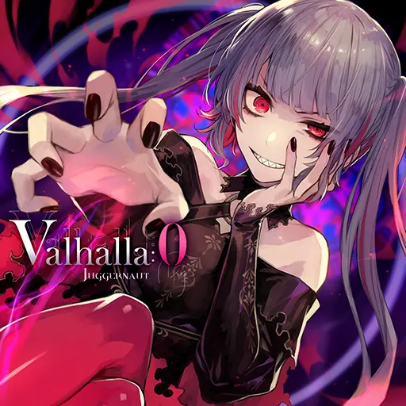 | FTR | [Valhalla:0](<../pack/16_Sunset Radiance Pack/Valhalla_0.md>) | Sunset Radiance Pack 2.3.0(19/08/22) |
|  | FTR | [Malicious Mischance](<../pack/04_Memory Archive/Malicious Mischance.md>) | Memory Archive 3.1.2(20/09/04) |
| 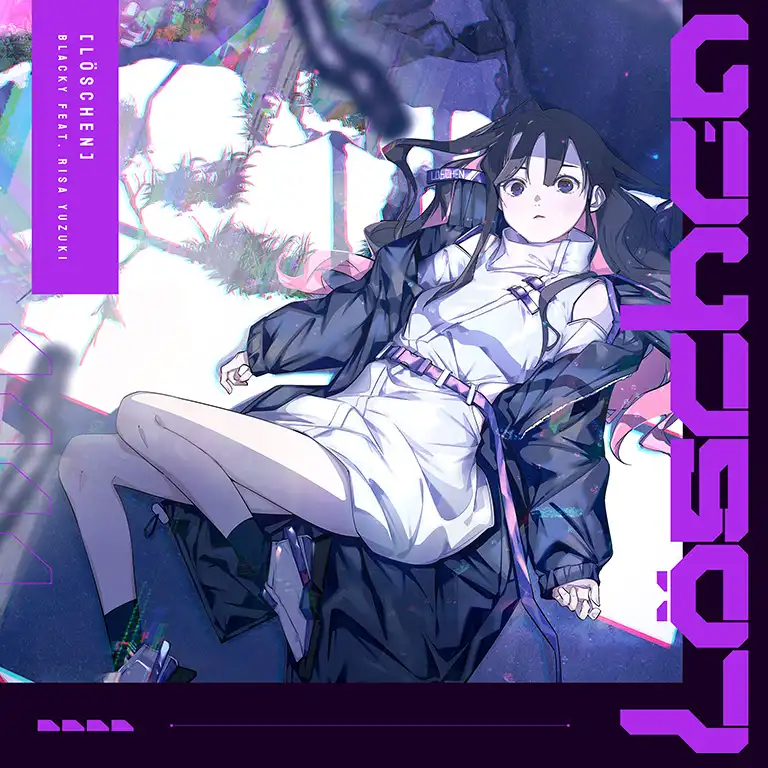 | FTR | [Löschen](<../pack/22_Esoteric Order Pack/Löschen.md>) | Esoteric Order Pack 3.6.0(21/05/11) |
| 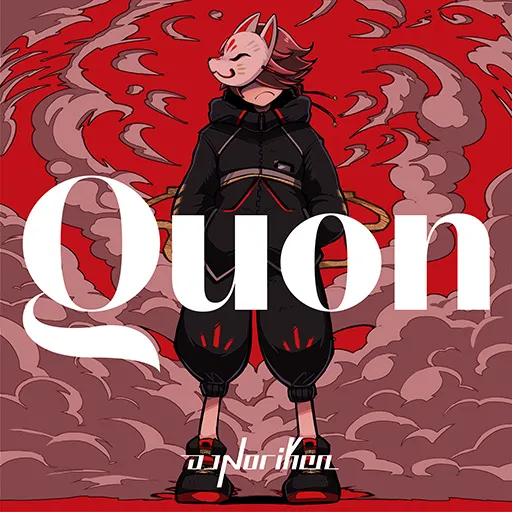 | BYD | [Quon](<../pack/23_WACCA Collaboration Pack/Quon【WACCA】.md>) | WACCA Collaboration Pack 3.8.0(21/08/10) |
| 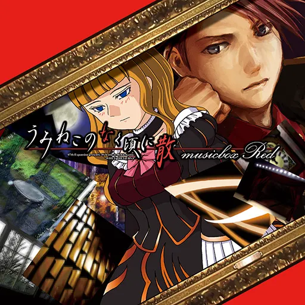 | BYD | [lastendconductor](<../pack/04_Memory Archive/lastendconductor.md>) | Memory Archive 3.8.6(21/09/29) |
|  | FTR | [Redolent Shape](<../pack/04_Memory Archive/Redolent Shape.md>) | Memory Archive 3.8.8(21/10/21) |
|  | FTR | [NEO WINGS](<../pack/04_Memory Archive/NEO WINGS.md>) | Memory Archive 3.12.0(22/02/17) |
| 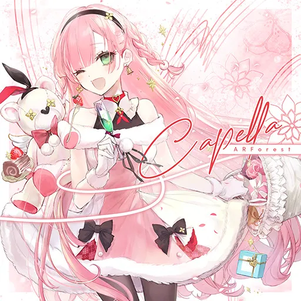 | FTR | [Capella](<../pack/04_Memory Archive/Capella.md>) | Memory Archive 4.1.6(22/12/22) |
| 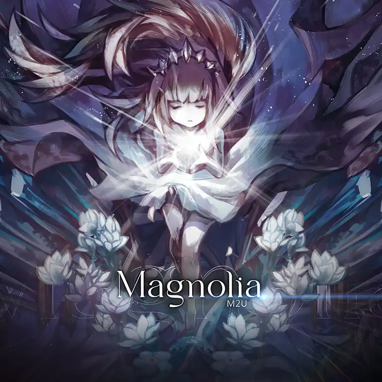 | FTR | [Magnolia](<../pack/28_Cytus II Collaboration Pack/Magnolia.md>) | Cytus II Collaboration Pack 4.6.0(23/07/19) |
| 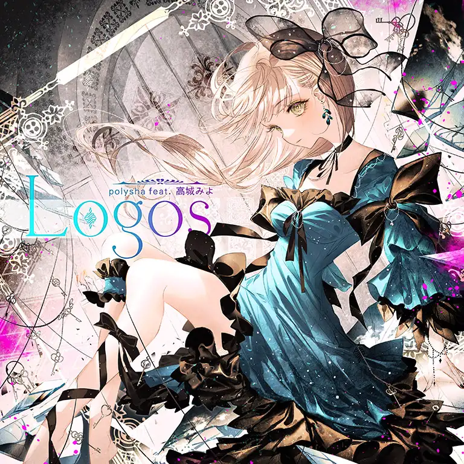 | FTR | [Logos](<../pack/29_Lasting Eden Pack/Logos.md>) | Lasting Eden Pack 5.0.0(23/09/27) |
| 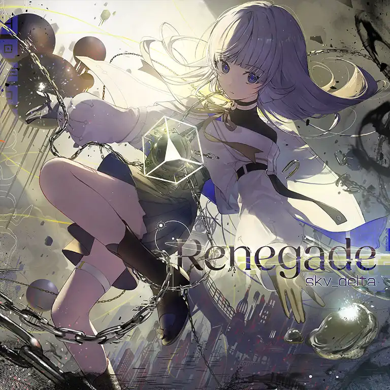 | BYD | [Renegade](<../pack/33_Lucent Historia Pack/Renegade.md>) | Lucent Historia Pack 6.0.0(24/11/21) |
|  | BYD | [最高の悪夢](<../pack/34_UNDERTALE Collaboration Pack/最高の悪夢.md>) | UNDERTALE Collaboration Pack 6.3.0(25/03/09) |
|  | FTR | [Angel's Boundary](<../pack/04_Memory Archive/Angel's Boundary.md>) | Memory Archive 6.10.0(25/10/30) |
| 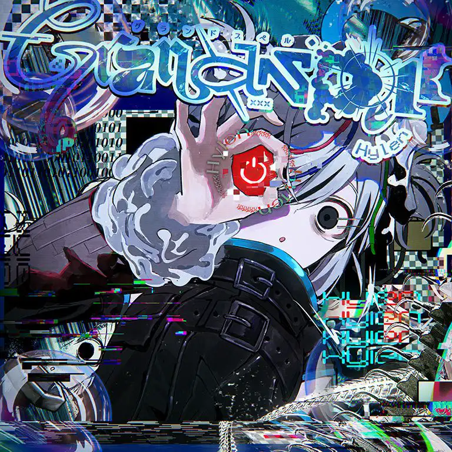 | FTR | [Grandspell](<../pack/04_Memory Archive/Grandspell.md>) | Memory Archive 6.11.0(25/11/27) |
| 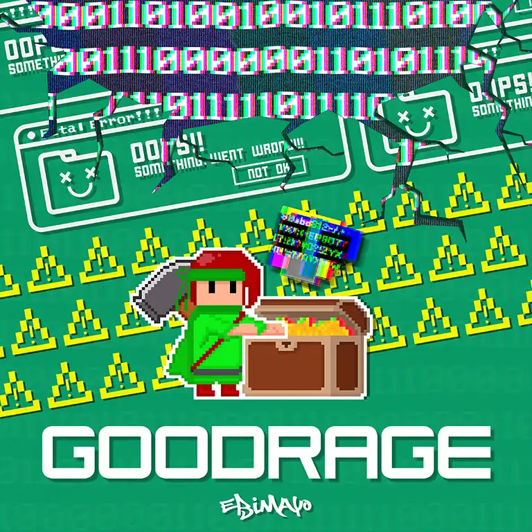 | ETR | [GOODRAGE](<../pack/04_Memory Archive/GOODRAGE.md>) | Memory Archive 6.13.0(26/03/09) |

## 10.3

| ジャケット | 難易 | 曲 | パック・初出 |
| :---: | :--- | :--- | :--- |
|  | BYD | [Party Vinyl](<../pack/03_Crimson Solace Pack/Party Vinyl.md>) | Crimson Solace Pack 1.0.11(17/05/11) |
|  | FTR | [Ether Strike](<../pack/10_Luminous Sky Pack/Ether Strike.md>) | Luminous Sky Pack 1.7.0(18/07/16) |
| 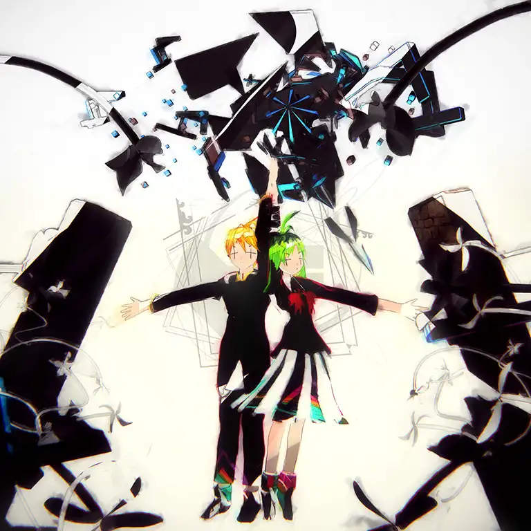 | FTR | [Tiferet](<../pack/11_Tone Sphere Collaboration Pack/Tiferet.md>) | Tone Sphere Collaboration Pack 1.8.0(18/10/07) |
|  | BYD | [OMAKENO Stroke](<../pack/12_Groove Coaster Collaboration Pack/OMAKENO Stroke.md>) | Groove Coaster Collaboration Pack 1.9.0(19/01/09) |
| 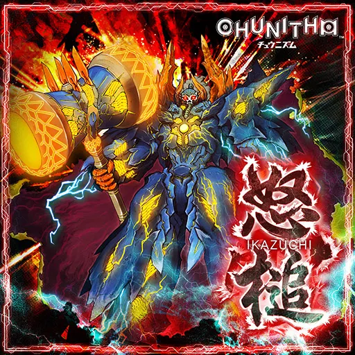 | FTR | [怒槌](<../pack/14_CHUNITHM Collaboration Pack/怒槌.md>) | CHUNITHM Collaboration Pack 2.1.0(19/05/23) |
| 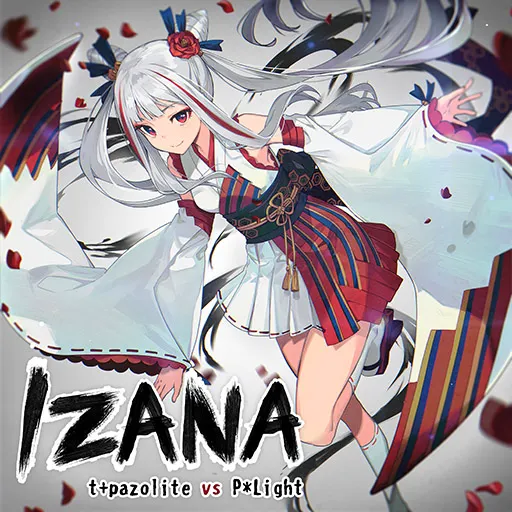 | FTR | [IZANA](<../pack/04_Memory Archive/IZANA.md>) | Memory Archive 2.5.0(20/01/21) |
| 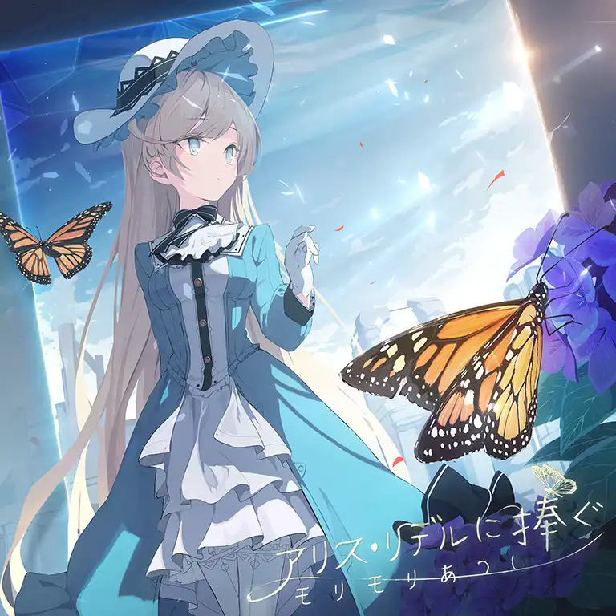 | FTR | [アリス・リデルに捧ぐ](<../pack/19_Ephemeral Page Pack/アリス・リデルに捧ぐ.md>) | Ephemeral Page Pack 3.3.1(20/12/09) |
|  | FTR | [Viyella's Tears](<../pack/20_O.N.G.E.K.I. Collaboration Pack/Viyella's Tears.md>) | O.N.G.E.K.I. Collaboration Pack 3.4.0(20/12/17) |
|  | BYD | [Small Cloud Sugar Candy](<../pack/22_Esoteric Order Pack/Small Cloud Sugar Candy.md>) | Esoteric Order Pack 3.7.0(21/07/21) |
|  | BYD | [ENERGY SYNERGY MATRIX](<../pack/17_Extend Archive 1－ Visions Pack/ENERGY SYNERGY MATRIX.md>) | Extend Archive 1－ Visions Pack 3.8.4(21/09/08) |
|  | FTR | [緋色月下、狂咲ノ絶(nayuta 2017 ver.)](<../pack/04_Memory Archive/緋色月下、狂咲ノ絶 (nayuta 2017 ver.).md>) | Memory Archive 4.3.0(23/03/02) |
|  | FTR | [99 Glooms](<../pack/28_Cytus II Collaboration Pack/99 Glooms.md>) | Cytus II Collaboration Pack 4.6.0(23/07/19) |
| 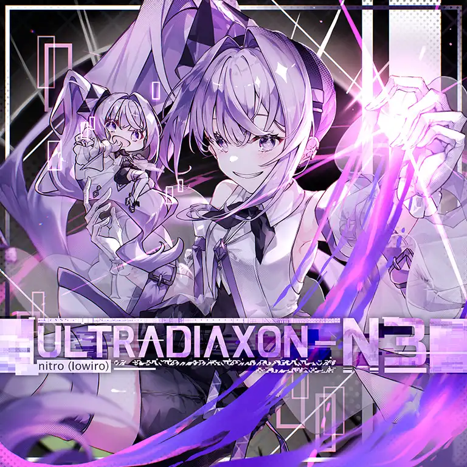 | FTR | [ultradiaxon-N3](<../pack/04_Memory Archive/ultradiaxon-N3.md>) | Memory Archive 5.5.8(24/04/02) |
|  | ETR | [Dual Doom Deathmatch](<../pack/32_Rotaeno Collaboration Pack/Dual Doom Deathmatch.md>) | Rotaeno Collaboration Pack 5.10.0(24/08/29) |
|  | FTR | [Breach of Faith](<../pack/33_Lucent Historia Pack/Breach of Faith.md>) | Lucent Historia Pack 6.0.0(24/11/21) |
|  | FTR | [SUPER AMBULANCE](<../pack/20_O.N.G.E.K.I. Collaboration Pack/SUPER AMBULANCE.md>) | O.N.G.E.K.I. Collaboration Pack 6.0.0(24/11/21) |
| 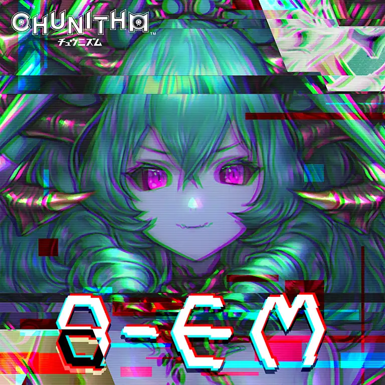 | ETR | [8-EM](<../pack/14_CHUNITHM Collaboration Pack/8-EM.md>) | CHUNITHM Collaboration Pack 6.1.0(24/12/19) |
|  | ETR | [BREaK! BREaK! BREaK!](<../pack/21_maimai Collaboration Pack/BREaK! BREaK! BREaK!.md>) | maimai Collaboration Pack 6.2.0(25/01/23) |
|  | FTR | [ROST PAGE GENE](<../pack/30_Extend Archive 3－ Illusions Pack/ROST PAGE GENE.md>) | Extend Archive 3－ Illusions Pack 6.9.0(25/10/02) |
| 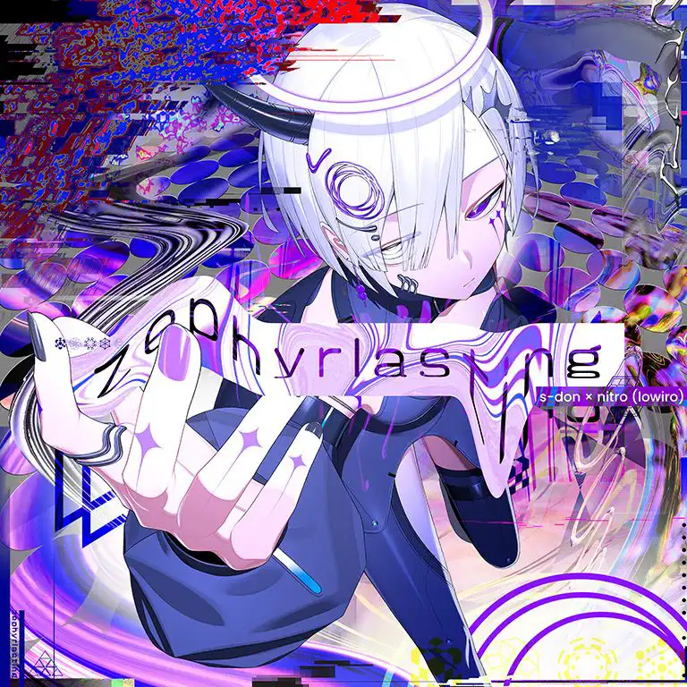 | ETR | [zephyrlasting](<../pack/39_Arcaea Next Stage Pack/zephyrlasting.md>) | Arcaea Next Stage Pack 6.10.8(25/11/22) |

## 10.4

| ジャケット | 難易 | 曲 | パック・初出 |
| :---: | :--- | :--- | :--- |
|  | BYD | [Singularity VVVIP](<../pack/09_Binary Enfold Pack/Singularity VVVIP.md>) | Binary Enfold Pack 1.6.0(18/03/23) |
| 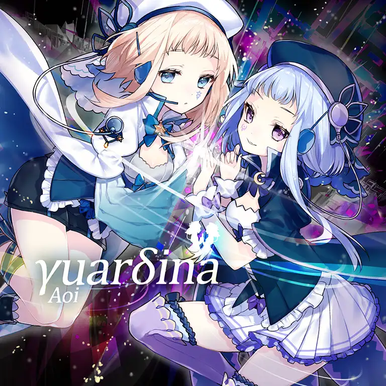 | FTR | [γuarδina](<../pack/04_Memory Archive/γuarδina.md>) | Memory Archive 1.6.2(18/04/29) |
|  | FTR | [Garakuta Doll Play](<../pack/14_CHUNITHM Collaboration Pack/Garakuta Doll Play.md>) | CHUNITHM Collaboration Pack 2.1.0(19/05/23) |
| 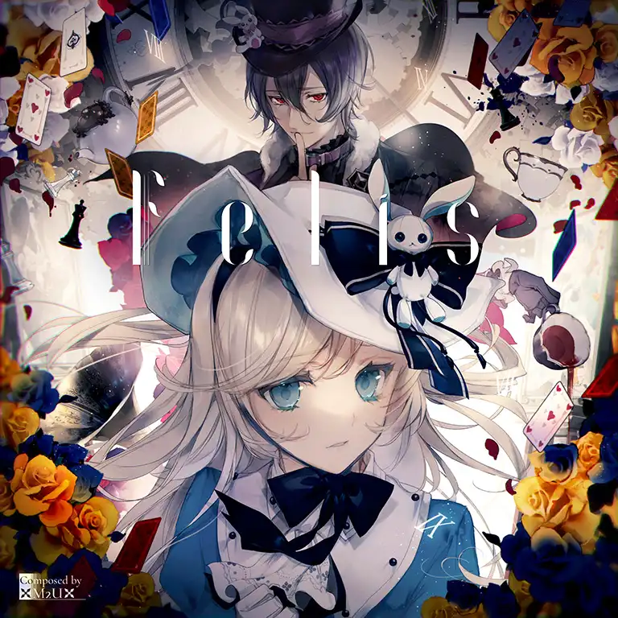 | FTR | [Felis](<../pack/19_Ephemeral Page Pack/Felis.md>) | Ephemeral Page Pack 3.3.0(20/12/03) |
| 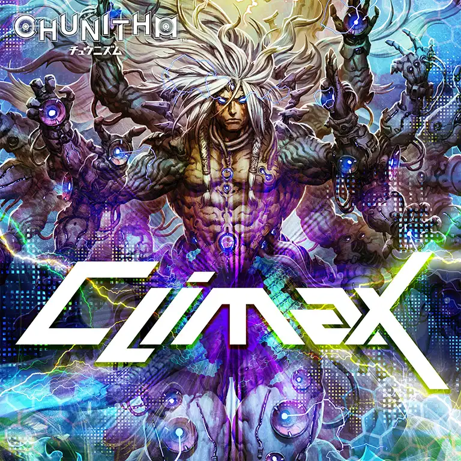 | FTR | [Climax](<../pack/14_CHUNITHM Collaboration Pack/Climax.md>) | CHUNITHM Collaboration Pack 3.5.0(21/01/21) |
|  | FTR | [Last Celebration](<../pack/14_CHUNITHM Collaboration Pack/Last Celebration.md>) | CHUNITHM Collaboration Pack 3.5.0(21/01/21) |
|  | FTR | [Kissing Lucifer](<../pack/04_Memory Archive/Kissing Lucifer.md>) | Memory Archive 3.12.0(22/02/17) |
| 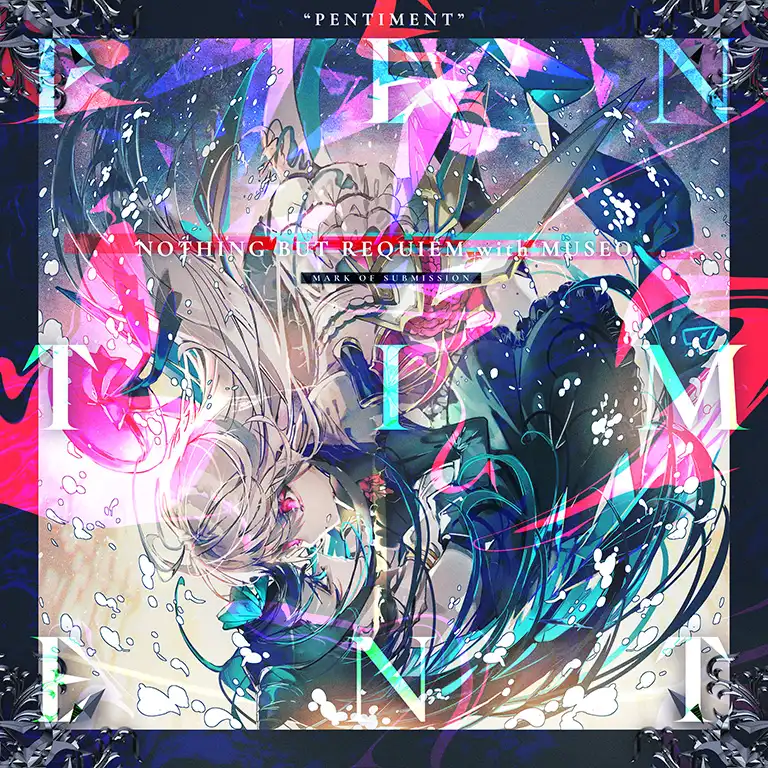 | FTR | [Pentiment](<../pack/26_Final Verdict Pack/Pentiment.md>) | Final Verdict Pack 4.0.0(22/07/07) |
| 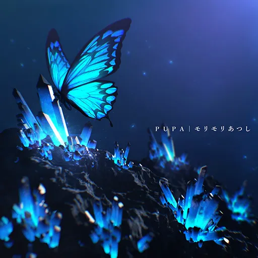 | FTR | [PUPA](<../pack/04_Memory Archive/PUPA.md>) | Memory Archive 4.0.0(22/07/07) |
| 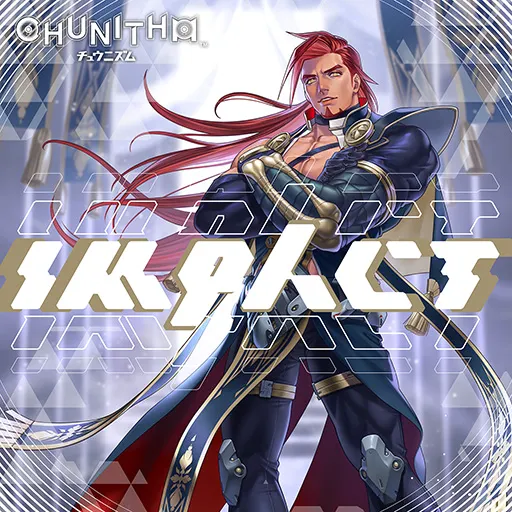 | BYD | [IMPACT](<../pack/14_CHUNITHM Collaboration Pack/IMPACT.md>) | CHUNITHM Collaboration Pack 4.4.0(23/03/23) |
|  | FTR | [To the Milky Way](<../pack/04_Memory Archive/To the Milky Way.md>) | Memory Archive 4.4.6(23/05/25) |
| 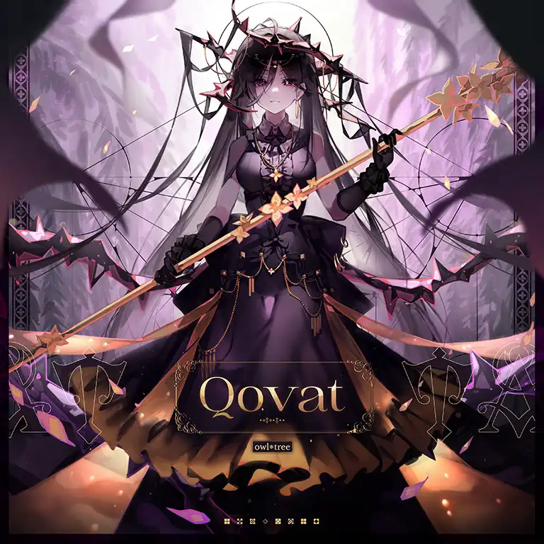 | FTR | [Qovat](<../pack/04_Memory Archive/Qovat.md>) | Memory Archive 5.4.0(24/03/08) |
|  | FTR | [Lethal Voltage](<../pack/30_Extend Archive 3－ Illusions Pack/Lethal Voltage.md>) | Extend Archive 3－ Illusions Pack 5.5.0(24/03/25) |
| 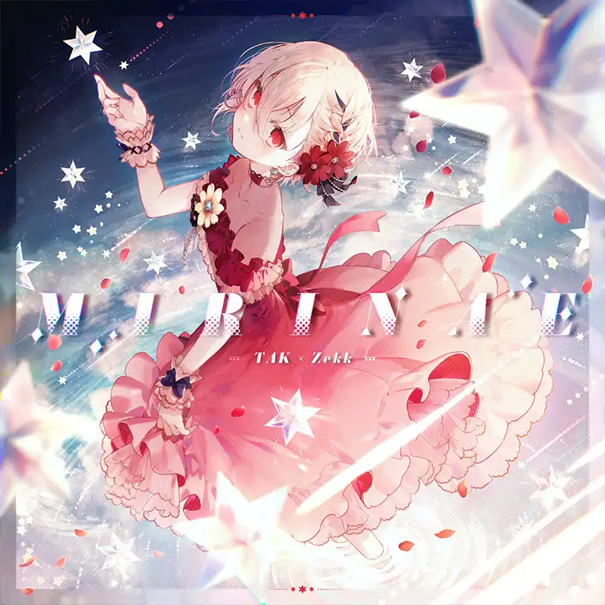 | FTR | [MIRINAE](<../pack/04_Memory Archive/MIRINAE.md>) | Memory Archive 5.5.0(24/03/25) |
|  | BYD | [Saint or Sinner](<../pack/15_Adverse Prelude Pack/Saint or Sinner.md>) | Adverse Prelude Pack 5.10.4(24/09/26) |
|  | BYD | [Rays of Remnant](<../pack/33_Lucent Historia Pack/Rays of Remnant.md>) | Lucent Historia Pack 6.0.0(24/11/21) |
| 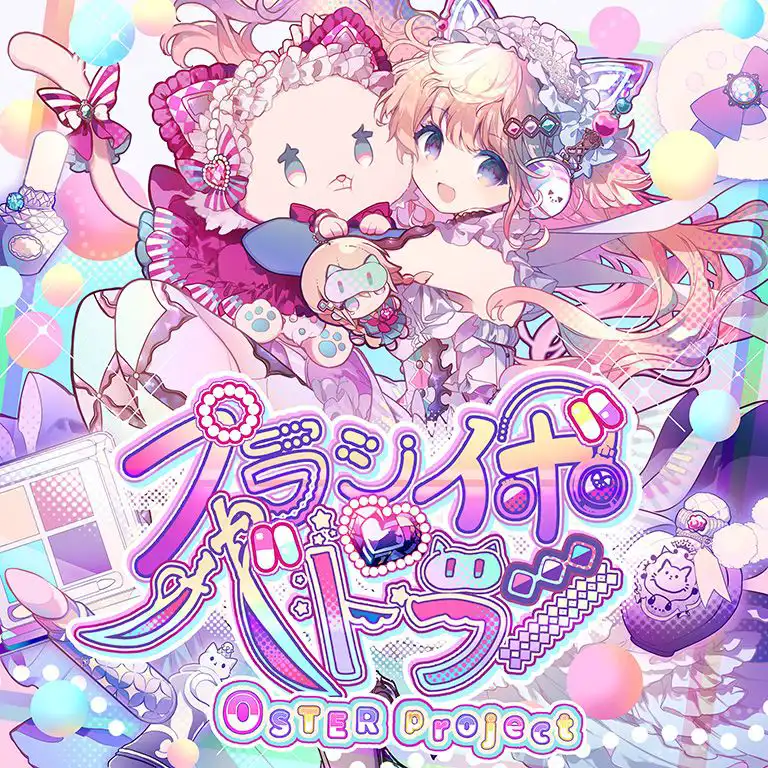 | FTR | [プラシイボ♥バトラー](<../pack/04_Memory Archive/プラシイボ♥バトラー.md>) | Memory Archive 6.3.0(25/03/09) |
|  | ETR | [Dual Dependency](<../pack/36_Extant Anima Pack/Dual Dependency.md>) | Extant Anima Pack 6.7.0(25/07/24) |
|  | ETR | [Eternity Break](<../pack/04_Memory Archive/Eternity Break.md>) | Memory Archive 6.8.4(25/09/24) |
|  | ETR | [No Way Back](<../pack/37_Liminal Eclipse Pack/No Way Back.md>) | Liminal Eclipse Pack 6.9.0(25/10/02) |
| 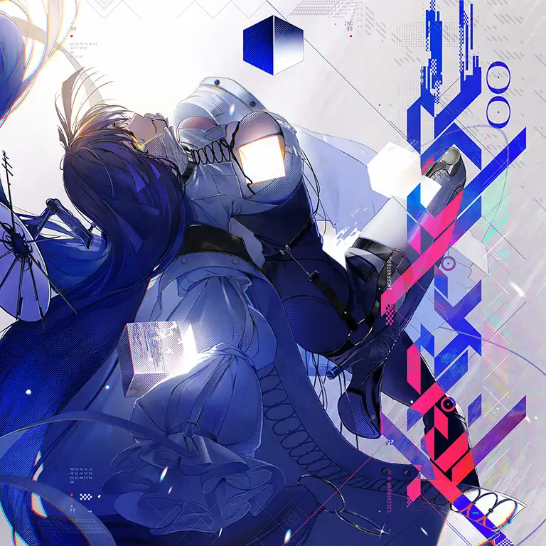 | ETR | [INCARNATOR₀₀](<../pack/39_Arcaea Next Stage Pack/INCARNATOR₀₀.md>) | Arcaea Next Stage Pack 6.10.8(25/11/22) |
| 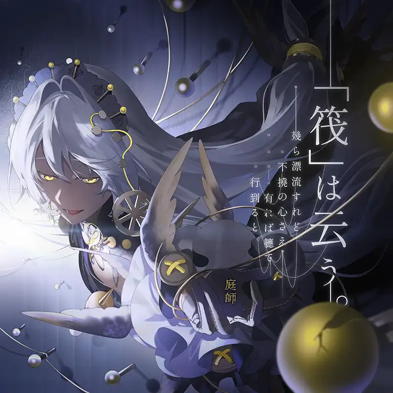 | ETR | [［筏］は云う。幾ら漂流すれど不撓の心さえ有れば軈て行到ると。](<../pack/04_Memory Archive/［筏］は云う。幾ら漂流すれど不撓の心さえ有れば軈て行到ると。.md>) | Memory Archive 6.11.6(26/01/07) |
| 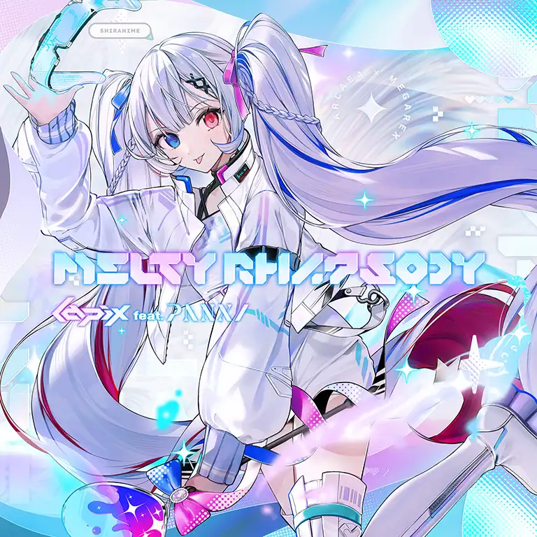 | ETR | [メルティーラプソディー](<../pack/40_MEGAREX Collaboration Pack/メルティーラプソディー.md>) | MEGAREX Collaboration Pack 6.12.0(26/01/29) |

## 10.5

| ジャケット | 難易 | 曲 | パック・初出 |
| :---: | :--- | :--- | :--- |
| 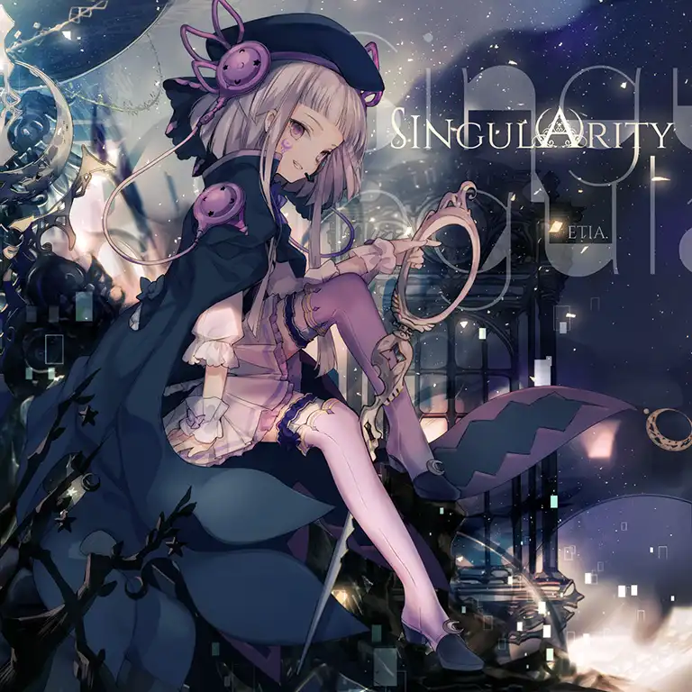 | FTR | [Singularity](<../pack/09_Binary Enfold Pack/Singularity.md>) | Binary Enfold Pack 1.6.0(18/03/23) |
|  | FTR | [Halcyon](<../pack/10_Luminous Sky Pack/Halcyon.md>) | Luminous Sky Pack 1.7.0(18/07/16) |
| 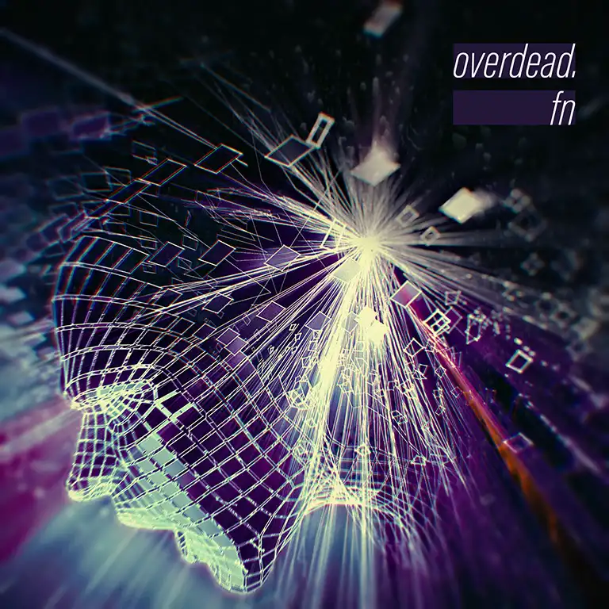 | BYD | [overdead.](<../pack/04_Memory Archive/overdead.md>) | Memory Archive 1.7.2(18/08/13) |
| 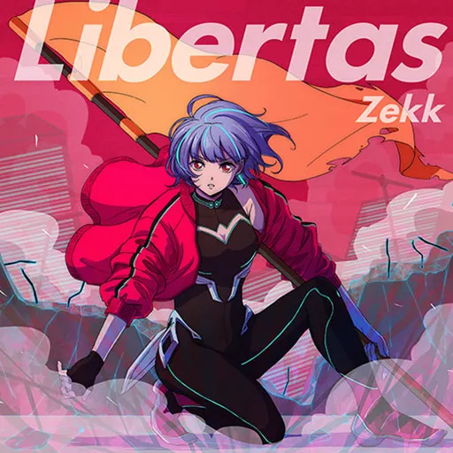 | BYD | [Libertas](<../pack/04_Memory Archive/Libertas.md>) | Memory Archive 1.9.2(19/02/11) |
| 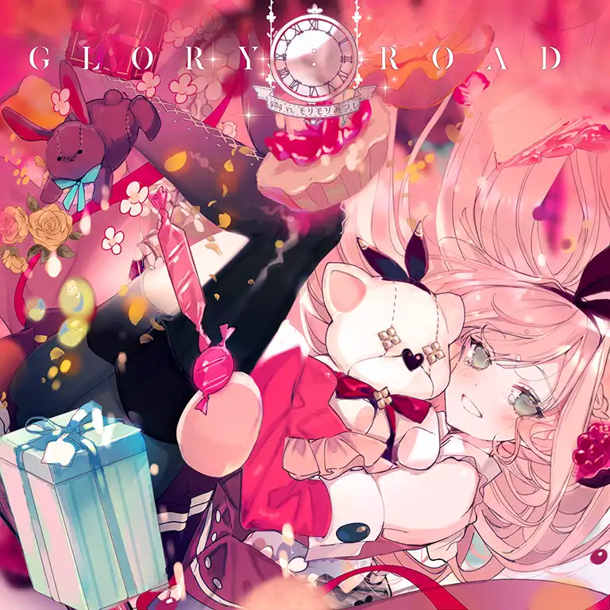 | FTR | [GLORY：ROAD](<../pack/03_Crimson Solace Pack/GLORY：ROAD.md>) | Crimson Solace Pack 2.4.0(19/10/08) |
|  | FTR | [GIMME DA BLOOD](<../pack/04_Memory Archive/GIMME DA BLOOD.md>) | Memory Archive 3.5.2(21/03/09) |
|  | FTR | [Lightning Screw](<../pack/24_Divided Heart Pack/Lightning Screw.md>) | Divided Heart Pack 3.10.0(21/12/09) |
| 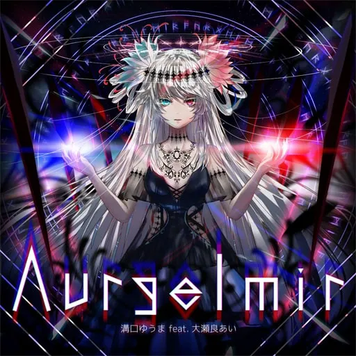 | FTR | [Aurgelmir](<../pack/04_Memory Archive/Aurgelmir.md>) | Memory Archive 3.12.4(22/03/23) |
|  | FTR | [Arcana Eden](<../pack/26_Final Verdict Pack/Arcana Eden.md>) | Final Verdict Pack 4.0.0(22/07/07) |
| 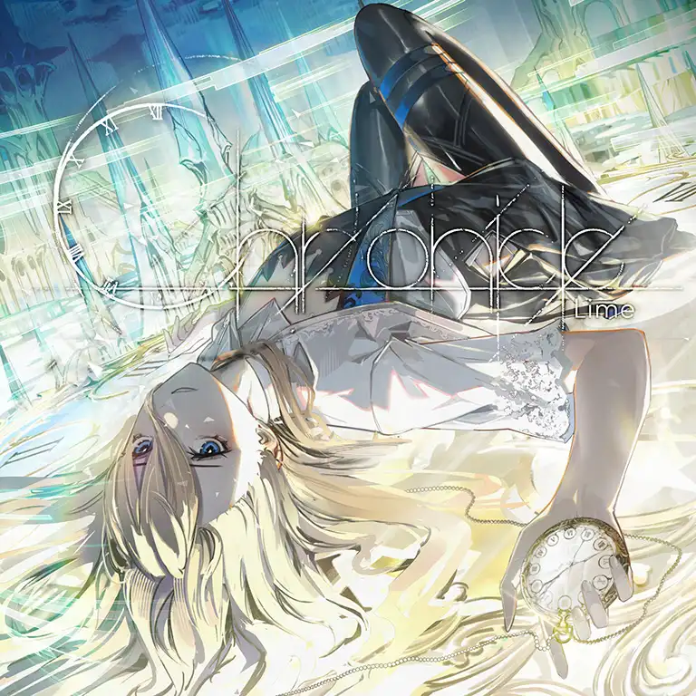 | FTR | [Chronicle](<../pack/27_Extend Archive 2－ Chronicles Pack/Chronicle.md>) | Extend Archive 2－ Chronicles Pack 4.2.0(23/01/26) |
|  | FTR | [Lucid Traveler](<../pack/28_Cytus II Collaboration Pack/Lucid Traveler.md>) | Cytus II Collaboration Pack 4.5.0(23/06/28) |
|  | FTR | [Rise of the World](<../pack/29_Lasting Eden Pack/Rise of the World.md>) | Lasting Eden Pack 4.7.0(23/08/18) |
|  | FTR | [Ego Eimi](<../pack/29_Lasting Eden Pack/Ego Eimi.md>) | Lasting Eden Pack 5.0.0(23/09/27) |
|  | FTR | [eden](<../pack/23_WACCA Collaboration Pack/eden.md>) | WACCA Collaboration Pack 5.2.0(23/11/30) |
|  | FTR | [Wish Upon a Snow](<../pack/04_Memory Archive/Wish Upon a Snow.md>) | Memory Archive 5.2.0(23/11/30) |
| 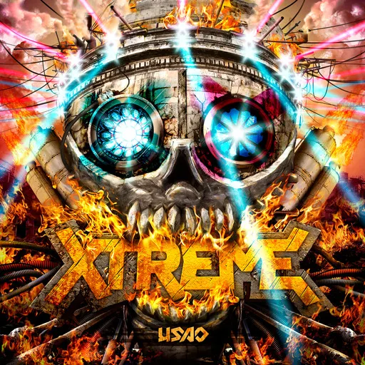 | FTR | [XTREME](<../pack/23_WACCA Collaboration Pack/XTREME.md>) | WACCA Collaboration Pack 5.2.0(23/11/30) |
| 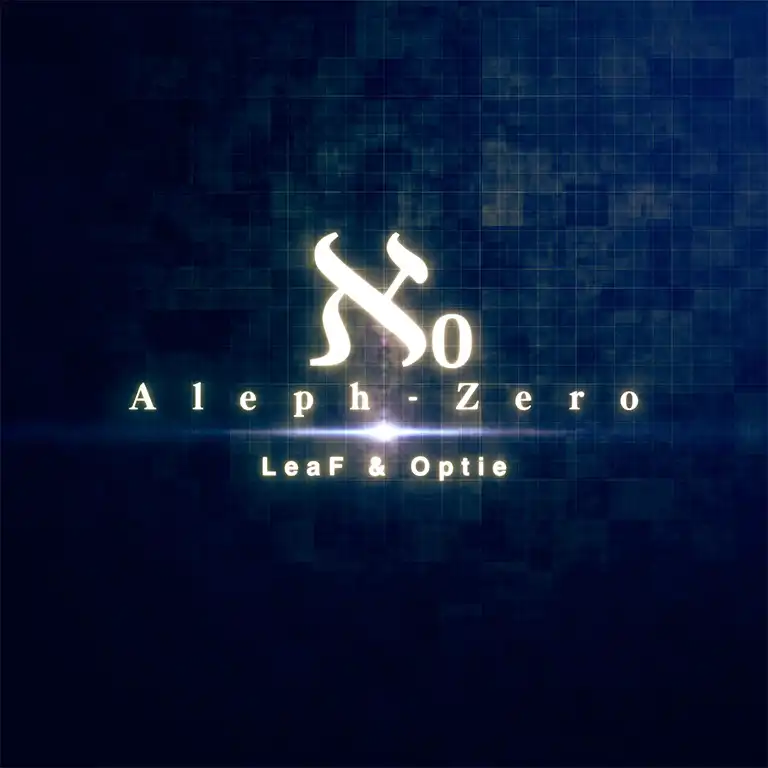 | FTR | [Aleph-0](<../pack/27_Extend Archive 2－ Chronicles Pack/Aleph-0.md>) | Extend Archive 2－ Chronicles Pack 5.4.0(24/03/08) |
| 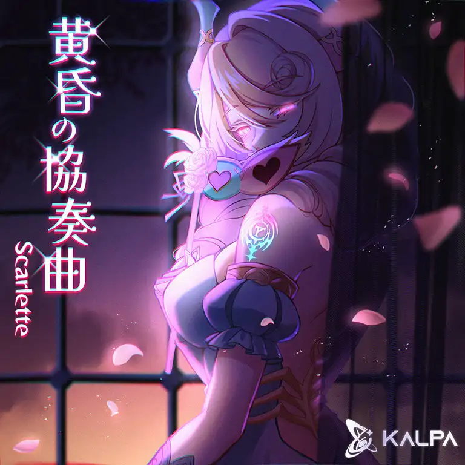 | ETR | [黄昏の協奏曲](<../pack/04_Memory Archive/黄昏の協奏曲.md>) | Memory Archive 5.7.0(24/05/30) |
| 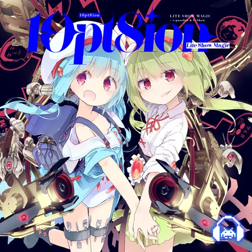 | ETR | [10pt8ion](<../pack/12_Groove Coaster Collaboration Pack/10pt8ion.md>) | Groove Coaster Collaboration Pack 5.8.0(24/06/27) |
|  | FTR | [ALTER EGO](<../pack/31_Absolute Nihil Pack/ALTER EGO.md>) | Absolute Nihil Pack 5.9.0(24/07/30) |
| 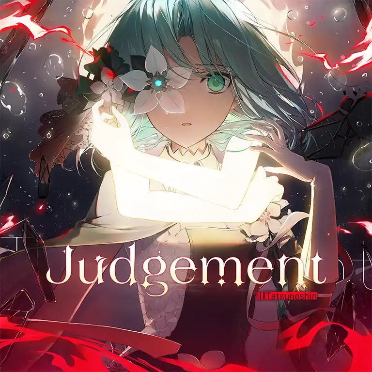 | FTR | [Judgement](<../pack/31_Absolute Nihil Pack/Judgement.md>) | Absolute Nihil Pack 5.9.0(24/07/30) |
|  | ETR | [Rain of Conflict in aRadiant Abyss](<../pack/04_Memory Archive/Rain of Conflict in a Radiant Abyss.md>) | Memory Archive 5.10.2(24/09/12) |
|  | FTR | [Spirit of the Dauntless](<../pack/04_Memory Archive/Spirit of the Dauntless.md>) | Memory Archive 5.10.6(24/10/24) |
|  | ETR | [Straight into the lights](<../pack/21_maimai Collaboration Pack/Straight into the lights.md>) | maimai Collaboration Pack 6.2.0(25/01/23) |
| 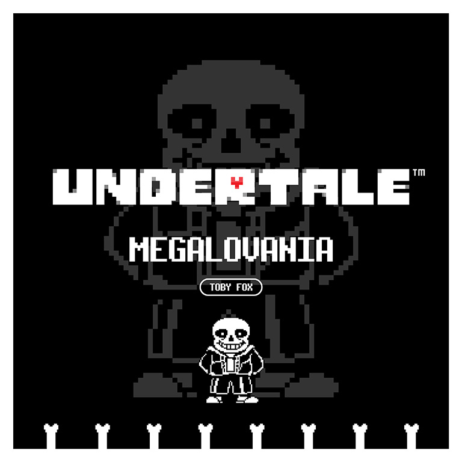 | ETR | [MEGALOVANIA](<../pack/34_UNDERTALE Collaboration Pack/MEGALOVANIA.md>) | UNDERTALE Collaboration Pack 6.3.0(25/03/09) |
|  | FTR | [Dull Blade](<../pack/04_Memory Archive/Dull Blade.md>) | Memory Archive 6.4.0(25/04/24) |
| 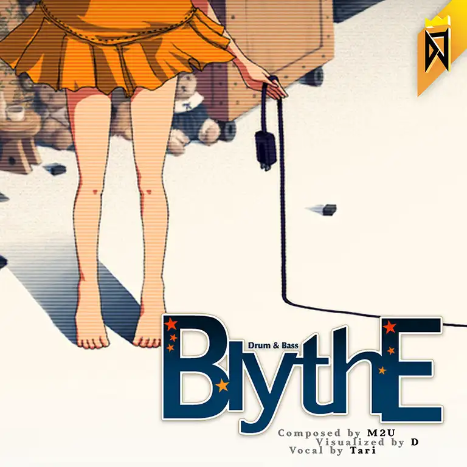 | ETR | [BlythE](<../pack/35_DJMAX Collaboration Pack/BlythE.md>) | DJMAX Collaboration Pack 6.6.0(25/06/26) |
| 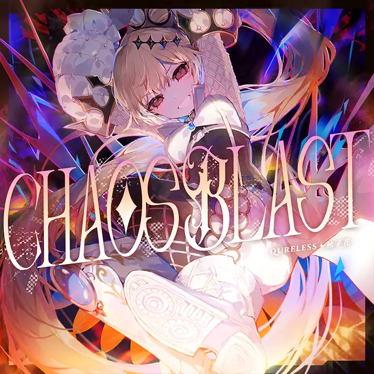 | ETR | [CHAOSBLAST](<../pack/36_Extant Anima Pack/CHAOSBLAST.md>) | Extant Anima Pack 6.8.0(25/08/21) |
|  | ETR | [Xxium and Purple haze](<../pack/38_World Extend 4－ Emanations Pack/Xxium and Purple haze.md>) | World Extend 4－ Emanations Pack 6.10.0(25/10/30) |
|  | ETR | [Paranoid Arc](<../pack/04_Memory Archive/Paranoid Arc.md>) | Memory Archive 6.11.2(25/12/24) |

## 10.6

| ジャケット | 難易 | 曲 | パック・初出 |
| :---: | :--- | :--- | :--- |
|  | BYD | [妖艶魔女 -trappola bewitching-](<../pack/07_Vicious Labyrinth Pack/妖艶魔女 -trappola bewitching-.md>) | Vicious Labyrinth Pack 1.5.0(17/11/03) |
|  | FTR | [Axium Crisis](<../pack/07_Vicious Labyrinth Pack/Axium Crisis.md>) | Vicious Labyrinth Pack 1.5.0(17/11/03) |
| 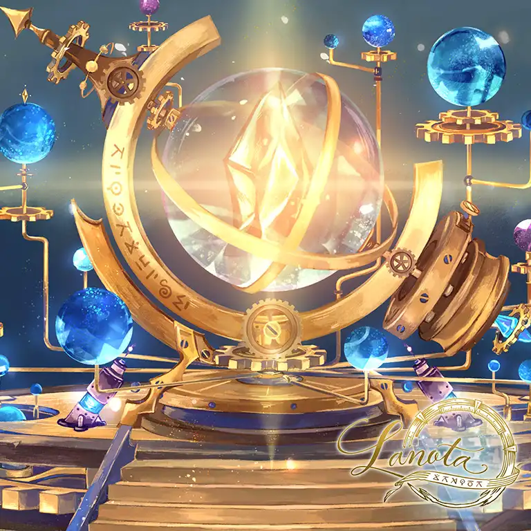 | FTR | [cyanine](<../pack/08_Lanota Collaboration Pack/cyanine.md>) | Lanota Collaboration Pack 1.5.5(18/02/01) |
| 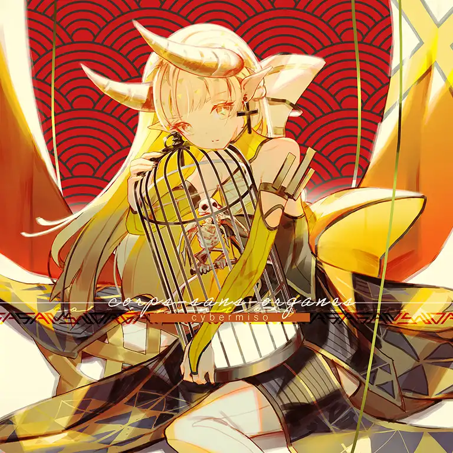 | FTR | [corps-sans-organes](<../pack/06_Ambivalent Vision Pack/corps-sans-organes.md>) | Ambivalent Vision Pack 2.6.0(20/03/25) |
|  | BYD | [Purple Verse](<../pack/17_Extend Archive 1－ Visions Pack/Purple Verse.md>) | Extend Archive 1－ Visions Pack 3.3.0(20/12/03) |
| 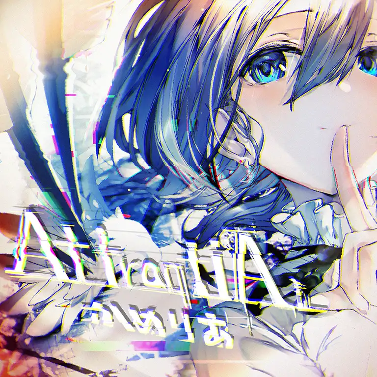 | FTR | [AttraqtiA](<../pack/04_Memory Archive/AttraqtiA.md>) | Memory Archive 3.5.0(21/01/21) |
| 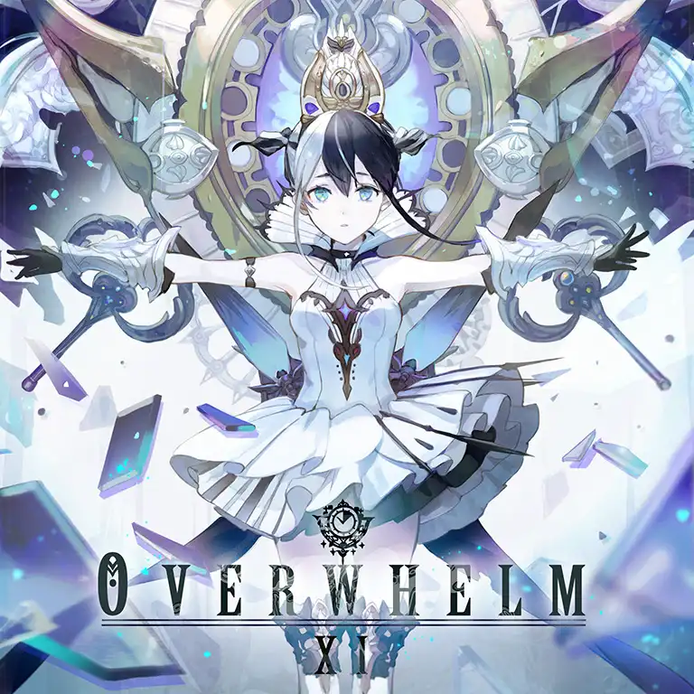 | FTR | [Overwhelm](<../pack/22_Esoteric Order Pack/Overwhelm.md>) | Esoteric Order Pack 3.6.0(21/05/11) |
| 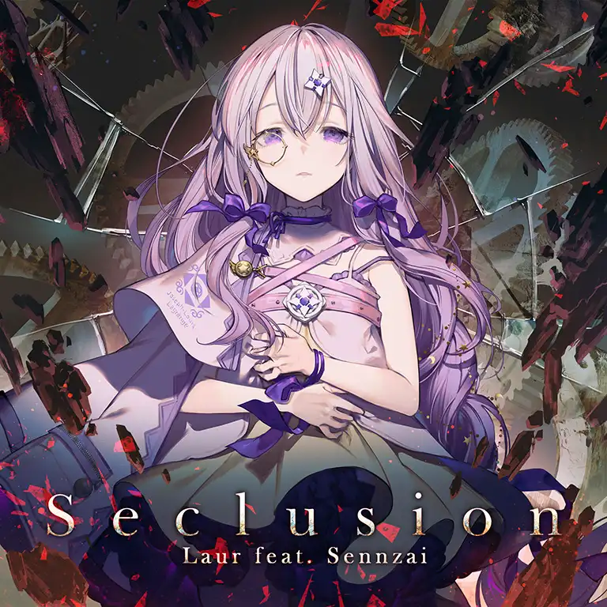 | FTR | [Seclusion](<../pack/22_Esoteric Order Pack/Seclusion.md>) | Esoteric Order Pack 3.7.0(21/07/21) |
|  | FTR | [Live Fast Die Young](<../pack/09_Binary Enfold Pack/Live Fast Die Young.md>) | Binary Enfold Pack 3.9.0(21/11/11) |
|  | FTR | [Good bye, Merry-Go-Round.](<../pack/20_O.N.G.E.K.I. Collaboration Pack/Good bye, Merry-Go-Round.md>) | O.N.G.E.K.I. Collaboration Pack 4.1.0(22/10/04) |
| 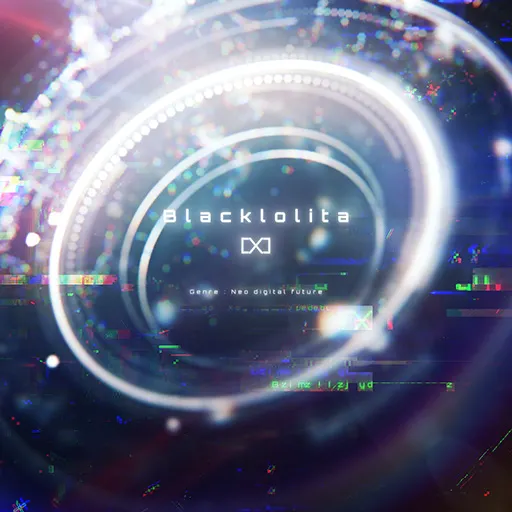 | FTR | [\[X\]](<../pack/21_maimai Collaboration Pack/［X］.md>) | maimai Collaboration Pack 4.3.0(23/03/02) |
|  | FTR | [Crimson Throne](<../pack/04_Memory Archive/Crimson Throne.md>) | Memory Archive 4.3.0(23/03/02) |
|  | FTR | [Manic Jeer](<../pack/04_Memory Archive/Manic Jeer.md>) | Memory Archive 4.3.0(23/03/02) |
|  | FTR | [UNKNOWN LEVELS](<../pack/29_Lasting Eden Pack/UNKNOWN LEVELS.md>) | Lasting Eden Pack 4.7.0(23/08/18) |
| 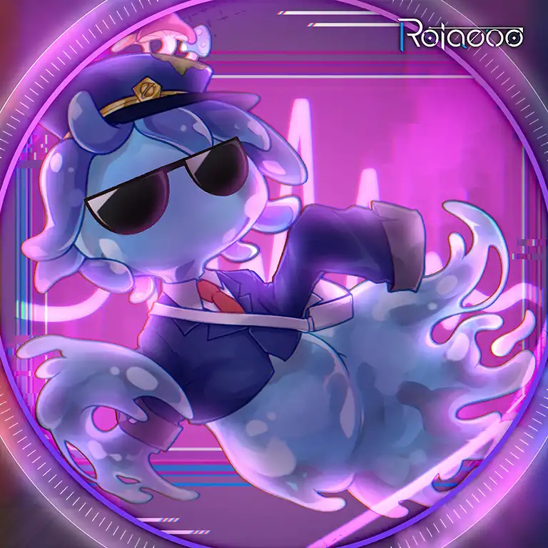 | FTR | [MVURBD](<../pack/32_Rotaeno Collaboration Pack/MVURBD.md>) | Rotaeno Collaboration Pack 5.10.0(24/08/29) |
|  | ETR | [Dies irae](<../pack/04_Memory Archive/Dies irae.md>) | Memory Archive 5.10.6(24/10/24) |
|  | FTR | [Astral Quantization](<../pack/33_Lucent Historia Pack/Astral Quantization.md>) | Lucent Historia Pack 6.0.0(24/11/21) |
|  | FTR | [Lament Rain](<../pack/33_Lucent Historia Pack/Lament Rain.md>) | Lucent Historia Pack 6.0.0(24/11/21) |
|  | FTR | [Aether Crest: Astral](<../pack/14_CHUNITHM Collaboration Pack/Aether Crest： Astral.md>) | CHUNITHM Collaboration Pack 6.2.6(25/02/26) |
| 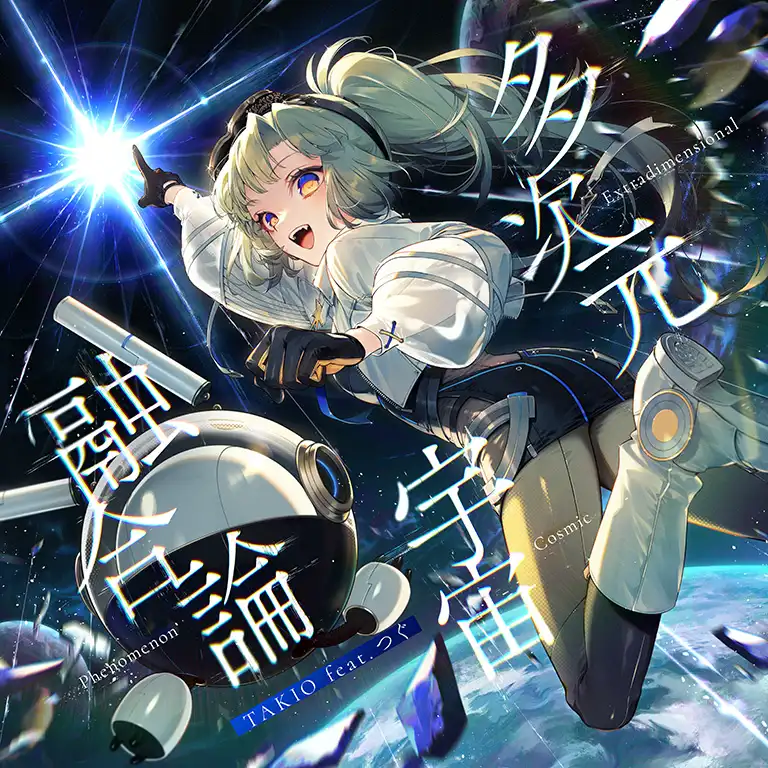 | FTR | [多次元宇宙融合論](<../pack/36_Extant Anima Pack/多次元宇宙融合論.md>) | Extant Anima Pack 6.7.0(25/07/24) |
| 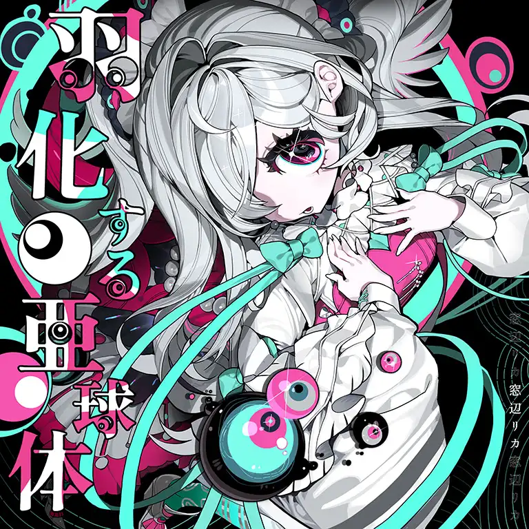 | ETR | [羽化する亜球体](<../pack/04_Memory Archive/羽化する亜球体.md>) | Memory Archive 6.11.6(25/12/31) |
| 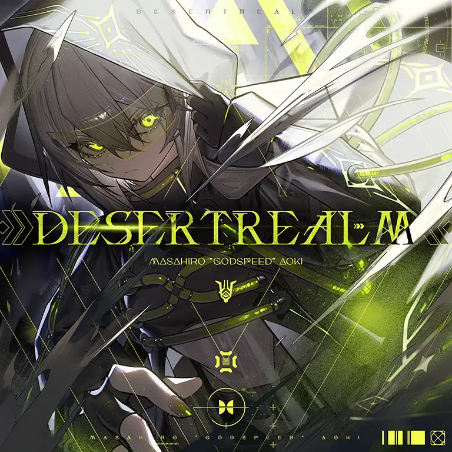 | FTR | [Desertrealm](<../pack/04_Memory Archive/Desertrealm.md>) | Memory Archive 6.13.0(26/03/09) |

