# 譜面定数 8+

## 8.7

| ジャケット | 難易 | 曲 | パック・初出 |
| :---: | :--- | :--- | :--- |
|  | FTR | [cry of viyella](<../pack/02_Eternal Core Pack/cry of viyella.md>) | Eternal Core Pack 1.0.5(17/03/09) |
|  | FTR | [Call My Name feat. Yukacco](<../pack/04_Memory Archive/Call My Name feat. Yukacco.md>) | Memory Archive 1.6.6(18/06/22) |
| 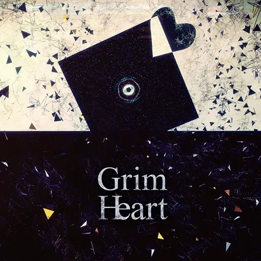 | FTR | [Grimheart](<../pack/01_Arcaea Pack/Grimheart.md>) | Arcaea Pack 2.0.0(19/03/21) |
| 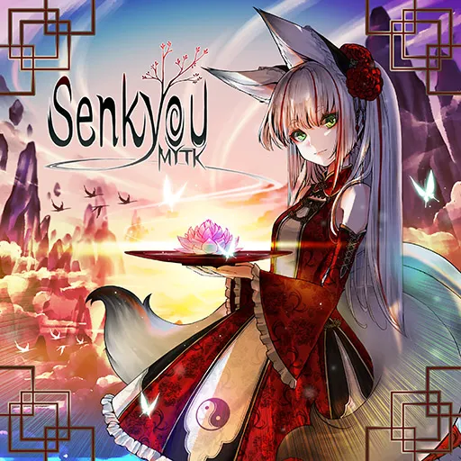 | FTR | [Senkyou](<../pack/01_Arcaea Pack/Senkyou.md>) | Arcaea Pack 2.4.5(19/11/18) |
|  | FTR | [Beside You](<../pack/19_Ephemeral Page Pack/Beside You.md>) | Ephemeral Page Pack 3.3.1(20/12/09) |
|  | FTR | [Paper Witch](<../pack/22_Esoteric Order Pack/Paper Witch.md>) | Esoteric Order Pack 3.6.0(21/05/11) |
|  | FTR | [Quon](<../pack/23_WACCA Collaboration Pack/Quon【WACCA】.md>) | WACCA Collaboration Pack 3.8.0(21/08/10) |
|  | PRS | [Arcana Eden](<../pack/26_Final Verdict Pack/Arcana Eden.md>) | Final Verdict Pack 4.0.0(22/07/07) |
|  | PRS | [Pentiment](<../pack/26_Final Verdict Pack/Pentiment.md>) | Final Verdict Pack 4.0.0(22/07/07) |
| 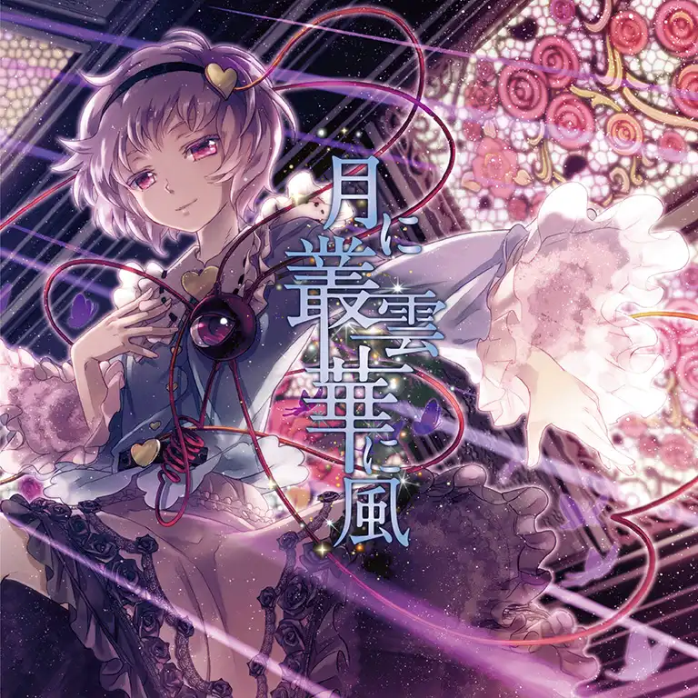 | FTR | [月に叢雲華に風](<../pack/27_Extend Archive 2－ Chronicles Pack/月に叢雲華に風.md>) | Extend Archive 2－ Chronicles Pack 4.2.0(23/01/26) |
|  | FTR | [WAIT FOR DAWN](<../pack/29_Lasting Eden Pack/WAIT FOR DAWN.md>) | Lasting Eden Pack 4.7.0(23/08/18) |
|  | FTR | [幻想のサテライト](<../pack/04_Memory Archive/幻想のサテライト.md>) | Memory Archive 5.10.4(24/09/26) |
| 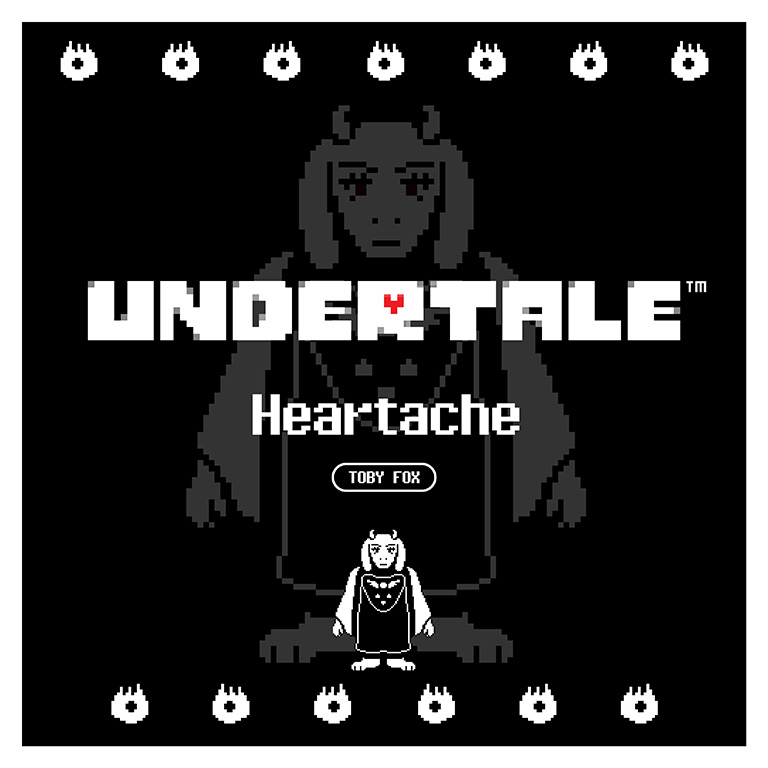 | ETR | [心の痛み](<../pack/34_UNDERTALE Collaboration Pack/心の痛み.md>) | UNDERTALE Collaboration Pack 6.3.0(25/03/09) |
|  | FTR | [U.A.D](<../pack/35_DJMAX Collaboration Pack/U.A.D.md>) | DJMAX Collaboration Pack 6.5.0(25/05/22) |
|  | PRS | [AlterGate](<../pack/36_Extant Anima Pack/AlterGate.md>) | Extant Anima Pack 6.8.0(25/08/21) |
|  | PRS | [Undying Macula](<../pack/37_Liminal Eclipse Pack/Undying Macula.md>) | Liminal Eclipse Pack 6.9.0(25/10/02) |
| 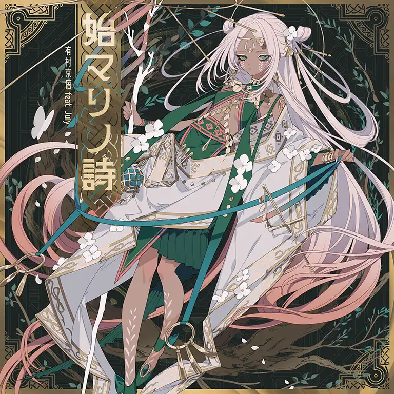 | ETR | [始マリノ詩](<../pack/38_World Extend 4－ Emanations Pack/始マリノ詩.md>) | World Extend 4－ Emanations Pack 6.10.0(25/10/30) |

## 8.8

| ジャケット | 難易 | 曲 | パック・初出 |
| :---: | :--- | :--- | :--- |
| 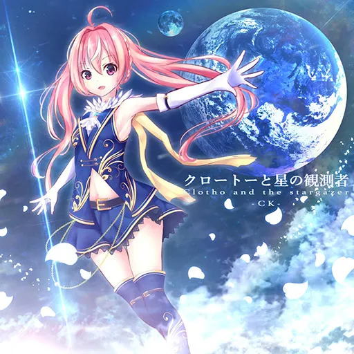 | ETR | [クロートーと星の観測者](<../pack/01_Arcaea Pack/クロートーと星の観測者.md>) | Arcaea Pack 1.1.2(17/06/23) |
| 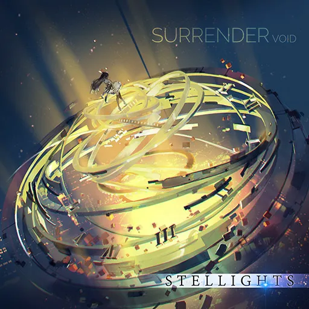 | FTR | [Surrender](<../pack/04_Memory Archive/Surrender.md>) | Memory Archive 1.5.2(17/11/24) |
|  | FTR | [next to you](<../pack/09_Binary Enfold Pack/next to you.md>) | Binary Enfold Pack 1.6.0(18/03/23) |
| 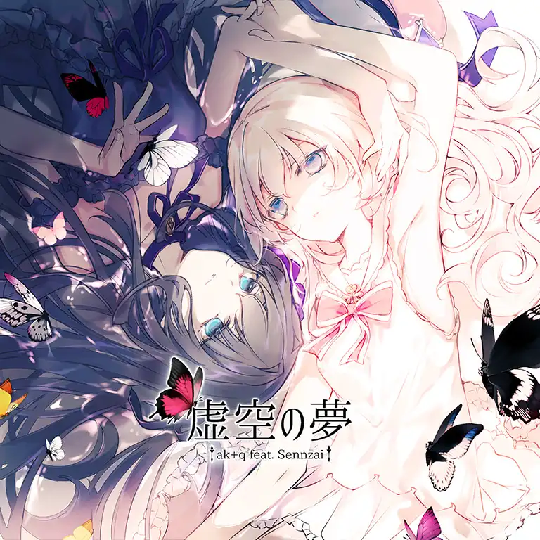 | FTR | [虚空の夢](<../pack/02_Eternal Core Pack/虚空の夢.md>) | Eternal Core Pack 1.9.2(19/03/09) |
|  | FTR | [Antithese](<../pack/13_Absolute Reason Pack/Antithese.md>) | Absolute Reason Pack 2.0.0(19/03/21) |
|  | FTR | [Particle Arts](<../pack/15_Adverse Prelude Pack/Particle Arts.md>) | Adverse Prelude Pack 2.2.0(19/07/18) |
|  | FTR | [Vivid Theory](<../pack/17_Extend Archive 1－ Visions Pack/Vivid Theory.md>) | Extend Archive 1－ Visions Pack 3.0.0(20/05/27) |
| 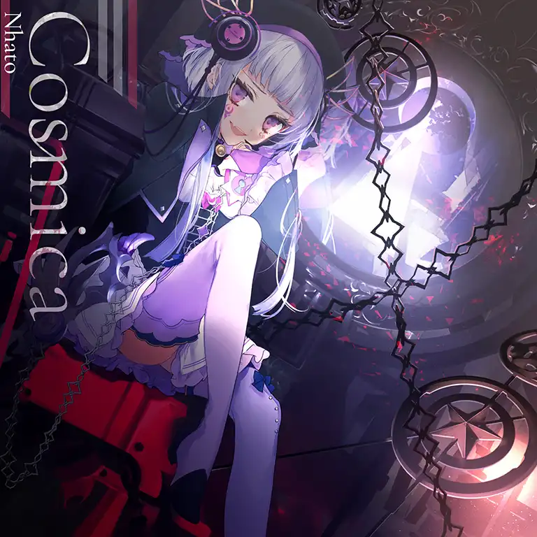 | FTR | [Cosmica](<../pack/09_Binary Enfold Pack/Cosmica.md>) | Binary Enfold Pack 3.9.0(21/11/11) |
|  | FTR | [だいあるのーと](<../pack/01_Arcaea Pack/だいあるのーと.md>) | Arcaea Pack 4.1.6(22/12/22) |
|  | PRS | [NULL APOPHENIA](<../pack/04_Memory Archive/NULL APOPHENIA.md>) | Memory Archive 4.2.0(23/01/26) |
| 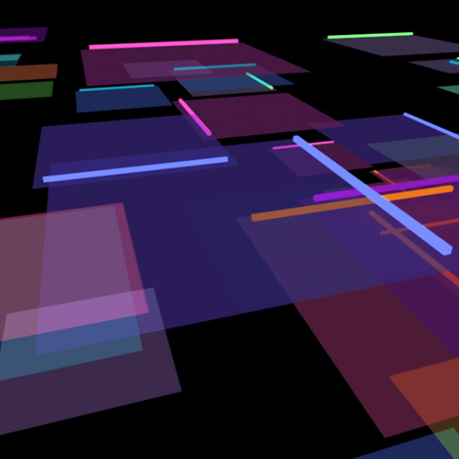 | FTR | [CYCLES](<../pack/21_maimai Collaboration Pack/CYCLES.md>) | maimai Collaboration Pack 4.3.0(23/03/02) |
|  | PRS | [PRIMITIVE LIGHTS](<../pack/04_Memory Archive/PRIMITIVE LIGHTS.md>) | Memory Archive 4.3.2(23/03/09) |
| 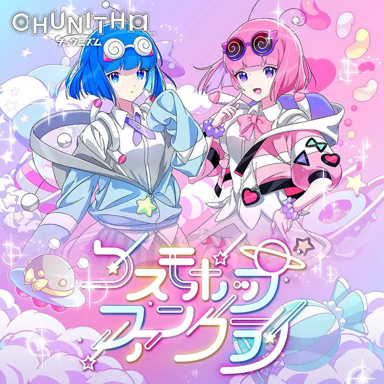 | FTR | [コスモポップファンクラブ](<../pack/14_CHUNITHM Collaboration Pack/コスモポップファンクラブ.md>) | CHUNITHM Collaboration Pack 4.4.0(23/03/23) |
|  | PRS | [Aleph-0](<../pack/27_Extend Archive 2－ Chronicles Pack/Aleph-0.md>) | Extend Archive 2－ Chronicles Pack 5.4.0(24/03/08) |
| 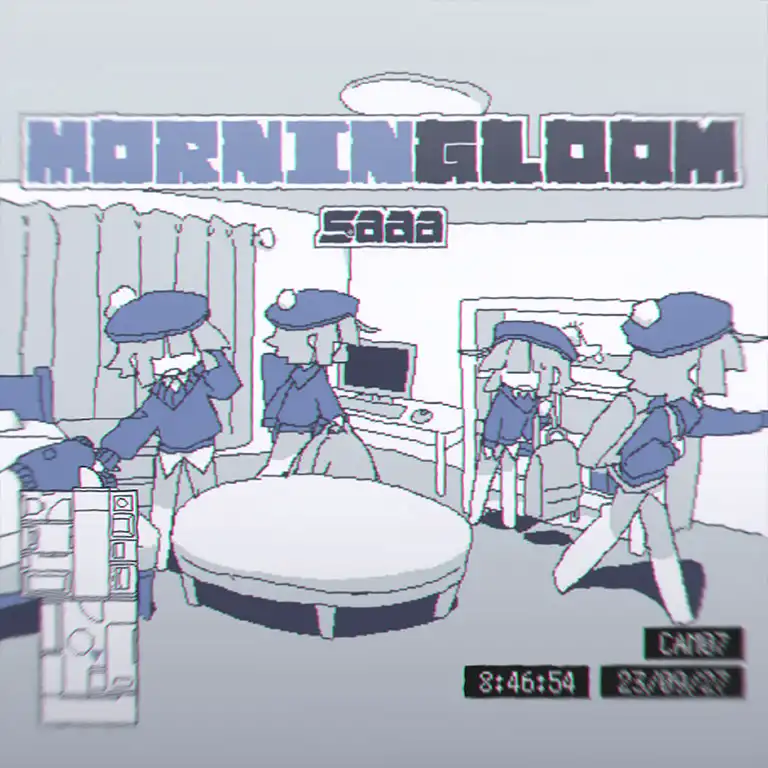 | FTR | [MORNINGLOOM](<../pack/30_Extend Archive 3－ Illusions Pack/MORNINGLOOM.md>) | Extend Archive 3－ Illusions Pack 5.5.0(24/03/25) |
| 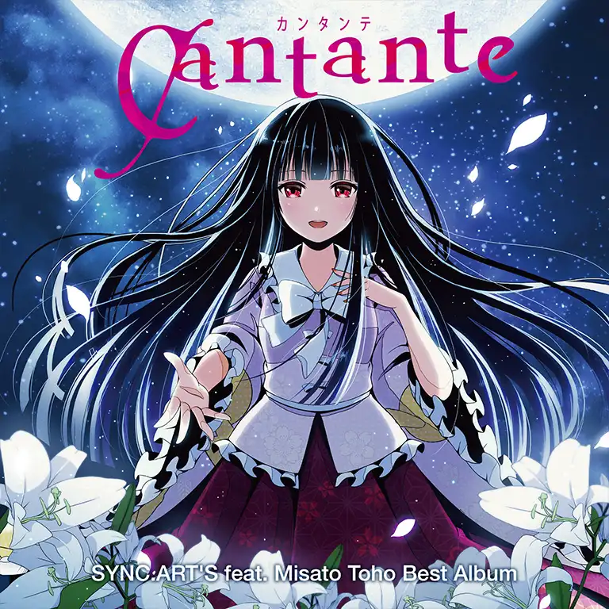 | ETR | [エピクロスの虹はもう見えない](<../pack/01_Arcaea Pack/エピクロスの虹はもう見えない.md>) | Arcaea Pack 5.7.0(24/05/30) |
|  | FTR | [Waltz for Lorelei](<../pack/32_Rotaeno Collaboration Pack/Waltz for Lorelei.md>) | Rotaeno Collaboration Pack 5.10.0(24/08/29) |
|  | FTR | [Saint or Sinner](<../pack/15_Adverse Prelude Pack/Saint or Sinner.md>) | Adverse Prelude Pack 5.10.4(24/09/26) |
|  | FTR | [Crimson Quartz](<../pack/04_Memory Archive/Crimson Quartz.md>) | Memory Archive 5.10.6(24/10/24) |
|  | PRS | [Lament Rain](<../pack/33_Lucent Historia Pack/Lament Rain.md>) | Lucent Historia Pack 6.0.0(24/11/21) |
|  | FTR | [BREaK! BREaK! BREaK!](<../pack/21_maimai Collaboration Pack/BREaK! BREaK! BREaK!.md>) | maimai Collaboration Pack 6.2.0(25/01/23) |
| 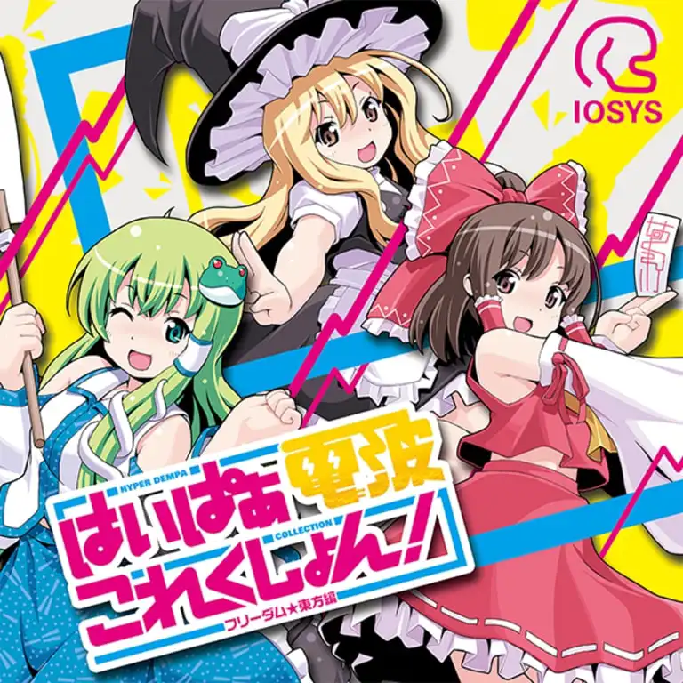 | FTR | [進捗どうですか?](<../pack/04_Memory Archive/進捗どうですか－.md>) | Memory Archive 6.3.2(25/03/27) |
|  | FTR | [Tic! Tac! Toe!](<../pack/04_Memory Archive/Tic! Tac! Toe!.md>) | Memory Archive 6.5.0(25/05/22) |
|  | PRS | [多次元宇宙融合論](<../pack/36_Extant Anima Pack/多次元宇宙融合論.md>) | Extant Anima Pack 6.7.0(25/07/24) |
|  | FTR | [incomplete the one](<../pack/36_Extant Anima Pack/incomplete the one.md>) | Extant Anima Pack 6.8.0(25/08/21) |
|  | FTR | [Paradox Palette](<../pack/38_World Extend 4－ Emanations Pack/Paradox Palette.md>) | World Extend 4－ Emanations Pack 6.10.0(25/10/30) |
|  | FTR | [My life is mine alone!](<../pack/40_MEGAREX Collaboration Pack/My life is mine alone!.md>) | MEGAREX Collaboration Pack 6.12.0(26/01/29) |

## 8.9

| ジャケット | 難易 | 曲 | パック・初出 |
| :---: | :--- | :--- | :--- |
| 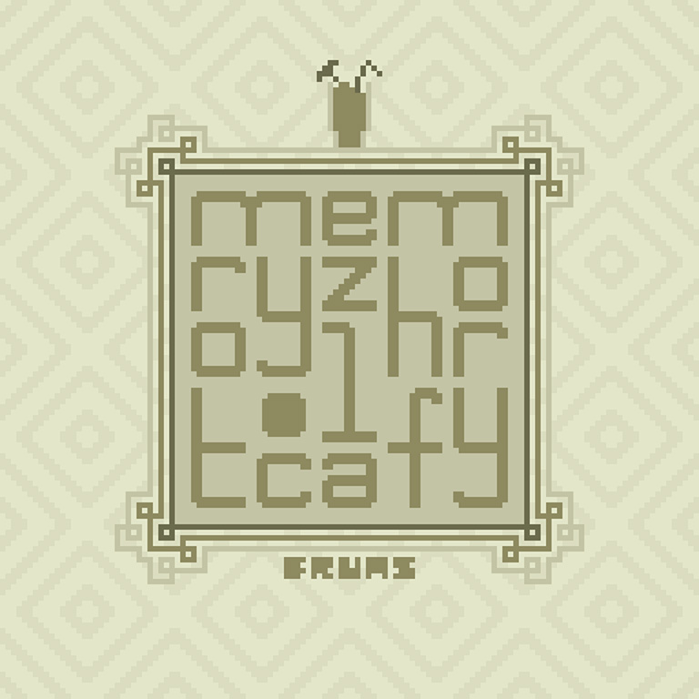 | FTR | [memoryfactory.lzh](<../pack/02_Eternal Core Pack/memoryfactory.lzh.md>) | Eternal Core Pack 1.0.5(17/03/09) |
| 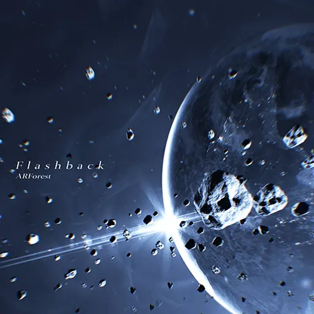 | FTR | [Flashback](<../pack/03_Crimson Solace Pack/Flashback.md>) | Crimson Solace Pack 1.0.11(17/05/11) |
| 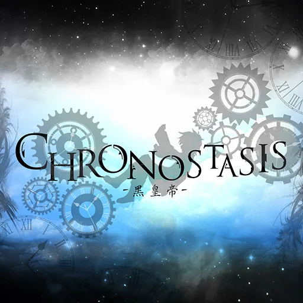 | FTR | [Chronostasis](<../pack/01_Arcaea Pack/Chronostasis.md>) | Arcaea Pack 1.1.0(17/06/02) |
|  | FTR | [Evoltex (poppi'n mix)](<../pack/05_Dynamix Collaboration Pack/Evoltex (poppi'n mix).md>) | Dynamix Collaboration Pack 1.1.2(17/06/23) |
| 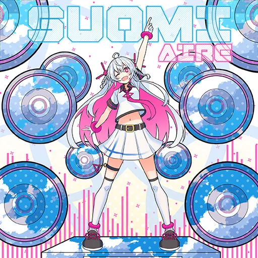 | ETR | [Suomi](<../pack/01_Arcaea Pack/Suomi.md>) | Arcaea Pack 1.7.0(18/07/16) |
| 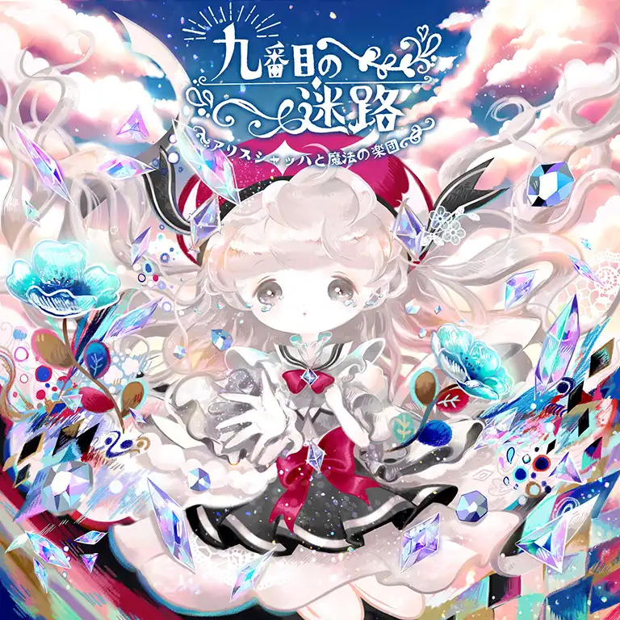 | FTR | [九番目の迷路](<../pack/10_Luminous Sky Pack/九番目の迷路.md>) | Luminous Sky Pack 1.7.0(18/07/16) |
|  | FTR | [MERLIN](<../pack/12_Groove Coaster Collaboration Pack/MERLIN.md>) | Groove Coaster Collaboration Pack 1.9.0(19/01/09) |
| 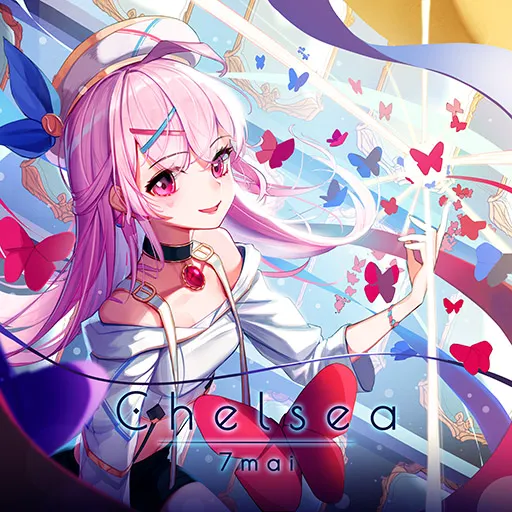 | FTR | [Chelsea](<../pack/16_Sunset Radiance Pack/Chelsea.md>) | Sunset Radiance Pack 2.3.0(19/08/22) |
|  | FTR | [Give Me a Nightmare](<../pack/17_Extend Archive 1－ Visions Pack/Give Me a Nightmare.md>) | Extend Archive 1－ Visions Pack 3.0.0(20/05/27) |
|  | PRS | [烈華RESONANCE](<../pack/04_Memory Archive/烈華RESONANCE.md>) | Memory Archive 3.6.4(21/06/30) |
|  | PRS | [GENOCIDER](<../pack/23_WACCA Collaboration Pack/GENOCIDER.md>) | WACCA Collaboration Pack 3.8.0(21/08/10) |
|  | FTR | [Lights of Muse](<../pack/25_Muse Dash Collaboration Pack/Lights of Muse.md>) | Muse Dash Collaboration Pack 3.11.0(21/12/24) |
|  | PRS | [Chronicle](<../pack/27_Extend Archive 2－ Chronicles Pack/Chronicle.md>) | Extend Archive 2－ Chronicles Pack 4.2.0(23/01/26) |
|  | PRS | [To the Milky Way](<../pack/04_Memory Archive/To the Milky Way.md>) | Memory Archive 4.4.6(23/05/25) |
|  | PRS | [Lucid Traveler](<../pack/28_Cytus II Collaboration Pack/Lucid Traveler.md>) | Cytus II Collaboration Pack 4.5.0(23/06/28) |
|  | PRS | [͟͝͞Ⅱ́̕](<../pack/28_Cytus II Collaboration Pack/Ⅱ.md>) | Cytus II Collaboration Pack 4.6.0(23/07/19) |
|  | PRS | [Abstruse Dilemma](<../pack/29_Lasting Eden Pack/Abstruse Dilemma.md>) | Lasting Eden Pack 4.7.0(23/08/18) |
|  | PRS | [TeraVolt](<../pack/29_Lasting Eden Pack/TeraVolt.md>) | Lasting Eden Pack 5.1.0(23/10/26) |
| 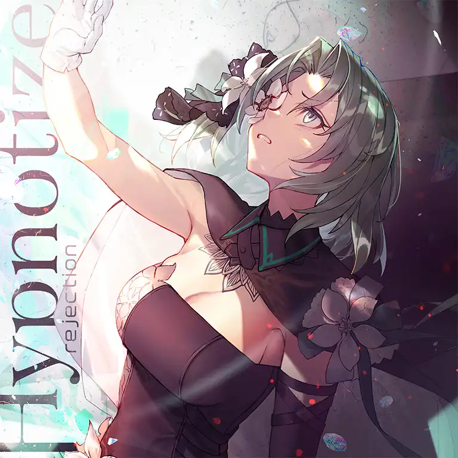 | FTR | [Hypnotize](<../pack/31_Absolute Nihil Pack/Hypnotize.md>) | Absolute Nihil Pack 5.9.0(24/07/30) |
|  | FTR | [Dual Doom Deathmatch](<../pack/32_Rotaeno Collaboration Pack/Dual Doom Deathmatch.md>) | Rotaeno Collaboration Pack 5.10.0(24/08/29) |
|  | FTR | [BlazinG AIR](<../pack/14_CHUNITHM Collaboration Pack/BlazinG AIR.md>) | CHUNITHM Collaboration Pack 6.1.0(24/12/19) |
|  | PRS | [Aether Crest: Astral](<../pack/14_CHUNITHM Collaboration Pack/Aether Crest： Astral.md>) | CHUNITHM Collaboration Pack 6.2.6(25/02/26) |
|  | FTR | [最高の悪夢](<../pack/34_UNDERTALE Collaboration Pack/最高の悪夢.md>) | UNDERTALE Collaboration Pack 6.3.0(25/03/09) |
|  | FTR | [No Way Back](<../pack/37_Liminal Eclipse Pack/No Way Back.md>) | Liminal Eclipse Pack 6.9.0(25/10/02) |
|  | FTR | [INCARNATOR₀₀](<../pack/39_Arcaea Next Stage Pack/INCARNATOR₀₀.md>) | Arcaea Next Stage Pack 6.10.8(25/11/22) |

