# 譜面定数 8

## 8.0

| ジャケット | 難易 | 曲 | パック・初出 |
| :---: | :--- | :--- | :--- |
| 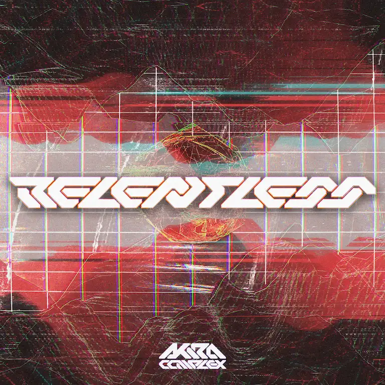 | FTR | [Relentless](<../pack/02_Eternal Core Pack/Relentless.md>) | Eternal Core Pack 1.0.5(17/03/09) |
|  | PRS | [γuarδina](<../pack/04_Memory Archive/γuarδina.md>) | Memory Archive 1.6.2(18/04/29) |
| 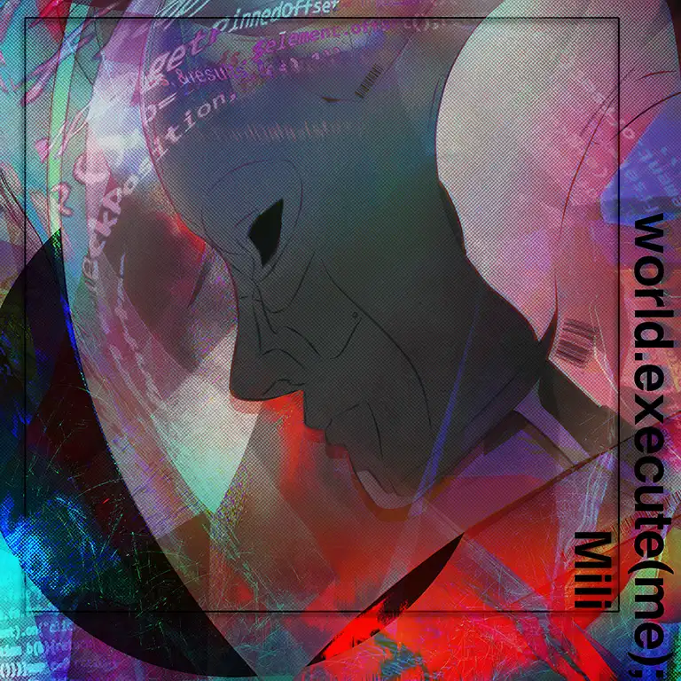 | FTR | [world.execute(me);](<../pack/01_Arcaea Pack/world.execute(me);.md>) | Arcaea Pack 2.5.2(20/02/21) |
| 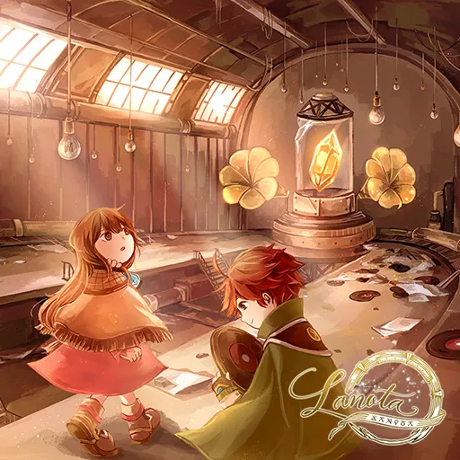 | FTR | [Prism](<../pack/08_Lanota Collaboration Pack/Prism.md>) | Lanota Collaboration Pack 3.12.8(22/04/28) |
|  | PRS | [Crimson Throne](<../pack/04_Memory Archive/Crimson Throne.md>) | Memory Archive 4.3.0(23/03/02) |
|  | PRS | [Désive](<../pack/04_Memory Archive/Désive.md>) | Memory Archive 5.6.0(24/04/26) |
|  | PRS | [Black MInD](<../pack/12_Groove Coaster Collaboration Pack/Black MInD.md>) | Groove Coaster Collaboration Pack 5.8.0(24/06/27) |
| 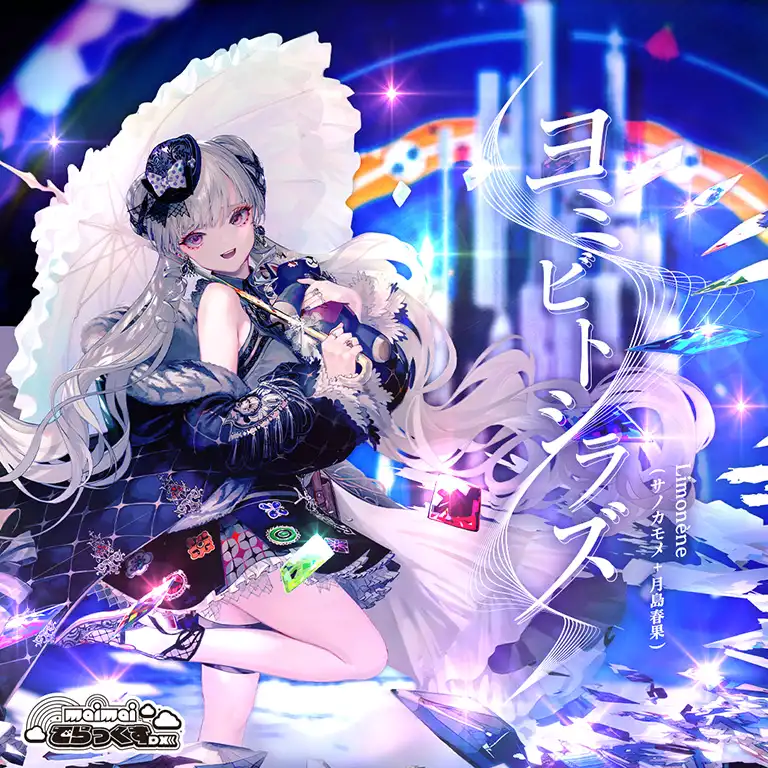 | PRS | [ヨミビトシラズ](<../pack/21_maimai Collaboration Pack/ヨミビトシラズ.md>) | maimai Collaboration Pack 6.2.0(25/01/23) |
|  | PRS | [Dull Blade](<../pack/04_Memory Archive/Dull Blade.md>) | Memory Archive 6.4.0(25/04/24) |
|  | PRS | [We're All Gonna Die](<../pack/35_DJMAX Collaboration Pack/We're All Gonna Die.md>) | DJMAX Collaboration Pack 6.6.0(25/06/26) |
| 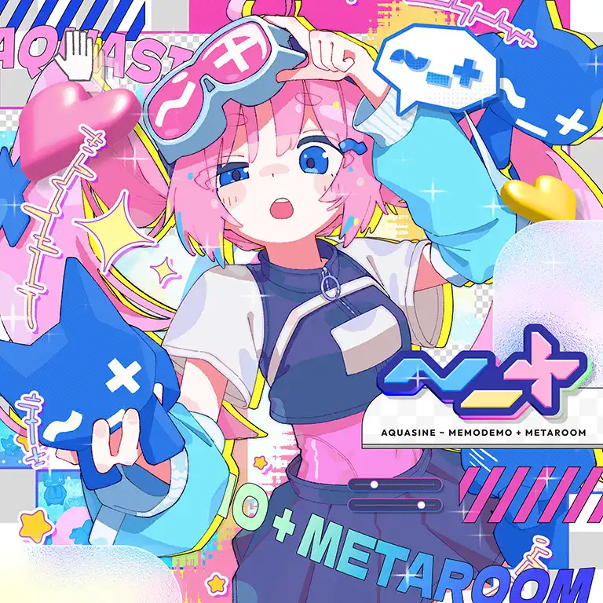 | PRS | [~_+](<../pack/38_World Extend 4－ Emanations Pack/~_+.md>) | World Extend 4－ Emanations Pack 6.11.2(25/12/24) |

## 8.1

| ジャケット | 難易 | 曲 | パック・初出 |
| :---: | :--- | :--- | :--- |
|  | FTR | [I've heard it said](<../pack/02_Eternal Core Pack/I've heard it said.md>) | Eternal Core Pack 1.0.5(17/03/09) |
| 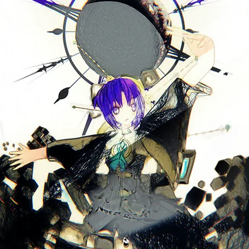 | FTR | [光](<../pack/11_Tone Sphere Collaboration Pack/光.md>) | Tone Sphere Collaboration Pack 1.8.0(18/10/07) |
| 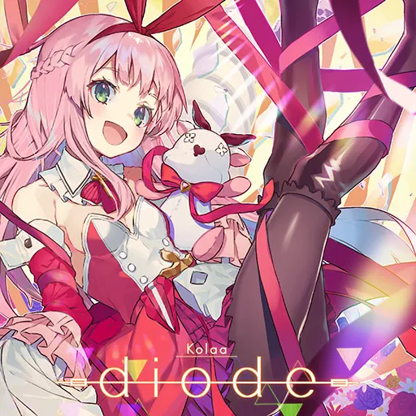 | FTR | [Diode](<../pack/01_Arcaea Pack/Diode.md>) | Arcaea Pack 2.4.0(19/10/08) |
|  | PRS | [G e n g a o z o](<../pack/17_Extend Archive 1－ Visions Pack/G e n g a o z o.md>) | Extend Archive 1－ Visions Pack 3.8.6(21/09/29) |
|  | FTR | [Bullet Waiting for Me(James Landino remix)](<../pack/28_Cytus II Collaboration Pack/Bullet Waiting for Me (James Landino remix).md>) | Cytus II Collaboration Pack 4.5.0(23/06/28) |
|  | PRS | [Rise of the World](<../pack/29_Lasting Eden Pack/Rise of the World.md>) | Lasting Eden Pack 4.7.0(23/08/18) |
|  | PRS | [UNKNOWN LEVELS](<../pack/29_Lasting Eden Pack/UNKNOWN LEVELS.md>) | Lasting Eden Pack 4.7.0(23/08/18) |
|  | PRS | [Astral Quantization](<../pack/33_Lucent Historia Pack/Astral Quantization.md>) | Lucent Historia Pack 6.0.0(24/11/21) |
|  | PRS | [羽化する亜球体](<../pack/04_Memory Archive/羽化する亜球体.md>) | Memory Archive 6.11.6(25/12/31) |
|  | FTR | [キャラメルポップコーンたべたいよ～](<../pack/01_Arcaea Pack/キャラメルポップコーンたべたいよ～.md>) | Arcaea Pack 6.12.10(26/02/19) |
|  | PRS | [3rd Avenue](<../pack/38_World Extend 4－ Emanations Pack/3rd Avenue.md>) | World Extend 4－ Emanations Pack 6.13.0(26/03/09) |

## 8.2

| ジャケット | 難易 | 曲 | パック・初出 |
| :---: | :--- | :--- | :--- |
|  | FTR | [Lucifer](<../pack/01_Arcaea Pack/Lucifer.md>) | Arcaea Pack 1.0.5(17/03/09) |
| 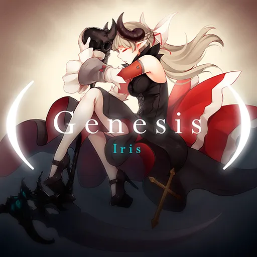 | FTR | [Genesis](<../pack/06_Ambivalent Vision Pack/Genesis.md>) | Ambivalent Vision Pack 1.1.4(17/08/10) |
|  | FTR | [One Last Drive](<../pack/01_Arcaea Pack/One Last Drive.md>) | Arcaea Pack 1.5.0(17/11/03) |
|  | PRS | [Halcyon](<../pack/10_Luminous Sky Pack/Halcyon.md>) | Luminous Sky Pack 1.7.0(18/07/16) |
|  | FTR | [Hall of Mirrors](<../pack/11_Tone Sphere Collaboration Pack/Hall of Mirrors.md>) | Tone Sphere Collaboration Pack 1.8.0(18/10/07) |
| 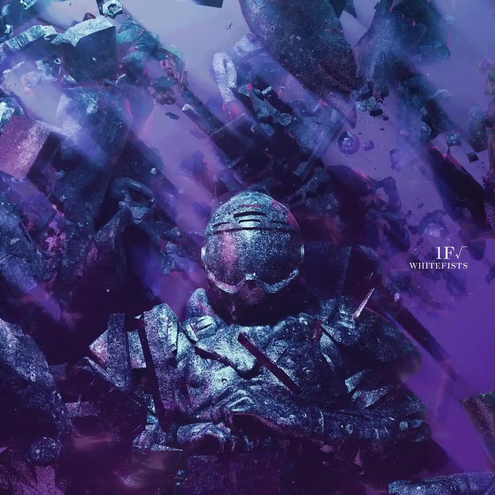 | FTR | [1F√](<../pack/17_Extend Archive 1－ Visions Pack/1F√.md>) | Extend Archive 1－ Visions Pack 3.0.0(20/05/27) |
|  | PRS | [Dantalion](<../pack/18_Black Fate Pack/Dantalion.md>) | Black Fate Pack 3.0.0(20/05/27) |
|  | FTR | [blue comet](<../pack/17_Extend Archive 1－ Visions Pack/blue comet.md>) | Extend Archive 1－ Visions Pack 3.8.2(21/08/24) |
|  | PRS | [TEmPTaTiON](<../pack/21_maimai Collaboration Pack/TEmPTaTiON.md>) | maimai Collaboration Pack 4.3.0(23/03/02) |
|  | PRS | [eden](<../pack/23_WACCA Collaboration Pack/eden.md>) | WACCA Collaboration Pack 5.2.0(23/11/30) |
|  | PRS | [Qovat](<../pack/04_Memory Archive/Qovat.md>) | Memory Archive 5.4.0(24/03/08) |
|  | FTR | [プレヤ](<../pack/30_Extend Archive 3－ Illusions Pack/プレヤ.md>) | Extend Archive 3－ Illusions Pack 5.10.6(24/10/24) |
| 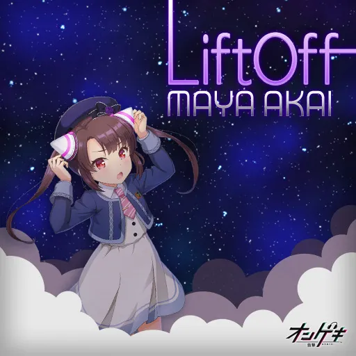 | FTR | [LiftOff](<../pack/20_O.N.G.E.K.I. Collaboration Pack/LiftOff.md>) | O.N.G.E.K.I. Collaboration Pack 6.0.0(24/11/21) |
| 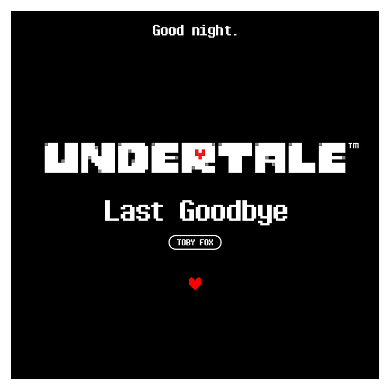 | FTR | [これでホントにサヨナラ](<../pack/34_UNDERTALE Collaboration Pack/これでホントにサヨナラ.md>) | UNDERTALE Collaboration Pack 6.3.0(25/03/09) |
| 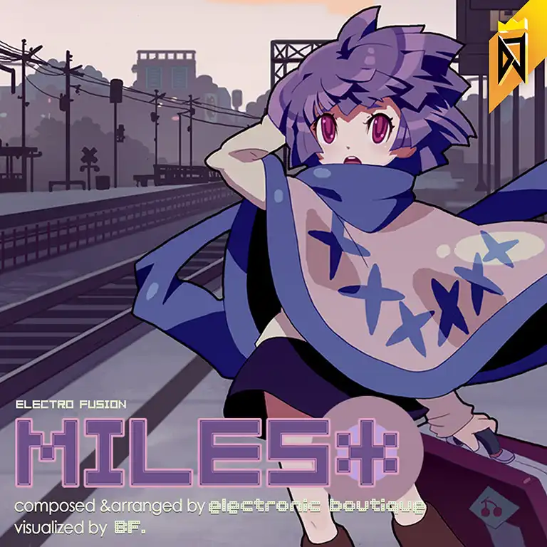 | FTR | [Miles](<../pack/04_Memory Archive/Miles.md>) | Memory Archive 6.6.0(25/06/26) |
|  | PRS | [ROST PAGE GENE](<../pack/30_Extend Archive 3－ Illusions Pack/ROST PAGE GENE.md>) | Extend Archive 3－ Illusions Pack 6.9.0(25/10/02) |

## 8.3

| ジャケット | 難易 | 曲 | パック・初出 |
| :---: | :--- | :--- | :--- |
|  | FTR | [Bookmaker (2D Version)](<../pack/01_Arcaea Pack/Bookmaker (2D Version).md>) | Arcaea Pack 1.7.0(18/07/16) |
|  | PRS | [Ether Strike](<../pack/10_Luminous Sky Pack/Ether Strike.md>) | Luminous Sky Pack 1.7.0(18/07/16) |
|  | FTR | [Dot to Dot feat. shully](<../pack/04_Memory Archive/Dot to Dot feat. shully.md>) | Memory Archive 2.0.3(19/05/02) |
|  | FTR | [Tie me down gently](<../pack/16_Sunset Radiance Pack/Tie me down gently.md>) | Sunset Radiance Pack 2.3.0(19/08/22) |
|  | PRS | [IZANA](<../pack/04_Memory Archive/IZANA.md>) | Memory Archive 2.5.0(20/01/21) |
| 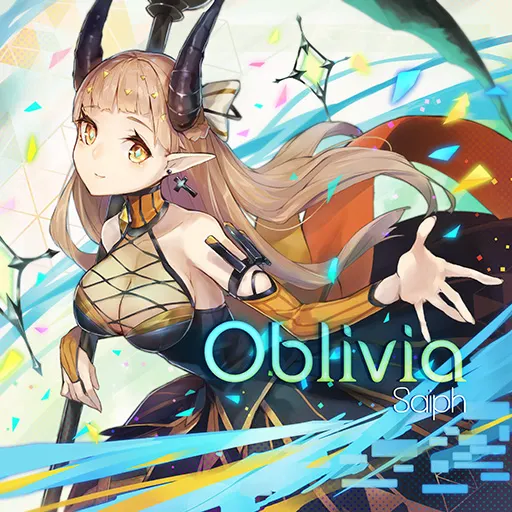 | FTR | [Oblivia](<../pack/01_Arcaea Pack/Oblivia.md>) | Arcaea Pack 2.6.0(20/03/25) |
|  | PRS | [AttraqtiA](<../pack/04_Memory Archive/AttraqtiA.md>) | Memory Archive 3.5.0(21/01/21) |
|  | FTR | [Ävril -Flicka i krans-](<../pack/01_Arcaea Pack/Ävril -Flicka i krans-.md>) | Arcaea Pack 3.12.0(22/02/17) |
|  | FTR | [san skia](<../pack/01_Arcaea Pack/san skia.md>) | Arcaea Pack 3.12.10(22/05/25) |
|  | PRS | [MIRINAE](<../pack/04_Memory Archive/MIRINAE.md>) | Memory Archive 5.5.0(24/03/25) |
|  | PRS | [プラシイボ♥バトラー](<../pack/04_Memory Archive/プラシイボ♥バトラー.md>) | Memory Archive 6.3.0(25/03/09) |
|  | FTR | [I want You](<../pack/35_DJMAX Collaboration Pack/I want You.md>) | DJMAX Collaboration Pack 6.6.0(25/06/26) |
| 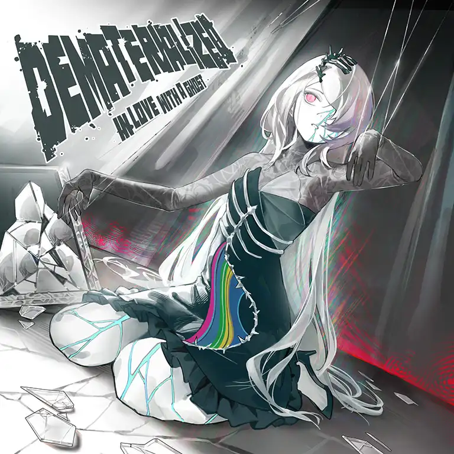 | ETR | [Dematerialized](<../pack/01_Arcaea Pack/Dematerialized.md>) | Arcaea Pack 6.7.0(25/07/24) |
| 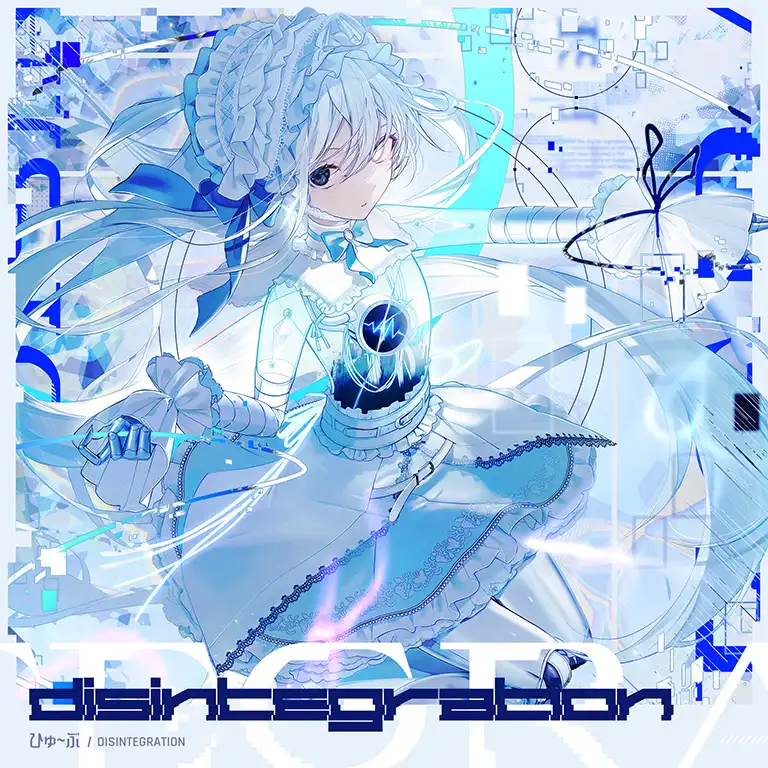 | FTR | [disintegration](<../pack/30_Extend Archive 3－ Illusions Pack/disintegration.md>) | Extend Archive 3－ Illusions Pack 6.8.0(25/08/21) |
|  | PRS | [Xterfusion](<../pack/04_Memory Archive/Xterfusion.md>) | Memory Archive 6.10.0(25/10/30) |
|  | PRS | [Code: Oblivion](<../pack/39_Arcaea Next Stage Pack/Code： Oblivion.md>) | Arcaea Next Stage Pack 6.10.8(25/11/22) |

## 8.4

| ジャケット | 難易 | 曲 | パック・初出 |
| :---: | :--- | :--- | :--- |
|  | FTR | [Lumia](<../pack/02_Eternal Core Pack/Lumia.md>) | Eternal Core Pack 1.0.5(17/03/09) |
|  | FTR | [Snow White](<../pack/01_Arcaea Pack/Snow White.md>) | Arcaea Pack 1.0.5(17/03/09) |
| 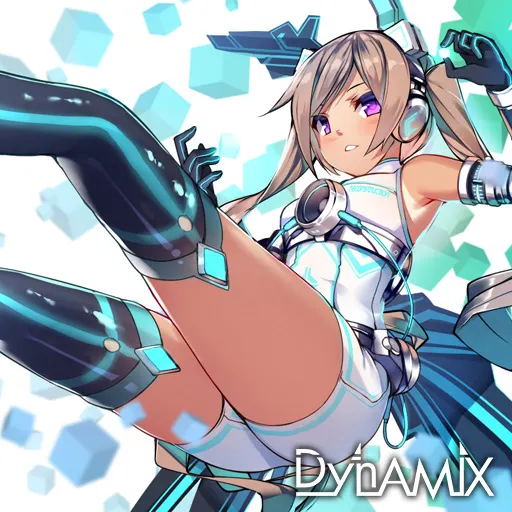 | FTR | [REconstruction](<../pack/05_Dynamix Collaboration Pack/REconstruction.md>) | Dynamix Collaboration Pack 1.1.2(17/06/23) |
| 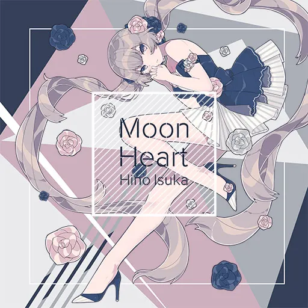 | FTR | [Moonheart](<../pack/06_Ambivalent Vision Pack/Moonheart.md>) | Ambivalent Vision Pack 1.1.4(17/08/10) |
|  | FTR | [Rabbit In The Black Room](<../pack/01_Arcaea Pack/Rabbit In The Black Room.md>) | Arcaea Pack 1.1.6(17/09/25) |
|  | FTR | [Purgatorium](<../pack/01_Arcaea Pack/Purgatorium.md>) | Arcaea Pack 1.7.5(18/09/17) |
|  | PRS | [Cyaegha](<../pack/13_Absolute Reason Pack/Cyaegha.md>) | Absolute Reason Pack 2.0.0(19/03/21) |
|  | PRS | [Ringed Genesis](<../pack/15_Adverse Prelude Pack/Ringed Genesis.md>) | Adverse Prelude Pack 2.2.0(19/07/18) |
|  | FTR | [Eccentric Tale](<../pack/19_Ephemeral Page Pack/Eccentric Tale.md>) | Ephemeral Page Pack 3.3.0(20/12/03) |
|  | FTR | [フレテミタイ](<../pack/30_Extend Archive 3－ Illusions Pack/フレテミタイ.md>) | Extend Archive 3－ Illusions Pack 5.10.4(24/09/26) |
|  | PRS | [Breach of Faith](<../pack/33_Lucent Historia Pack/Breach of Faith.md>) | Lucent Historia Pack 6.0.0(24/11/21) |
|  | PRS | [DA'AT -The First Seeker of Souls-](<../pack/14_CHUNITHM Collaboration Pack/DA'AT -The First Seeker of Souls-.md>) | CHUNITHM Collaboration Pack 6.1.0(24/12/19) |
|  | PRS | [MEGALOVANIA(Camellia Remix)](<../pack/04_Memory Archive/MEGALOVANIA (Camellia Remix).md>) | Memory Archive 6.3.0(25/03/09) |
|  | FTR | [Ladymade Star](<../pack/35_DJMAX Collaboration Pack/Ladymade Star.md>) | DJMAX Collaboration Pack 6.5.0(25/05/22) |
|  | PRS | [Lilly](<../pack/36_Extant Anima Pack/Lilly.md>) | Extant Anima Pack 6.7.0(25/07/24) |
| 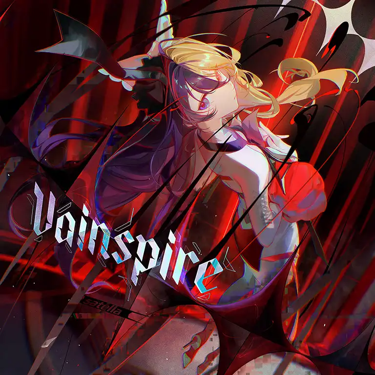 | FTR | [Vainspire](<../pack/37_Liminal Eclipse Pack/Vainspire.md>) | Liminal Eclipse Pack 6.9.0(25/10/02) |
|  | FTR | [taboo tears you up 2017](<../pack/38_World Extend 4－ Emanations Pack/taboo tears you up 2017.md>) | World Extend 4－ Emanations Pack 6.11.0(25/11/27) |
|  | PRS | [Grandspell](<../pack/04_Memory Archive/Grandspell.md>) | Memory Archive 6.11.0(25/11/27) |

## 8.5

| ジャケット | 難易 | 曲 | パック・初出 |
| :---: | :--- | :--- | :--- |
|  | ETR | [Sayonara Hatsukoi](<../pack/01_Arcaea Pack/Sayonara Hatsukoi.md>) | Arcaea Pack 1.0.5(17/03/09) |
| 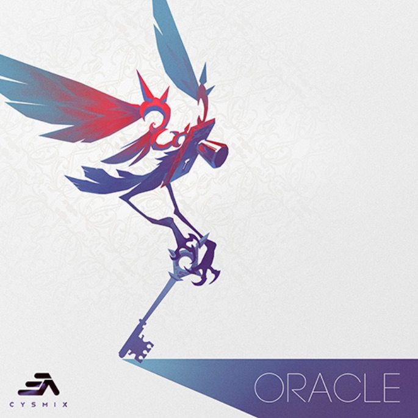 | FTR | [Babaroque](<../pack/01_Arcaea Pack/Babaroque.md>) | Arcaea Pack 1.0.5(17/03/09) |
| 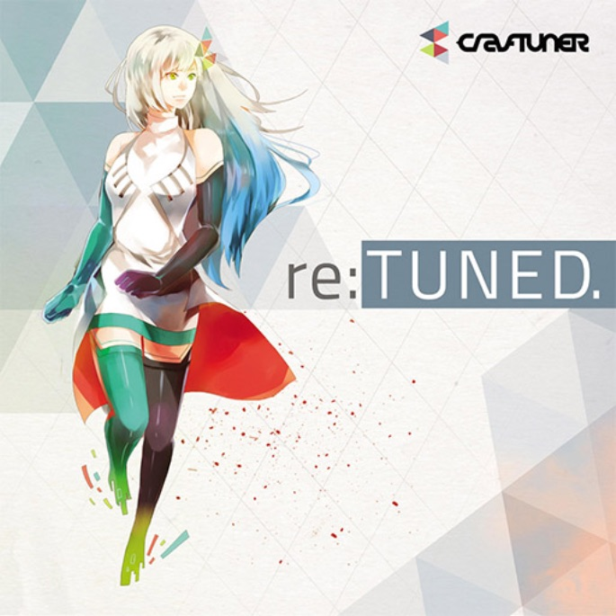 | FTR | [Dandelion](<../pack/01_Arcaea Pack/Dandelion.md>) | Arcaea Pack 1.0.9(17/03/20) |
|  | FTR | [ハルトピア ~Utopia of Spring~](<../pack/01_Arcaea Pack/ハルトピア ~Utopia of Spring~.md>) | Arcaea Pack 1.1.4(17/08/10) |
|  | PRS | [Axium Crisis](<../pack/07_Vicious Labyrinth Pack/Axium Crisis.md>) | Vicious Labyrinth Pack 1.5.0(17/11/03) |
| 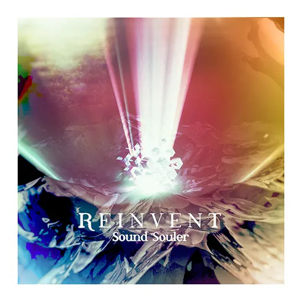 | FTR | [Reinvent](<../pack/01_Arcaea Pack/Reinvent.md>) | Arcaea Pack 1.5.3(17/12/21) |
|  | PRS | [業 -善なる神とこの世の悪について-](<../pack/14_CHUNITHM Collaboration Pack/業 -善なる神とこの世の悪について-.md>) | CHUNITHM Collaboration Pack 3.5.0(21/01/21) |
|  | PRS | [Overwhelm](<../pack/22_Esoteric Order Pack/Overwhelm.md>) | Esoteric Order Pack 3.6.0(21/05/11) |
|  | PRS | [Live Fast Die Young](<../pack/09_Binary Enfold Pack/Live Fast Die Young.md>) | Binary Enfold Pack 3.9.0(21/11/11) |
| 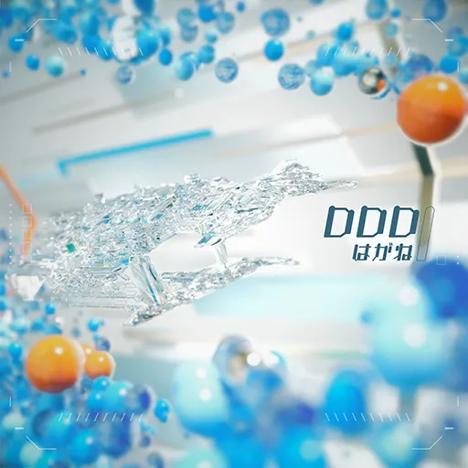 | FTR | [DDD](<../pack/01_Arcaea Pack/DDD.md>) | Arcaea Pack 3.12.4(22/03/23) |
|  | PRS | [Aurgelmir](<../pack/04_Memory Archive/Aurgelmir.md>) | Memory Archive 3.12.4(22/03/23) |
|  | FTR | [Altair (feat. *spiLa*)](<../pack/01_Arcaea Pack/Altair (feat. －spiLa－).md>) | Arcaea Pack 4.0.0(22/07/07) |
| 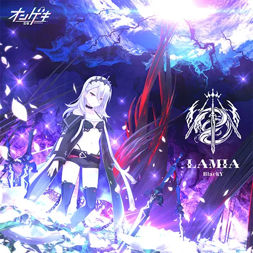 | PRS | [LAMIA](<../pack/20_O.N.G.E.K.I. Collaboration Pack/LAMIA.md>) | O.N.G.E.K.I. Collaboration Pack 4.1.0(22/10/04) |
| 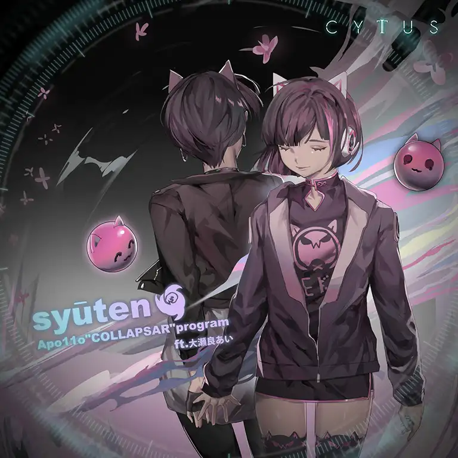 | FTR | [syūten](<../pack/28_Cytus II Collaboration Pack/syūten.md>) | Cytus II Collaboration Pack 4.6.0(23/07/19) |
| 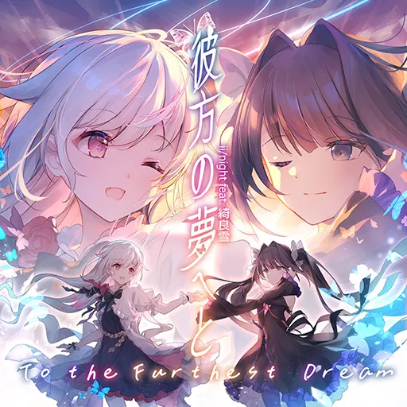 | PRS | [彼方の夢へと](<../pack/04_Memory Archive/彼方の夢へと.md>) | Memory Archive 4.7.2(23/09/14) |
| 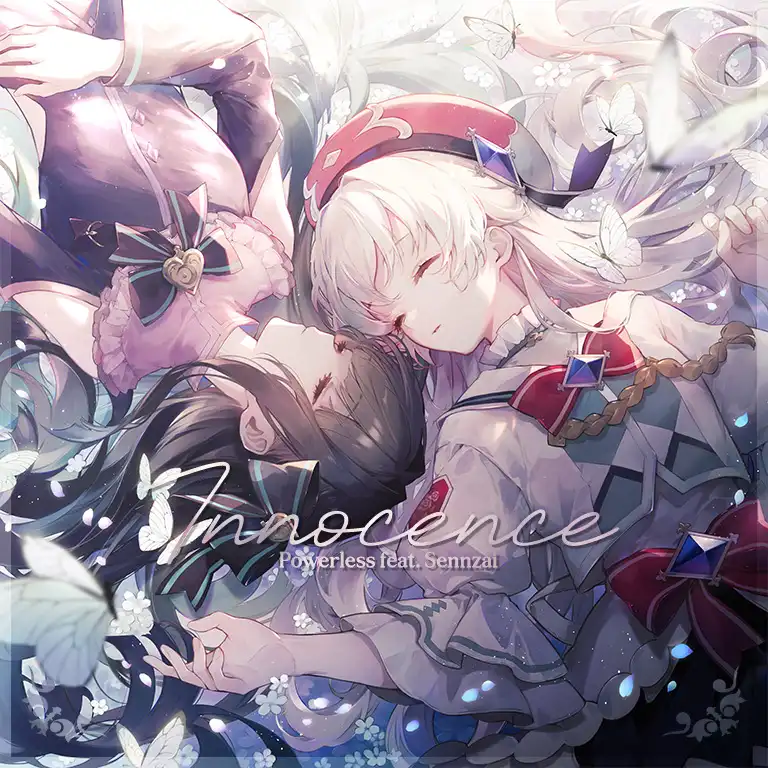 | FTR | [Innocence](<../pack/04_Memory Archive/Innocence.md>) | Memory Archive 5.4.0(24/03/08) |
|  | PRS | [ultradiaxon-N3](<../pack/04_Memory Archive/ultradiaxon-N3.md>) | Memory Archive 5.5.8(24/04/02) |
|  | PRS | [Vulcānus](<../pack/32_Rotaeno Collaboration Pack/Vulcānus.md>) | Rotaeno Collaboration Pack 5.10.0(24/08/29) |
|  | PRS | [And Revive The Melody](<../pack/20_O.N.G.E.K.I. Collaboration Pack/And Revive The Melody.md>) | O.N.G.E.K.I. Collaboration Pack 6.0.0(24/11/21) |
|  | FTR | [SATISFACTION](<../pack/01_Arcaea Pack/SATISFACTION.md>) | Arcaea Pack 6.6.0(25/06/26) |
|  | PRS | [Welcome, Queen of Fiction.](<../pack/36_Extant Anima Pack/Welcome, Queen of Fiction.md>) | Extant Anima Pack 6.8.0(25/08/21) |
|  | PRS | [Angel's Boundary](<../pack/04_Memory Archive/Angel's Boundary.md>) | Memory Archive 6.10.0(25/10/30) |

## 8.6

| ジャケット | 難易 | 曲 | パック・初出 |
| :---: | :--- | :--- | :--- |
|  | PRS | [PRAGMATISM](<../pack/02_Eternal Core Pack/PRAGMATISM.md>) | Eternal Core Pack 1.0.5(17/03/09) |
|  | FTR | [Silent Rush](<../pack/09_Binary Enfold Pack/Silent Rush.md>) | Binary Enfold Pack 1.6.0(18/03/23) |
| 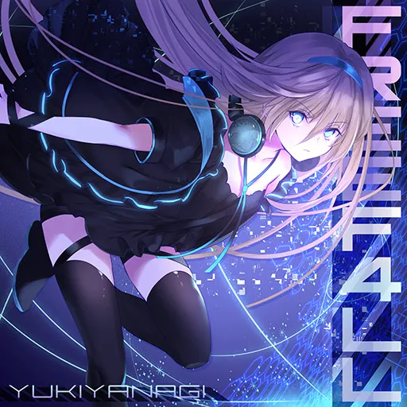 | FTR | [FREEF4LL](<../pack/01_Arcaea Pack/FREEF4LL.md>) | Arcaea Pack 2.4.0(19/10/08) |
|  | FTR | [Gekka (Short Version)](<../pack/17_Extend Archive 1－ Visions Pack/Gekka (Short Version).md>) | Extend Archive 1－ Visions Pack 3.0.0(20/05/27) |
|  | PRS | [BUCHiGiRE Berserker](<../pack/04_Memory Archive/BUCHiGiRE Berserker.md>) | Memory Archive 3.2.0(20/09/16) |
| 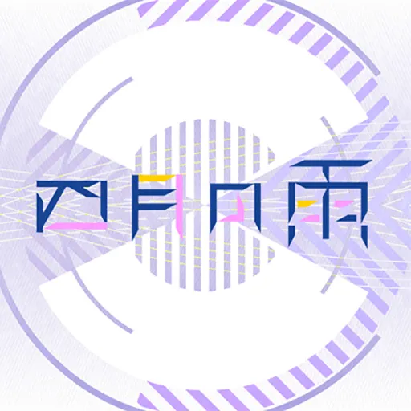 | FTR | [四月の雨](<../pack/21_maimai Collaboration Pack/四月の雨.md>) | maimai Collaboration Pack 3.4.1(21/01/08) |
|  | FTR | [enchanted love](<../pack/17_Extend Archive 1－ Visions Pack/enchanted love.md>) | Extend Archive 1－ Visions Pack 3.5.1(21/02/11) |
|  | PRS | [HIVEMIND](<../pack/17_Extend Archive 1－ Visions Pack/HIVEMIND.md>) | Extend Archive 1－ Visions Pack 3.7.0(21/07/21) |
|  | PRS | [Ego Eimi](<../pack/29_Lasting Eden Pack/Ego Eimi.md>) | Lasting Eden Pack 5.0.0(23/09/27) |
|  | PRS | [Judgement](<../pack/31_Absolute Nihil Pack/Judgement.md>) | Absolute Nihil Pack 5.9.0(24/07/30) |
|  | FTR | [epitaxy](<../pack/30_Extend Archive 3－ Illusions Pack/epitaxy.md>) | Extend Archive 3－ Illusions Pack 5.10.0(24/08/29) |
|  | PRS | [ViRTUS](<../pack/21_maimai Collaboration Pack/ViRTUS.md>) | maimai Collaboration Pack 6.2.0(25/01/23) |
|  | FTR | [Black Mirror on the Wall](<../pack/30_Extend Archive 3－ Illusions Pack/Black Mirror on the Wall.md>) | Extend Archive 3－ Illusions Pack 6.3.2(25/03/27) |
|  | FTR | [See the Lights!](<../pack/36_Extant Anima Pack/See the Lights!.md>) | Extant Anima Pack 6.7.0(25/07/24) |
|  | FTR | [Factorder](<../pack/36_Extant Anima Pack/Factorder.md>) | Extant Anima Pack 6.8.0(25/08/21) |
|  | FTR | [INFINITE DIMENSION](<../pack/39_Arcaea Next Stage Pack/INFINITE DIMENSION.md>) | Arcaea Next Stage Pack 6.10.8(25/11/22) |
| 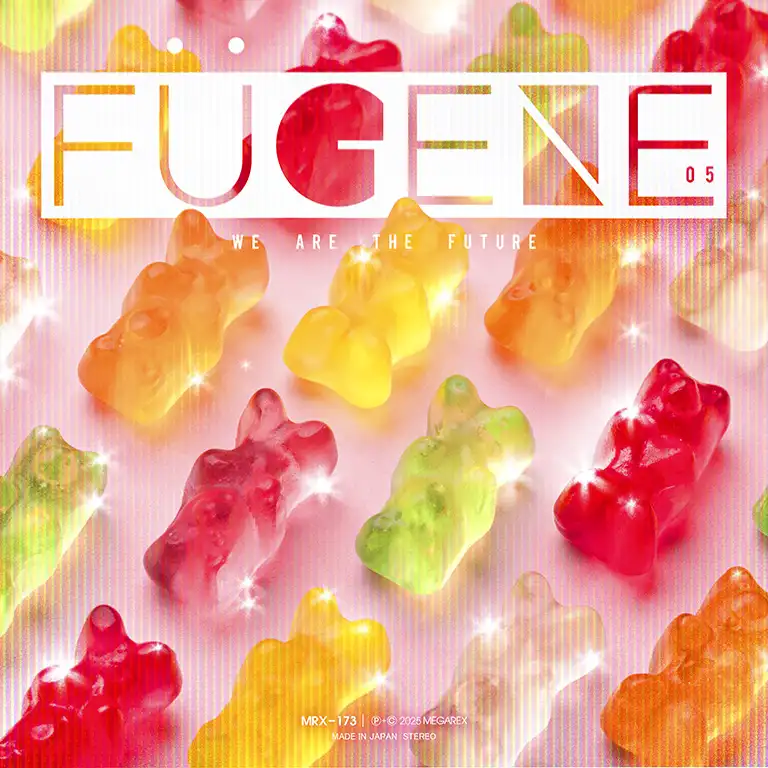 | FTR | [CHAIN2NITE](<../pack/40_MEGAREX Collaboration Pack/CHAIN2NITE.md>) | MEGAREX Collaboration Pack 6.12.0(26/01/29) |

