# 譜面定数 9+

## 9.7

| ジャケット | 難易 | 曲 | パック・初出 |
| :---: | :--- | :--- | :--- |
|  | BYD | [Snow White](<../pack/01_Arcaea Pack/Snow White.md>) | Arcaea Pack 1.0.5(17/03/09) |
|  | BYD | [Moonheart](<../pack/06_Ambivalent Vision Pack/Moonheart.md>) | Ambivalent Vision Pack 1.1.4(17/08/10) |
| 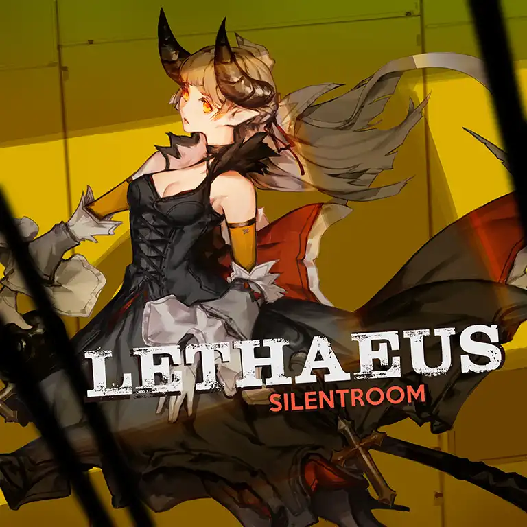 | FTR | [Lethaeus](<../pack/06_Ambivalent Vision Pack/Lethaeus.md>) | Ambivalent Vision Pack 1.1.4(17/08/10) |
| 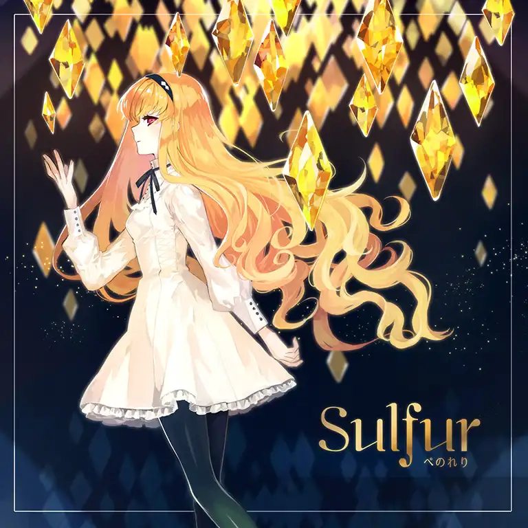 | FTR | [Sulfur](<../pack/10_Luminous Sky Pack/Sulfur.md>) | Luminous Sky Pack 1.7.0(18/07/16) |
|  | FTR | [The Message](<../pack/10_Luminous Sky Pack/The Message.md>) | Luminous Sky Pack 1.7.0(18/07/16) |
| 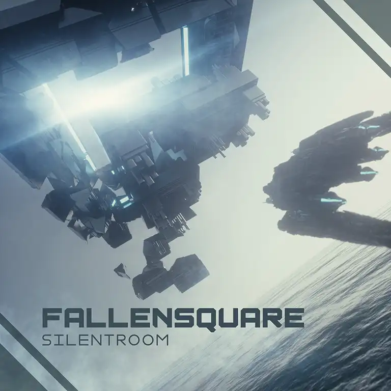 | FTR | [Fallensquare](<../pack/04_Memory Archive/Fallensquare.md>) | Memory Archive 1.7.2(18/08/13) |
| 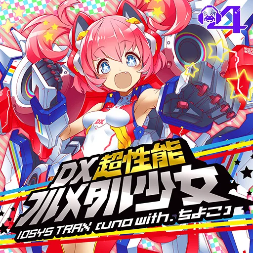 | FTR | [DX超性能フルメタル少女](<../pack/12_Groove Coaster Collaboration Pack/DX超性能フルメタル少女.md>) | Groove Coaster Collaboration Pack 1.9.0(19/01/09) |
| 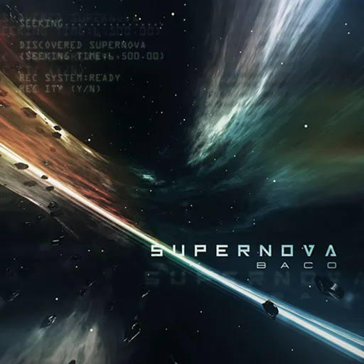 | FTR | [SUPERNOVA](<../pack/01_Arcaea Pack/SUPERNOVA.md>) | Arcaea Pack 2.0.3(19/05/02) |
| 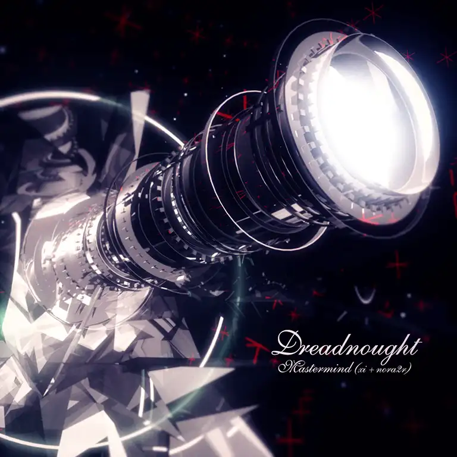 | FTR | [Dreadnought](<../pack/04_Memory Archive/Dreadnought.md>) | Memory Archive 2.2.0(19/07/18) |
|  | FTR | [Monochrome Princess](<../pack/01_Arcaea Pack/Monochrome Princess.md>) | Arcaea Pack 2.4.3(19/10/26) |
| 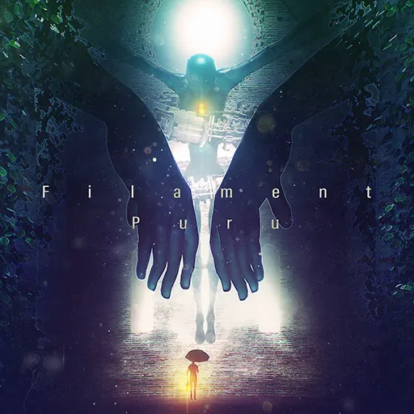 | FTR | [Filament](<../pack/04_Memory Archive/Filament.md>) | Memory Archive 2.4.5(19/11/18) |
|  | FTR | [BATTLE NO.1](<../pack/04_Memory Archive/BATTLE NO.1.md>) | Memory Archive 2.4.9(20/01/15) |
| 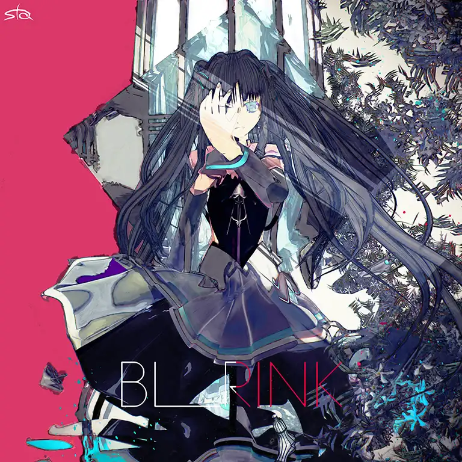 | FTR | [BLRINK](<../pack/15_Adverse Prelude Pack/BLRINK.md>) | Adverse Prelude Pack 2.5.3(20/03/09) |
|  | BYD | [Oblivia](<../pack/01_Arcaea Pack/Oblivia.md>) | Arcaea Pack 2.6.0(20/03/25) |
| 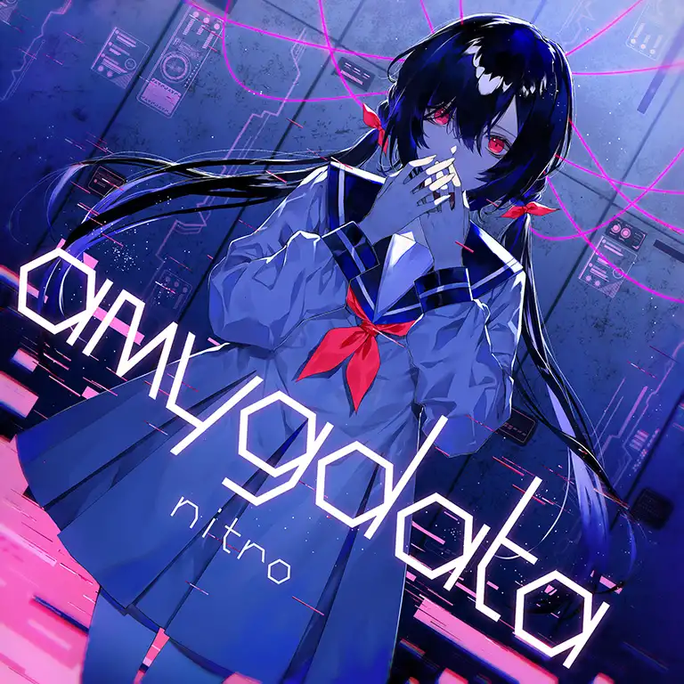 | FTR | [amygdata](<../pack/04_Memory Archive/amygdata.md>) | Memory Archive 2.6.0(20/03/25) |
|  | FTR | [Black Lotus](<../pack/17_Extend Archive 1－ Visions Pack/Black Lotus.md>) | Extend Archive 1－ Visions Pack 3.0.0(20/05/27) |
|  | BYD | [Teriqma](<../pack/04_Memory Archive/Teriqma.md>) | Memory Archive 3.0.5(20/07/16) |
| 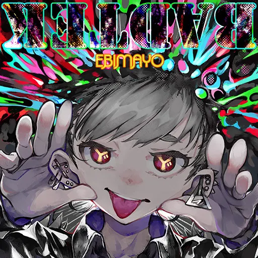 | FTR | [BADTEK](<../pack/04_Memory Archive/BADTEK.md>) | Memory Archive 3.1.0(20/08/21) |
|  | FTR | [Heart Jackin'](<../pack/19_Ephemeral Page Pack/Heart Jackin'.md>) | Ephemeral Page Pack 3.3.1(20/12/09) |
|  | FTR | [Dazzle hop](<../pack/20_O.N.G.E.K.I. Collaboration Pack/Dazzle hop.md>) | O.N.G.E.K.I. Collaboration Pack 3.4.0(20/12/17) |
| 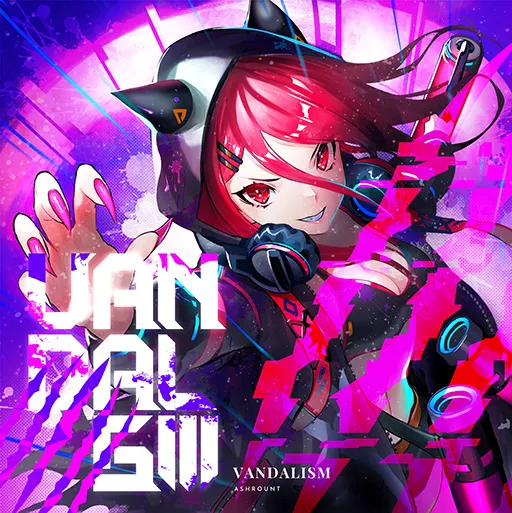 | FTR | [Vandalism](<../pack/17_Extend Archive 1－ Visions Pack/Vandalism.md>) | Extend Archive 1－ Visions Pack 3.6.0(21/05/11) |
| 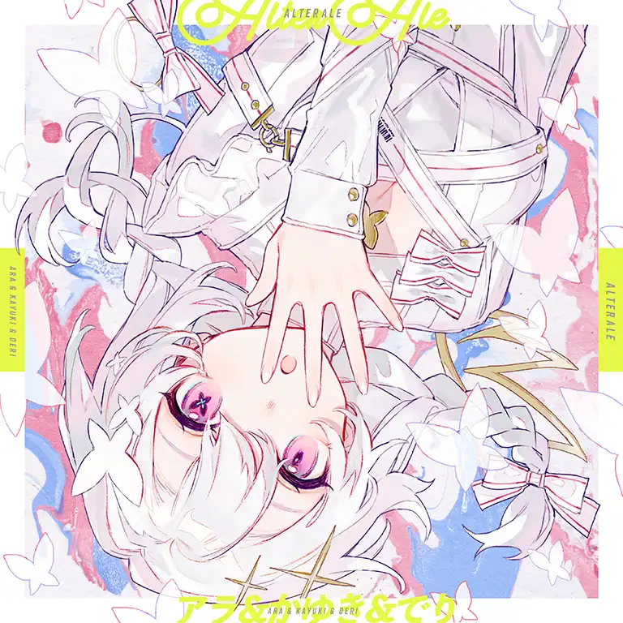 | FTR | [AlterAle](<../pack/22_Esoteric Order Pack/AlterAle.md>) | Esoteric Order Pack 3.7.0(21/07/21) |
| 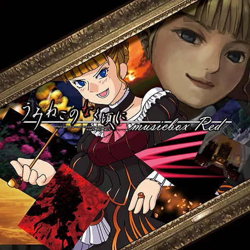 | FTR | [goldenslaughterer](<../pack/04_Memory Archive/goldenslaughterer.md>) | Memory Archive 3.8.6(21/09/29) |
|  | FTR | [nέο κόsmo](<../pack/24_Divided Heart Pack/nέο κόsmo.md>) | Divided Heart Pack 3.10.0(21/12/09) |
| 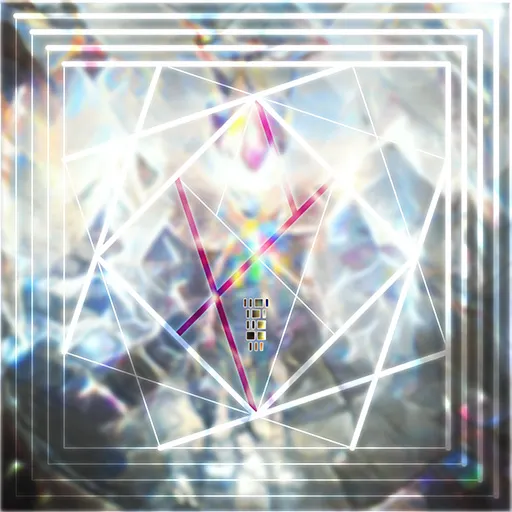 | FTR | [μ](<../pack/04_Memory Archive/μ.md>) | Memory Archive 3.12.10(22/05/25) |
|  | BYD | [Last ｜ Moment / Last ｜ Eternity](<../pack/26_Final Verdict Pack/Last － Moment － Last － Eternity.md>) | Final Verdict Pack 4.0.255(22/07/13) |
|  | FTR | [Loveless Dress](<../pack/26_Final Verdict Pack/Loveless Dress.md>) | Final Verdict Pack 4.0.255(22/07/13) |
|  | FTR | [Let's Rock (Arcaea mix)](<../pack/27_Extend Archive 2－ Chronicles Pack/Let's Rock (Arcaea mix).md>) | Extend Archive 2－ Chronicles Pack 4.3.0(23/03/02) |
|  | FTR | [Lost in the Abyss](<../pack/04_Memory Archive/Lost in the Abyss.md>) | Memory Archive 4.4.6(23/05/25) |
|  | FTR | [SACRIFICE feat. ayame](<../pack/04_Memory Archive/SACRIFICE feat. ayame.md>) | Memory Archive 4.7.0(23/08/18) |
| 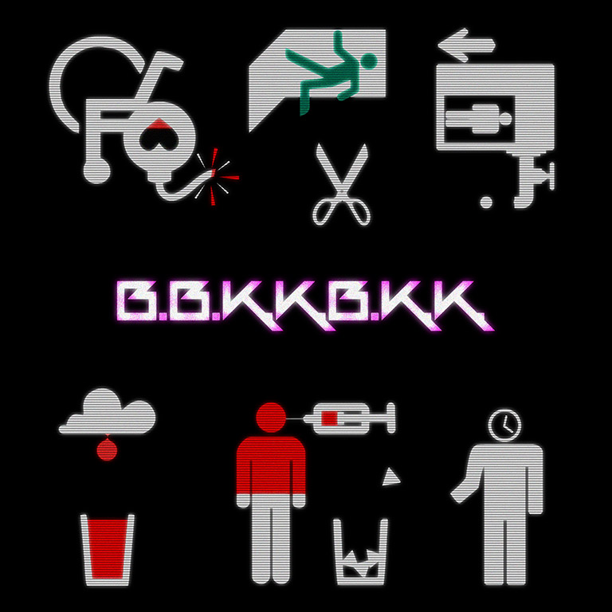 | FTR | [B.B.K.K.B.K.K.](<../pack/04_Memory Archive/B.B.K.K.B.K.K.md>) | Memory Archive 5.0.0(23/09/27) |
| 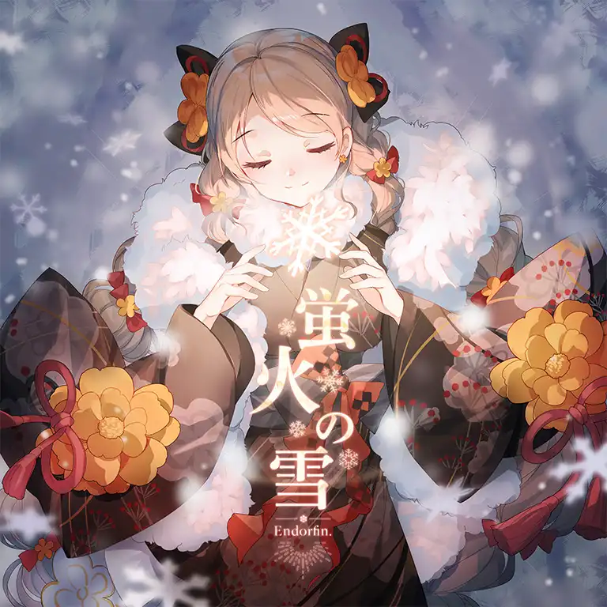 | FTR | [蛍火の雪](<../pack/16_Sunset Radiance Pack/蛍火の雪.md>) | Sunset Radiance Pack 5.2.6(24/01/12) |
|  | FTR | [Luna Rossa](<../pack/04_Memory Archive/Luna Rossa.md>) | Memory Archive 5.3.0(24/01/25) |
|  | ETR | [Innocence](<../pack/04_Memory Archive/Innocence.md>) | Memory Archive 5.4.0(24/03/08) |
|  | FTR | [Awaken In Ruins](<../pack/30_Extend Archive 3－ Illusions Pack/Awaken In Ruins.md>) | Extend Archive 3－ Illusions Pack 5.5.0(24/03/25) |
| 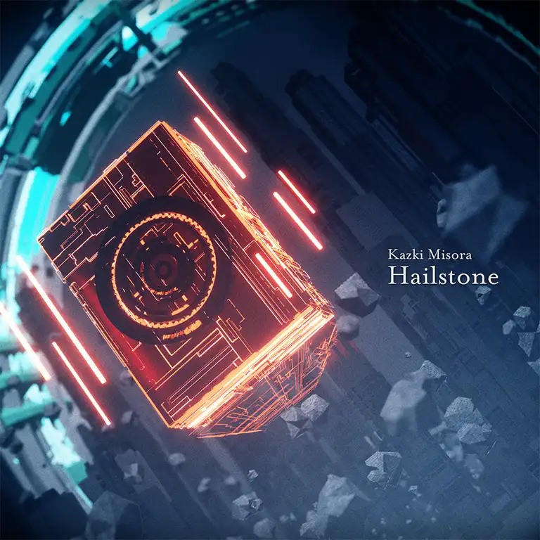 | FTR | [Hailstone](<../pack/30_Extend Archive 3－ Illusions Pack/Hailstone.md>) | Extend Archive 3－ Illusions Pack 5.10.4(24/09/26) |
|  | FTR | [Rays of Remnant](<../pack/33_Lucent Historia Pack/Rays of Remnant.md>) | Lucent Historia Pack 6.0.0(24/11/21) |
|  | ETR | [これでホントにサヨナラ](<../pack/34_UNDERTALE Collaboration Pack/これでホントにサヨナラ.md>) | UNDERTALE Collaboration Pack 6.3.0(25/03/09) |
|  | ETR | [Black Mirror on the Wall](<../pack/30_Extend Archive 3－ Illusions Pack/Black Mirror on the Wall.md>) | Extend Archive 3－ Illusions Pack 6.3.2(25/03/27) |
|  | FTR | [τ (tau)](<../pack/30_Extend Archive 3－ Illusions Pack/τ (tau).md>) | Extend Archive 3－ Illusions Pack 6.4.0(25/04/24) |
| 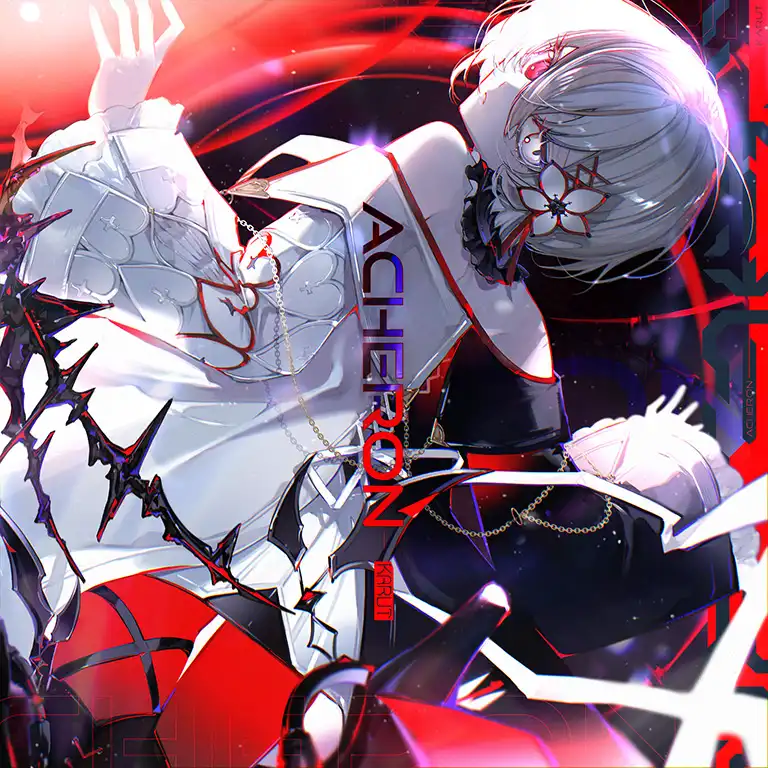 | FTR | [Acheron](<../pack/04_Memory Archive/Acheron.md>) | Memory Archive 6.8.2(25/09/04) |
|  | ETR | [Particle](<../pack/38_World Extend 4－ Emanations Pack/Particle.md>) | World Extend 4－ Emanations Pack 6.10.0(25/10/30) |
| 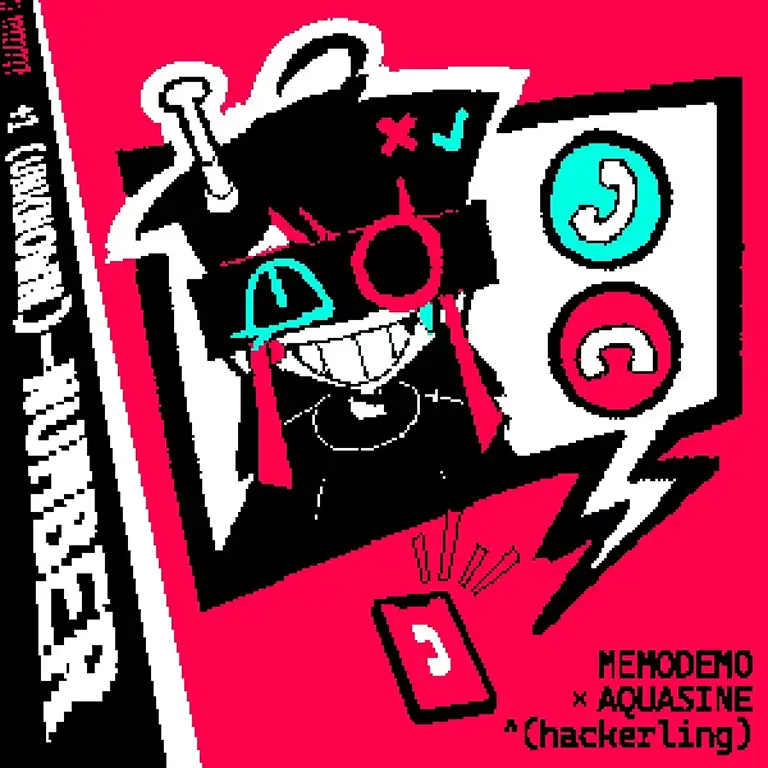 | FTR | [+1(UNKNOWN)-NUMBER](<../pack/04_Memory Archive/+1(UNKNOWN)-NUMBER.md>) | Memory Archive 6.12.10(26/02/19) |
| 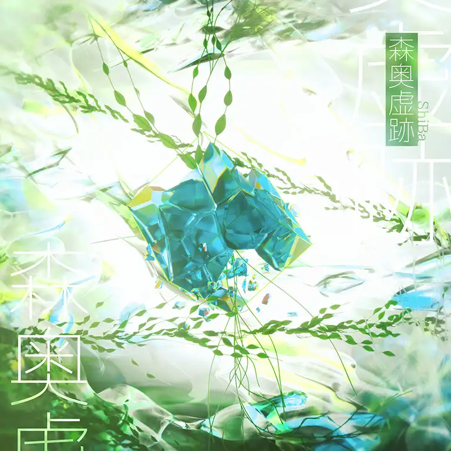 | FTR | [森奥虚跡](<../pack/38_World Extend 4－ Emanations Pack/森奥虚跡.md>) | World Extend 4－ Emanations Pack 6.12.10(26/02/19) |
| 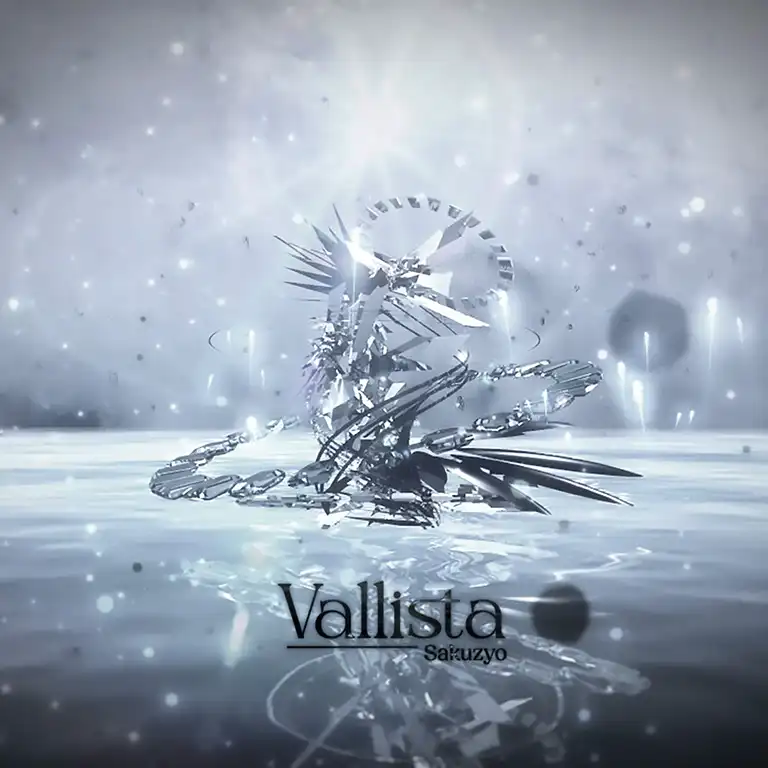 | FTR | [Vallista](<../pack/38_World Extend 4－ Emanations Pack/Vallista.md>) | World Extend 4－ Emanations Pack 6.13.0(26/03/09) |

## 9.8

| ジャケット | 難易 | 曲 | パック・初出 |
| :---: | :--- | :--- | :--- |
|  | BYD | [GOODTEK (Arcaea Edit)](<../pack/01_Arcaea Pack/GOODTEK (Arcaea Edit).md>) | Arcaea Pack 1.0.5(17/03/09) |
|  | BYD | [Lost Civilization](<../pack/01_Arcaea Pack/Lost Civilization.md>) | Arcaea Pack 1.0.5(17/03/09) |
|  | BYD | [qualia -ideaesthesia-](<../pack/01_Arcaea Pack/qualia -ideaesthesia-.md>) | Arcaea Pack 1.0.5(17/03/09) |
|  | BYD | [神奈川電脳暗渠](<../pack/01_Arcaea Pack/神奈川電脳暗渠.md>) | Arcaea Pack 1.1.0(17/06/02) |
| 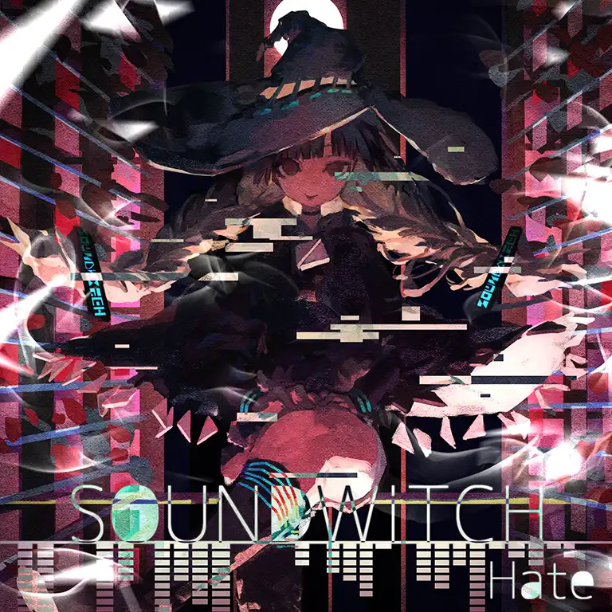 | FTR | [SOUNDWiTCH](<../pack/07_Vicious Labyrinth Pack/SOUNDWiTCH.md>) | Vicious Labyrinth Pack 1.5.0(17/11/03) |
|  | BYD | [Cybernecia Catharsis](<../pack/01_Arcaea Pack/Cybernecia Catharsis.md>) | Arcaea Pack 1.6.4(18/06/01) |
|  | FTR | [Linear Accelerator](<../pack/11_Tone Sphere Collaboration Pack/Linear Accelerator.md>) | Tone Sphere Collaboration Pack 1.8.0(18/10/07) |
|  | FTR | [Black Territory](<../pack/13_Absolute Reason Pack/Black Territory.md>) | Absolute Reason Pack 2.0.0(19/03/21) |
| 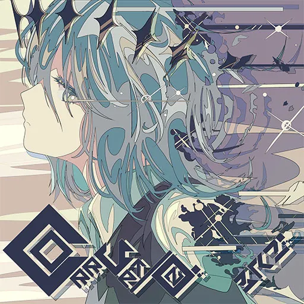 | FTR | [Corruption](<../pack/13_Absolute Reason Pack/Corruption.md>) | Absolute Reason Pack 2.0.0(19/03/21) |
|  | BYD | [FREEF4LL](<../pack/01_Arcaea Pack/FREEF4LL.md>) | Arcaea Pack 2.4.0(19/10/08) |
|  | FTR | [Heavenly caress](<../pack/04_Memory Archive/Heavenly caress.md>) | Memory Archive 2.4.3(19/10/26) |
|  | FTR | [Einherjar Joker](<../pack/04_Memory Archive/Einherjar Joker.md>) | Memory Archive 2.5.0(20/01/21) |
|  | FTR | [Altale](<../pack/04_Memory Archive/Altale.md>) | Memory Archive 3.0.0(20/05/27) |
|  | FTR | [Lost Desire](<../pack/18_Black Fate Pack/Lost Desire.md>) | Black Fate Pack 3.0.0(20/05/27) |
|  | FTR | [Scarlet Cage](<../pack/04_Memory Archive/Scarlet Cage.md>) | Memory Archive 3.0.3(20/07/08) |
|  | FTR | [Got hive of Ra](<../pack/12_Groove Coaster Collaboration Pack/Got hive of Ra.md>) | Groove Coaster Collaboration Pack 3.2.0(20/09/16) |
| 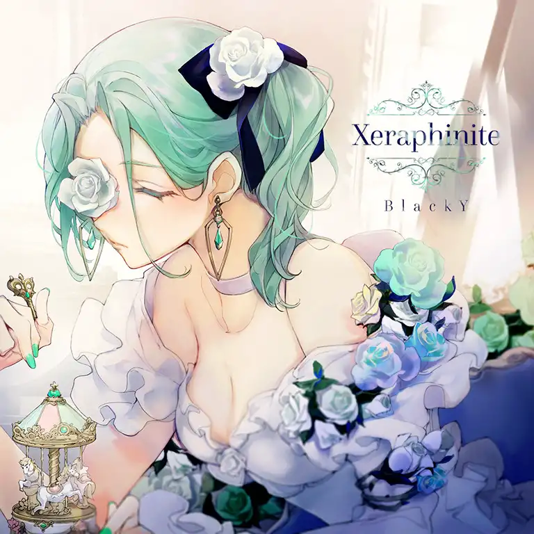 | FTR | [Xeraphinite](<../pack/04_Memory Archive/Xeraphinite.md>) | Memory Archive 3.2.2(20/10/30) |
|  | FTR | [Far Away Light](<../pack/22_Esoteric Order Pack/Far Away Light.md>) | Esoteric Order Pack 3.6.0(21/05/11) |
|  | FTR | [THE ULTIMACY](<../pack/04_Memory Archive/THE ULTIMACY.md>) | Memory Archive 3.6.4(21/06/30) |
|  | FTR | [Mazy Metroplex](<../pack/23_WACCA Collaboration Pack/Mazy Metroplex.md>) | WACCA Collaboration Pack 3.8.0(21/08/10) |
| 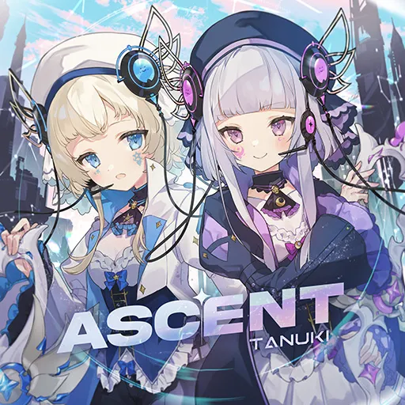 | FTR | [Ascent](<../pack/09_Binary Enfold Pack/Ascent.md>) | Binary Enfold Pack 3.9.0(21/11/11) |
| 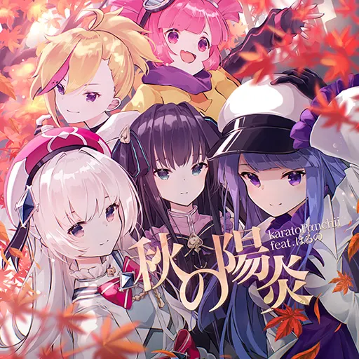 | FTR | [秋の陽炎](<../pack/25_Muse Dash Collaboration Pack/秋の陽炎.md>) | Muse Dash Collaboration Pack 3.11.0(21/12/24) |
| 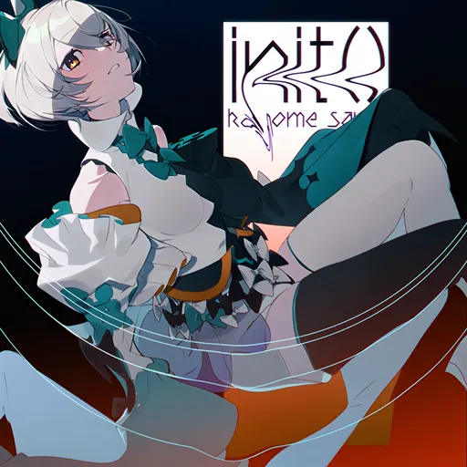 | FTR | [init()](<../pack/04_Memory Archive/init().md>) | Memory Archive 3.11.2(22/01/20) |
|  | FTR | [Macrocosmic Modulation](<../pack/04_Memory Archive/Macrocosmic Modulation.md>) | Memory Archive 3.12.0(22/02/17) |
| 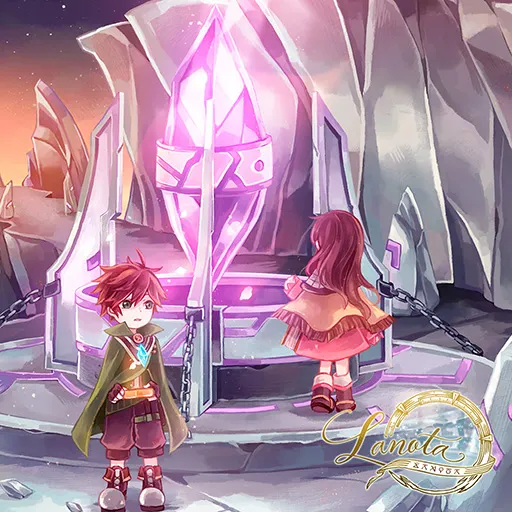 | FTR | [Protoflicker](<../pack/08_Lanota Collaboration Pack/Protoflicker.md>) | Lanota Collaboration Pack 3.12.8(22/04/28) |
| 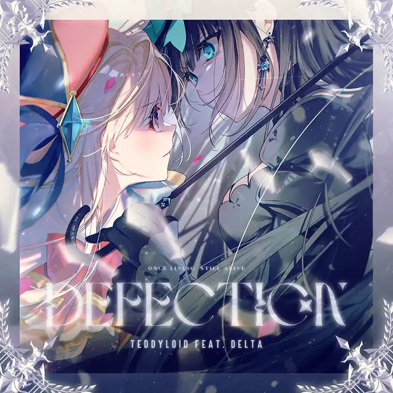 | FTR | [Defection](<../pack/26_Final Verdict Pack/Defection.md>) | Final Verdict Pack 4.0.0(22/07/07) |
|  | FTR | [Callima Karma](<../pack/26_Final Verdict Pack/Callima Karma.md>) | Final Verdict Pack 4.0.255(22/07/13) |
|  | FTR | [Ai Drew](<../pack/20_O.N.G.E.K.I. Collaboration Pack/Ai Drew.md>) | O.N.G.E.K.I. Collaboration Pack 4.1.0(22/10/04) |
|  | FTR | [FLUFFY FLASH](<../pack/20_O.N.G.E.K.I. Collaboration Pack/FLUFFY FLASH.md>) | O.N.G.E.K.I. Collaboration Pack 4.1.0(22/10/04) |
|  | FTR | [World Fragments III(radio edit)](<../pack/27_Extend Archive 2－ Chronicles Pack/World Fragments III(radio edit).md>) | Extend Archive 2－ Chronicles Pack 4.2.0(23/01/26) |
| 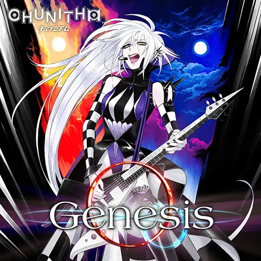 | FTR | [Genesis](<../pack/14_CHUNITHM Collaboration Pack/Genesis【CHUNITHM】.md>) | CHUNITHM Collaboration Pack 4.4.0(23/03/23) |
| 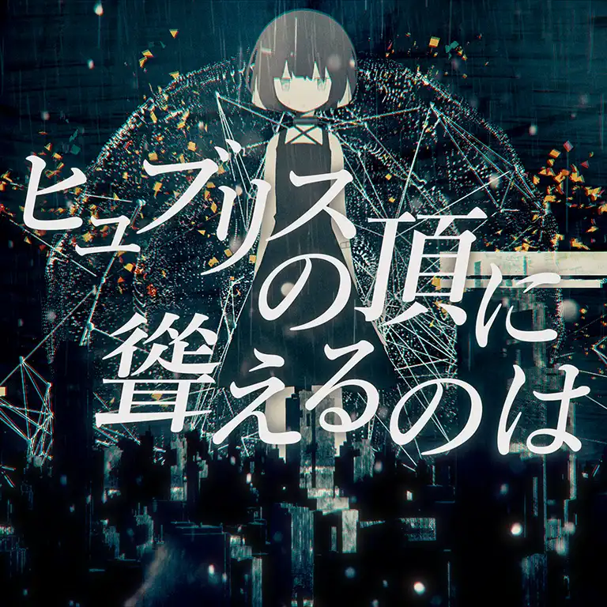 | FTR | [ヒュブリスの頂に聳えるのは](<../pack/27_Extend Archive 2－ Chronicles Pack/ヒュブリスの頂に聳えるのは.md>) | Extend Archive 2－ Chronicles Pack 4.4.6(23/05/25) |
| 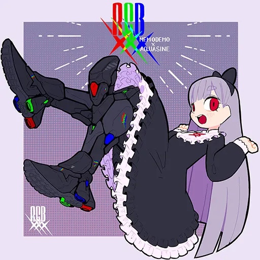 | FTR | [RGB](<../pack/27_Extend Archive 2－ Chronicles Pack/RGB.md>) | Extend Archive 2－ Chronicles Pack 4.7.0(23/08/18) |
|  | FTR | [彼方の夢へと](<../pack/04_Memory Archive/彼方の夢へと.md>) | Memory Archive 4.7.2(23/09/14) |
|  | FTR | [感情の摩天楼 ～Arr.Demetori](<../pack/27_Extend Archive 2－ Chronicles Pack/感情の摩天楼 ～Arr.Demetori.md>) | Extend Archive 2－ Chronicles Pack 4.7.2(23/09/14) |
| 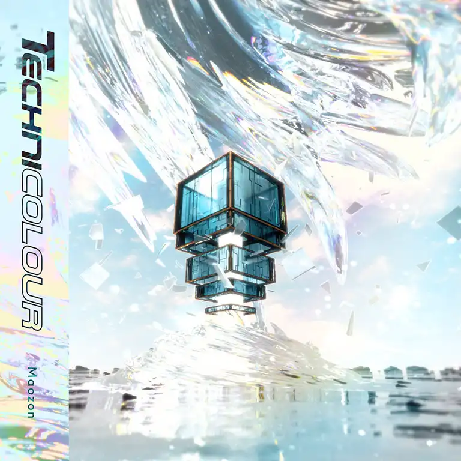 | FTR | [Technicolour](<../pack/29_Lasting Eden Pack/Technicolour.md>) | Lasting Eden Pack 5.0.0(23/09/27) |
|  | FTR | [Nameless Passion](<../pack/29_Lasting Eden Pack/Nameless Passion.md>) | Lasting Eden Pack 5.1.0(23/10/26) |
| 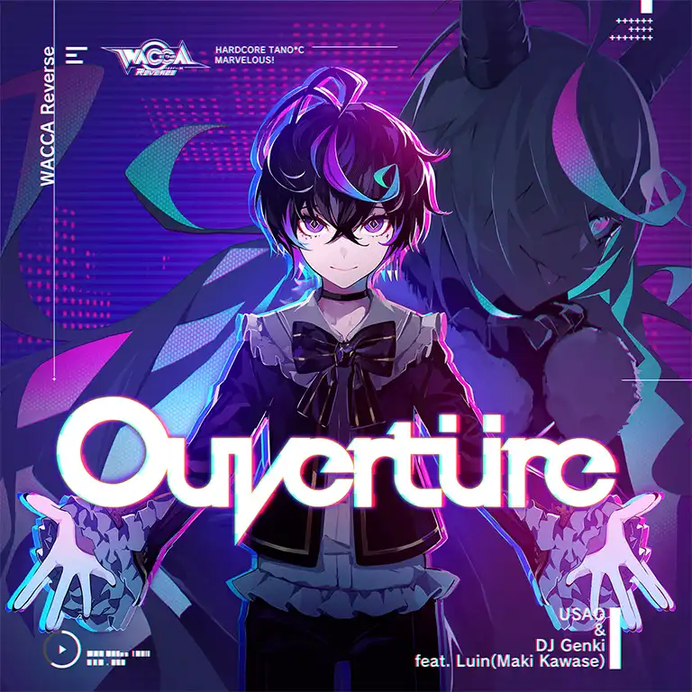 | FTR | [Ouvertüre](<../pack/23_WACCA Collaboration Pack/Ouvertüre.md>) | WACCA Collaboration Pack 5.2.0(23/11/30) |
|  | FTR | [LIVHT MY W​Δ​Y](<../pack/04_Memory Archive/LIVHT MY W​Δ​Y.md>) | Memory Archive 5.2.2(23/12/21) |
|  | ETR | [MORNINGLOOM](<../pack/30_Extend Archive 3－ Illusions Pack/MORNINGLOOM.md>) | Extend Archive 3－ Illusions Pack 5.5.0(24/03/25) |
|  | FTR | [Old School Salvage](<../pack/30_Extend Archive 3－ Illusions Pack/Old School Salvage.md>) | Extend Archive 3－ Illusions Pack 5.7.0(24/05/30) |
|  | FTR | [10pt8ion](<../pack/12_Groove Coaster Collaboration Pack/10pt8ion.md>) | Groove Coaster Collaboration Pack 5.8.0(24/06/27) |
|  | FTR | [HYPER VISION](<../pack/04_Memory Archive/HYPER VISION.md>) | Memory Archive 5.8.0(24/06/27) |
| 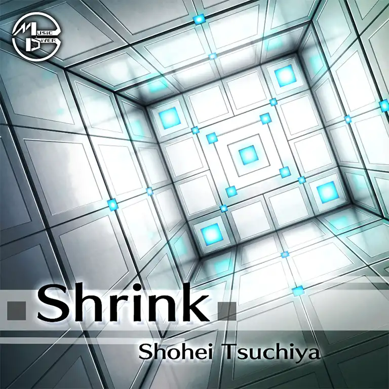 | FTR | [shrink](<../pack/04_Memory Archive/shrink.md>) | Memory Archive 5.9.0(24/07/30) |
|  | ETR | [Waltz for Lorelei](<../pack/32_Rotaeno Collaboration Pack/Waltz for Lorelei.md>) | Rotaeno Collaboration Pack 5.10.0(24/08/29) |
|  | ETR | [Crimson Quartz](<../pack/04_Memory Archive/Crimson Quartz.md>) | Memory Archive 5.10.6(24/10/24) |
|  | ETR | [LiftOff](<../pack/20_O.N.G.E.K.I. Collaboration Pack/LiftOff.md>) | O.N.G.E.K.I. Collaboration Pack 6.0.0(24/11/21) |
| 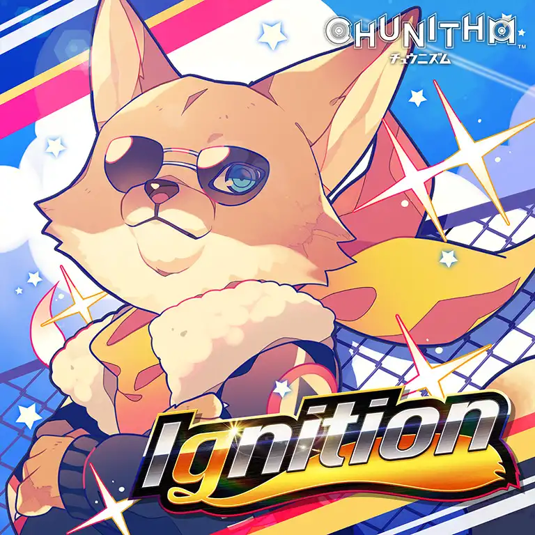 | FTR | [Ignition](<../pack/14_CHUNITHM Collaboration Pack/Ignition.md>) | CHUNITHM Collaboration Pack 6.1.0(24/12/19) |
|  | FTR | [ヨミビトシラズ](<../pack/21_maimai Collaboration Pack/ヨミビトシラズ.md>) | maimai Collaboration Pack 6.2.0(25/01/23) |
|  | FTR | [MEGALOVANIA(Camellia Remix)](<../pack/04_Memory Archive/MEGALOVANIA (Camellia Remix).md>) | Memory Archive 6.3.0(25/03/09) |
|  | ETR | [U.A.D](<../pack/35_DJMAX Collaboration Pack/U.A.D.md>) | DJMAX Collaboration Pack 6.5.0(25/05/22) |
|  | FTR | [Nightmare](<../pack/35_DJMAX Collaboration Pack/Nightmare.md>) | DJMAX Collaboration Pack 6.5.0(25/05/22) |
|  | FTR | [Won't Back Down](<../pack/30_Extend Archive 3－ Illusions Pack/Won't Back Down.md>) | Extend Archive 3－ Illusions Pack 6.5.0(25/05/22) |
|  | ETR | [Miles](<../pack/04_Memory Archive/Miles.md>) | Memory Archive 6.6.0(25/06/26) |
| 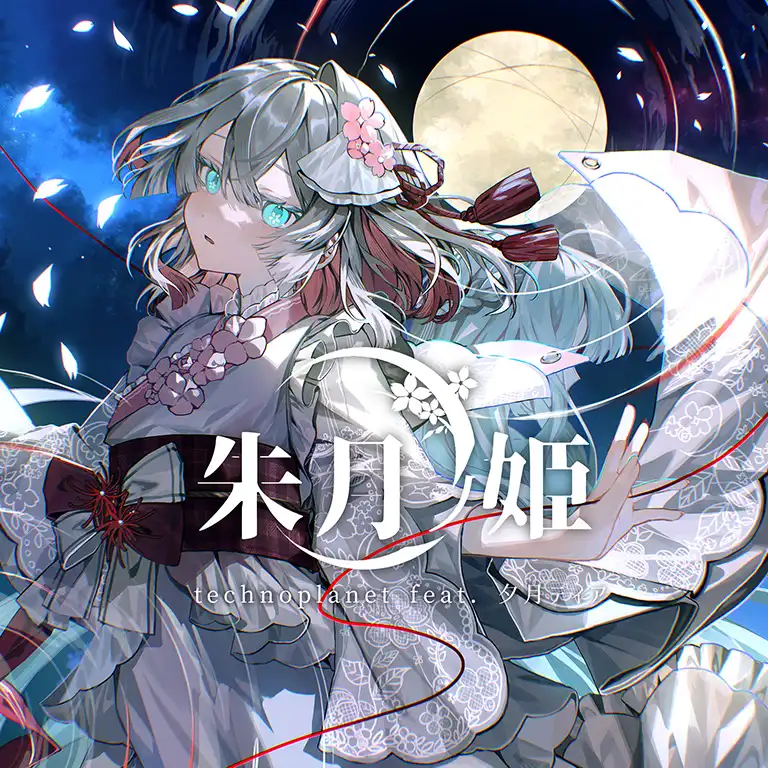 | FTR | [朱月ノ姫](<../pack/36_Extant Anima Pack/朱月ノ姫.md>) | Extant Anima Pack 6.7.0(25/07/24) |
|  | ETR | [disintegration](<../pack/30_Extend Archive 3－ Illusions Pack/disintegration.md>) | Extend Archive 3－ Illusions Pack 6.8.0(25/08/21) |
|  | FTR | [Xterfusion](<../pack/04_Memory Archive/Xterfusion.md>) | Memory Archive 6.10.0(25/10/30) |
|  | ETR | [taboo tears you up 2017](<../pack/38_World Extend 4－ Emanations Pack/taboo tears you up 2017.md>) | World Extend 4－ Emanations Pack 6.11.0(25/11/27) |
|  | FTR | [Signal](<../pack/40_MEGAREX Collaboration Pack/Signal.md>) | MEGAREX Collaboration Pack 6.12.0(26/01/29) |

## 9.9

| ジャケット | 難易 | 曲 | パック・初出 |
| :---: | :--- | :--- | :--- |
|  | BYD | [Dement ~after legend~](<../pack/01_Arcaea Pack/Dement ~after legend~.md>) | Arcaea Pack 1.0.9(17/03/20) |
|  | BYD | [Anökumene](<../pack/01_Arcaea Pack/Anokumene.md>) | Arcaea Pack 1.0.10(17/04/12) |
|  | BYD | [Ignotus Afterburn](<../pack/01_Arcaea Pack/Ignotus Afterburn.md>) | Arcaea Pack 1.1.3(17/07/18) |
| 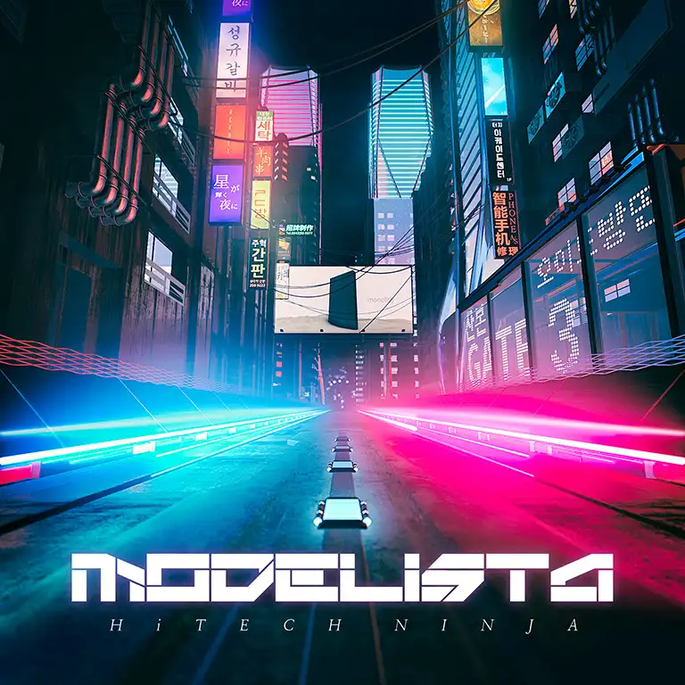 | FTR | [Modelista](<../pack/04_Memory Archive/Modelista.md>) | Memory Archive 1.1.6(17/09/25) |
|  | FTR | [妖艶魔女 -trappola bewitching-](<../pack/07_Vicious Labyrinth Pack/妖艶魔女 -trappola bewitching-.md>) | Vicious Labyrinth Pack 1.5.0(17/11/03) |
|  | FTR | [Nhelv](<../pack/01_Arcaea Pack/Nhelv.md>) | Arcaea Pack 1.7.2(18/08/13) |
|  | FTR | [Heavensdoor](<../pack/15_Adverse Prelude Pack/Heavensdoor.md>) | Adverse Prelude Pack 2.2.0(19/07/18) |
| 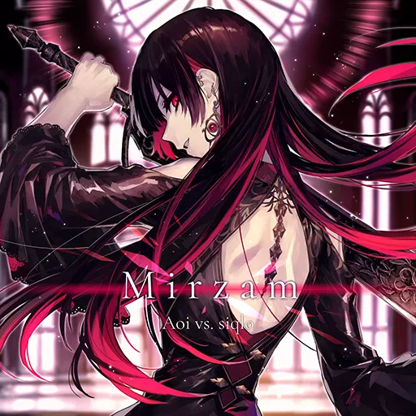 | FTR | [Mirzam](<../pack/04_Memory Archive/Mirzam.md>) | Memory Archive 2.3.2(19/09/15) |
| 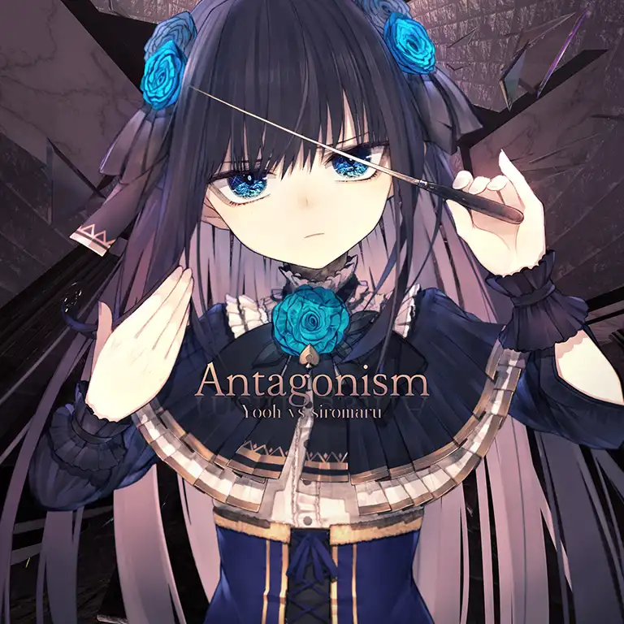 | FTR | [Antagonism](<../pack/18_Black Fate Pack/Antagonism.md>) | Black Fate Pack 3.0.0(20/05/27) |
| 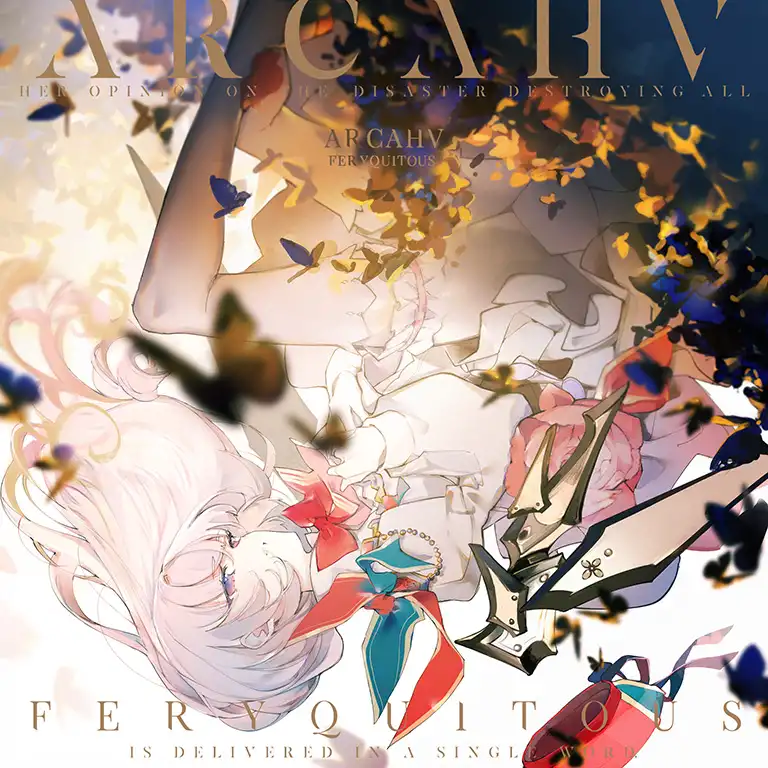 | FTR | [Arcahv](<../pack/18_Black Fate Pack/Arcahv.md>) | Black Fate Pack 3.0.0(20/05/27) |
|  | FTR | [Galaxy Friends](<../pack/04_Memory Archive/Galaxy Friends.md>) | Memory Archive 3.2.1(20/10/07) |
|  | BYD | [Eccentric Tale](<../pack/19_Ephemeral Page Pack/Eccentric Tale.md>) | Ephemeral Page Pack 3.3.0(20/12/03) |
| 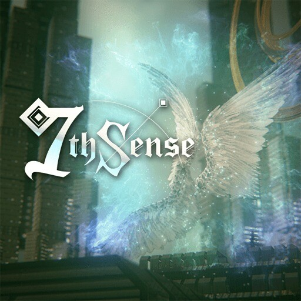 | FTR | [7thSense](<../pack/21_maimai Collaboration Pack/7thSense.md>) | maimai Collaboration Pack 3.4.1(21/01/08) |
| 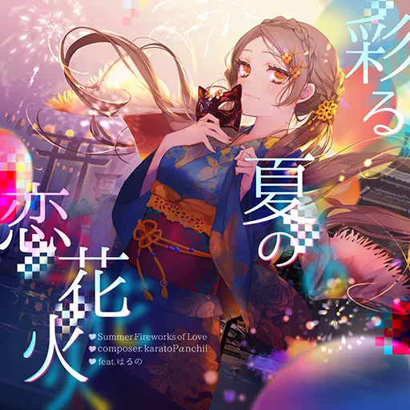 | FTR | [彩る夏の恋花火](<../pack/04_Memory Archive/彩る夏の恋花火.md>) | Memory Archive 3.9.0(21/11/11) |
|  | FTR | [Infinite Strife,](<../pack/26_Final Verdict Pack/Infinite Strife,.md>) | Final Verdict Pack 4.0.0(22/07/07) |
|  | FTR | [Trap Crow](<../pack/01_Arcaea Pack/Trap Crow.md>) | Arcaea Pack 4.0.0(22/07/07) |
|  | FTR | [Astra walkthrough](<../pack/27_Extend Archive 2－ Chronicles Pack/Astra walkthrough.md>) | Extend Archive 2－ Chronicles Pack 4.2.0(23/01/26) |
|  | FTR | [MAXRAGE](<../pack/21_maimai Collaboration Pack/MAXRAGE.md>) | maimai Collaboration Pack 4.3.0(23/03/02) |
|  | FTR | [New York Back Raise](<../pack/04_Memory Archive/New York Back Raise.md>) | Memory Archive 4.4.4(23/04/27) |
|  | FTR | [The Survivor (Game Edit)](<../pack/04_Memory Archive/The Survivor (Game Edit).md>) | Memory Archive 4.4.4(23/04/27) |
|  | FTR | [Devillic Sphere](<../pack/28_Cytus II Collaboration Pack/Devillic Sphere.md>) | Cytus II Collaboration Pack 4.5.0(23/06/28) |
|  | FTR | [Ultimate taste](<../pack/27_Extend Archive 2－ Chronicles Pack/Ultimate taste.md>) | Extend Archive 2－ Chronicles Pack 4.6.0(23/07/19) |
| 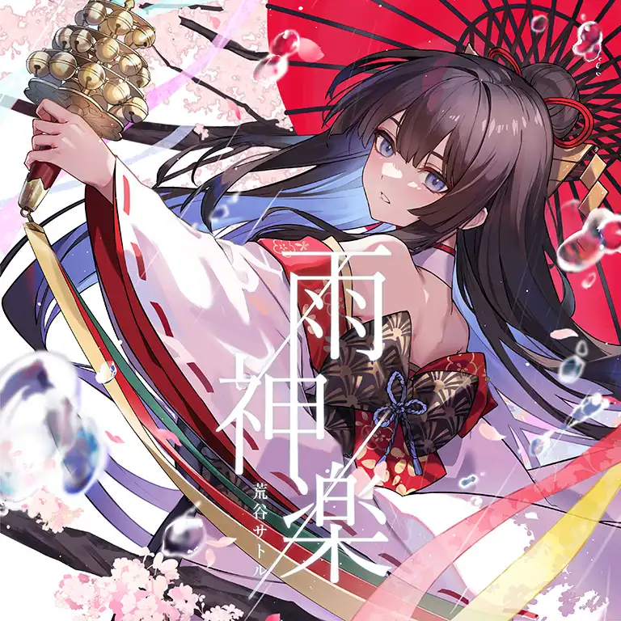 | FTR | [雨神楽](<../pack/27_Extend Archive 2－ Chronicles Pack/雨神楽.md>) | Extend Archive 2－ Chronicles Pack 5.0.0(23/09/27) |
|  | FTR | [Désive](<../pack/04_Memory Archive/Désive.md>) | Memory Archive 5.6.0(24/04/26) |
|  | ETR | [STARGATE EXTREME](<../pack/04_Memory Archive/STARGATE EXTREME.md>) | Memory Archive 5.8.0(24/06/27) |
|  | ETR | [Hypnotize](<../pack/31_Absolute Nihil Pack/Hypnotize.md>) | Absolute Nihil Pack 5.9.0(24/07/30) |
|  | FTR | [Ashen 6oundary](<../pack/31_Absolute Nihil Pack/Ashen 6oundary.md>) | Absolute Nihil Pack 5.9.0(24/07/30) |
| 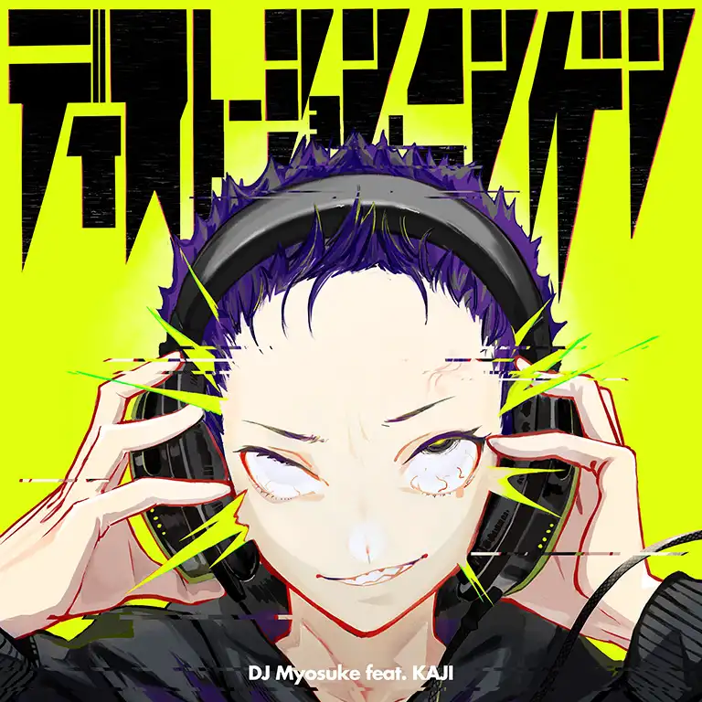 | FTR | [ディストーション・ニンゲン](<../pack/30_Extend Archive 3－ Illusions Pack/ディストーション・ニンゲン.md>) | Extend Archive 3－ Illusions Pack 5.9.0(24/07/30) |
|  | FTR | [Swan Song](<../pack/33_Lucent Historia Pack/Swan Song.md>) | Lucent Historia Pack 6.0.0(24/11/21) |
|  | FTR | [ViRTUS](<../pack/21_maimai Collaboration Pack/ViRTUS.md>) | maimai Collaboration Pack 6.2.0(25/01/23) |
|  | ETR | [進捗どうですか?](<../pack/04_Memory Archive/進捗どうですか－.md>) | Memory Archive 6.3.2(25/03/27) |
|  | ETR | [Tic! Tac! Toe!](<../pack/04_Memory Archive/Tic! Tac! Toe!.md>) | Memory Archive 6.5.0(25/05/22) |
| 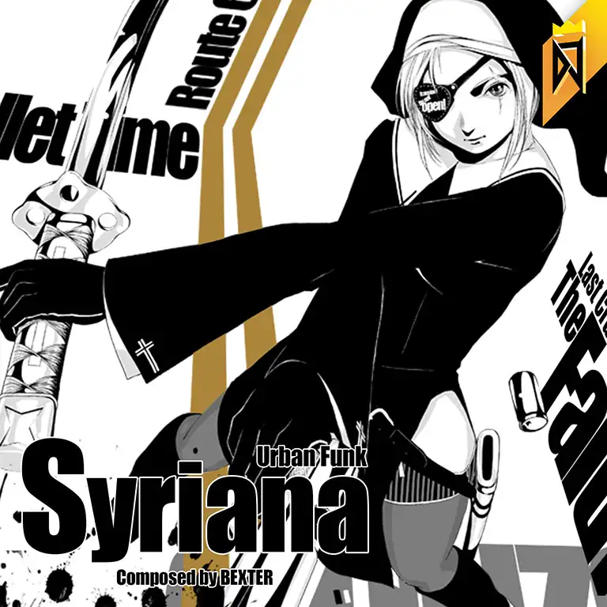 | FTR | [Syriana](<../pack/35_DJMAX Collaboration Pack/Syriana.md>) | DJMAX Collaboration Pack 6.6.0(25/06/26) |
|  | FTR | [Lilly](<../pack/36_Extant Anima Pack/Lilly.md>) | Extant Anima Pack 6.7.0(25/07/24) |
|  | ETR | [incomplete the one](<../pack/36_Extant Anima Pack/incomplete the one.md>) | Extant Anima Pack 6.8.0(25/08/21) |
|  | ETR | [Vainspire](<../pack/37_Liminal Eclipse Pack/Vainspire.md>) | Liminal Eclipse Pack 6.9.0(25/10/02) |
|  | FTR | [ANDORXOR](<../pack/37_Liminal Eclipse Pack/ANDORXOR.md>) | Liminal Eclipse Pack 6.9.0(25/10/02) |
|  | ETR | [Paradox Palette](<../pack/38_World Extend 4－ Emanations Pack/Paradox Palette.md>) | World Extend 4－ Emanations Pack 6.10.0(25/10/30) |
|  | FTR | [Xxium and Purple haze](<../pack/38_World Extend 4－ Emanations Pack/Xxium and Purple haze.md>) | World Extend 4－ Emanations Pack 6.10.0(25/10/30) |
|  | FTR | [Code: Oblivion](<../pack/39_Arcaea Next Stage Pack/Code： Oblivion.md>) | Arcaea Next Stage Pack 6.10.8(25/11/22) |
|  | FTR | [~_+](<../pack/38_World Extend 4－ Emanations Pack/~_+.md>) | World Extend 4－ Emanations Pack 6.11.2(25/12/24) |
|  | ETR | [CHAIN2NITE](<../pack/40_MEGAREX Collaboration Pack/CHAIN2NITE.md>) | MEGAREX Collaboration Pack 6.12.0(26/01/29) |

