# 譜面定数 9

## 9.0

| ジャケット | 難易 | 曲 | パック・初出 |
| :---: | :--- | :--- | :--- |
| 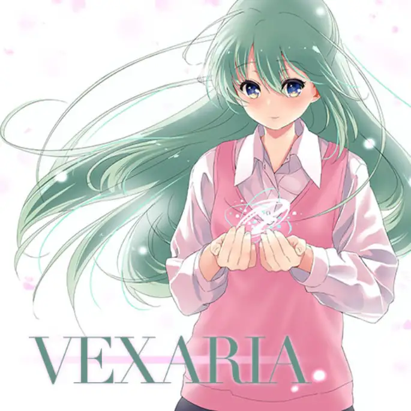 | BYD | [Vexaria](<../pack/01_Arcaea Pack/Vexaria.md>) | Arcaea Pack 1.0.5(17/03/09) |
| 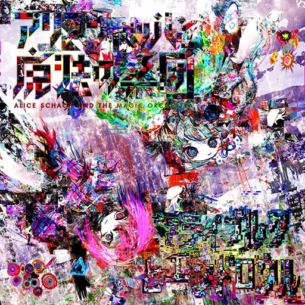 | FTR | [フライブルクとエンドロウル](<../pack/03_Crimson Solace Pack/フライブルクとエンドロウル.md>) | Crimson Solace Pack 1.0.11(17/05/11) |
| 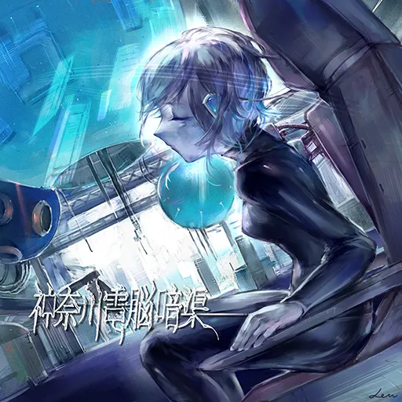 | FTR | [神奈川電脳暗渠](<../pack/01_Arcaea Pack/神奈川電脳暗渠.md>) | Arcaea Pack 1.1.0(17/06/02) |
| 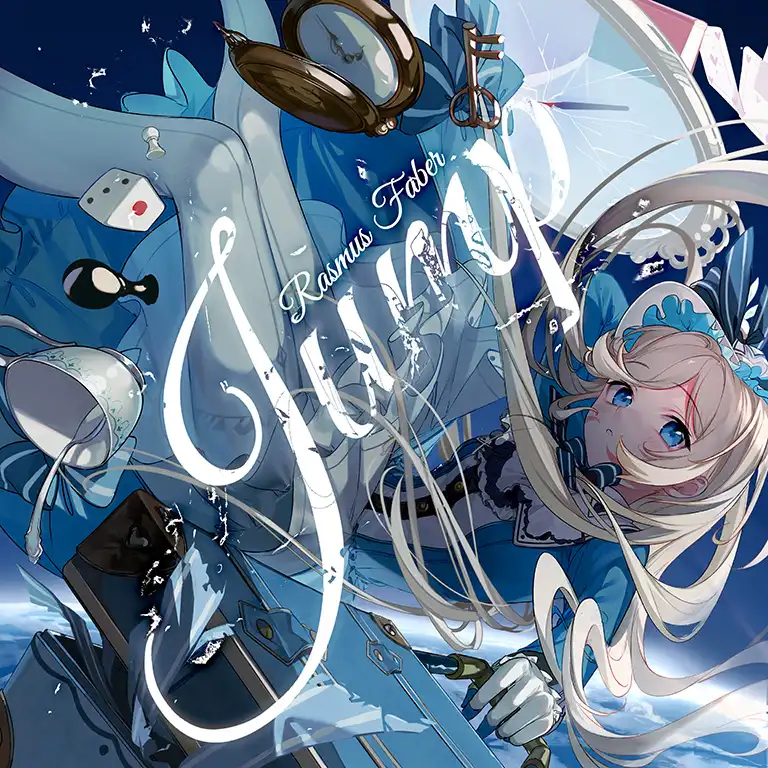 | FTR | [Jump](<../pack/19_Ephemeral Page Pack/Jump.md>) | Ephemeral Page Pack 3.3.0(20/12/03) |
| 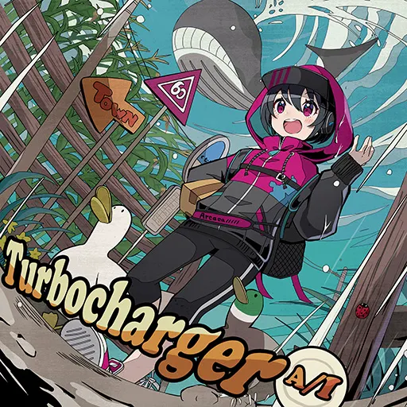 | FTR | [Turbocharger](<../pack/17_Extend Archive 1－ Visions Pack/Turbocharger.md>) | Extend Archive 1－ Visions Pack 3.6.2(21/06/10) |
| 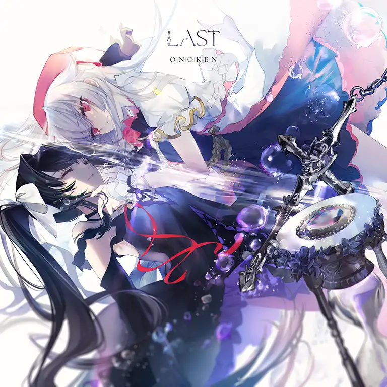 | FTR | [Last](<../pack/26_Final Verdict Pack/Last.md>) | Final Verdict Pack 4.0.255(22/07/13) |
|  | FTR | [Galactic Love](<../pack/04_Memory Archive/Galactic Love.md>) | Memory Archive 4.4.6(23/05/25) |
| 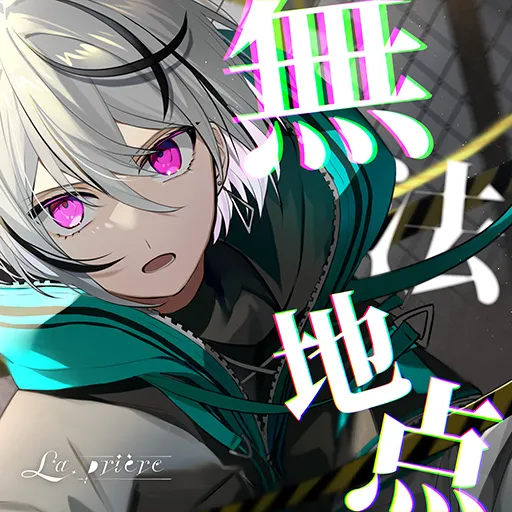 | FTR | [無法地点](<../pack/27_Extend Archive 2－ Chronicles Pack/無法地点.md>) | Extend Archive 2－ Chronicles Pack 4.4.6(23/05/25) |
|  | FTR | [Primeval Texture](<../pack/29_Lasting Eden Pack/Primeval Texture.md>) | Lasting Eden Pack 5.0.0(23/09/27) |

## 9.1

| ジャケット | 難易 | 曲 | パック・初出 |
| :---: | :--- | :--- | :--- |
|  | FTR | [Essence of Twilight](<../pack/02_Eternal Core Pack/Essence of Twilight.md>) | Eternal Core Pack 1.0.5(17/03/09) |
|  | FTR | [qualia -ideaesthesia-](<../pack/01_Arcaea Pack/qualia -ideaesthesia-.md>) | Arcaea Pack 1.0.5(17/03/09) |
| 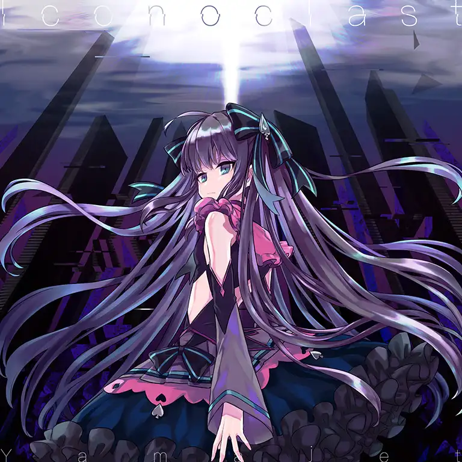 | FTR | [Iconoclast](<../pack/07_Vicious Labyrinth Pack/Iconoclast.md>) | Vicious Labyrinth Pack 1.5.0(17/11/03) |
| 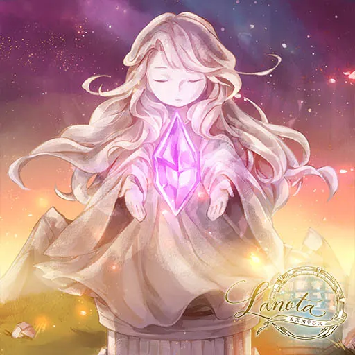 | FTR | [Journey](<../pack/08_Lanota Collaboration Pack/Journey.md>) | Lanota Collaboration Pack 1.5.5(18/02/01) |
| 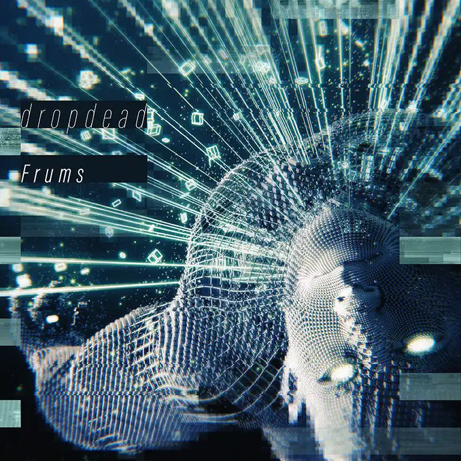 | FTR | [dropdead](<../pack/04_Memory Archive/dropdead.md>) | Memory Archive 1.7.2(18/08/13) |
|  | FTR | [Empire of Winter](<../pack/04_Memory Archive/Empire of Winter.md>) | Memory Archive 1.8.3(18/12/22) |
| 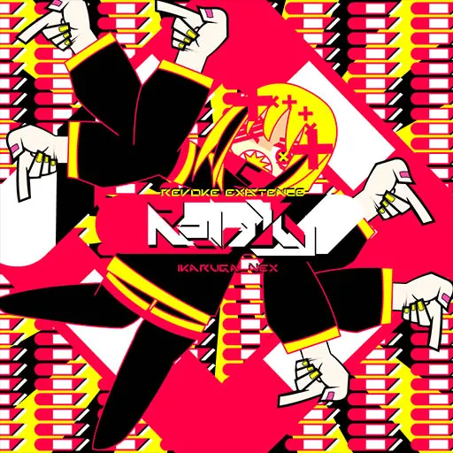 | FTR | [ReviXy](<../pack/01_Arcaea Pack/ReviXy.md>) | Arcaea Pack 2.0.0(19/03/21) |
|  | FTR | [La'qryma of the Wasteland](<../pack/04_Memory Archive/La'qryma of the Wasteland.md>) | Memory Archive 2.5.0(20/01/21) |
|  | FTR | [Faint Light (Arcaea Edit)](<../pack/17_Extend Archive 1－ Visions Pack/Faint Light (Arcaea Edit).md>) | Extend Archive 1－ Visions Pack 3.0.3(20/07/08) |
|  | FTR | [Alice's Suitcase](<../pack/19_Ephemeral Page Pack/Alice's Suitcase.md>) | Ephemeral Page Pack 3.3.0(20/12/03) |
|  | FTR | [Life is PIANO](<../pack/17_Extend Archive 1－ Visions Pack/Life is PIANO.md>) | Extend Archive 1－ Visions Pack 3.5.4(21/04/09) |
|  | FTR | [Coastal Highway](<../pack/22_Esoteric Order Pack/Coastal Highway.md>) | Esoteric Order Pack 3.6.0(21/05/11) |
| 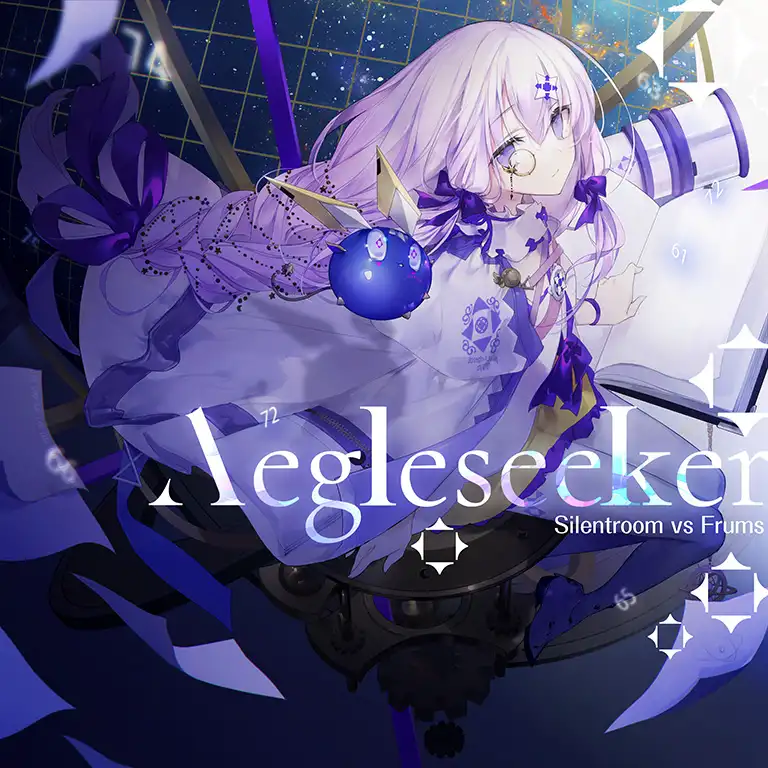 | PRS | [Aegleseeker](<../pack/22_Esoteric Order Pack/Aegleseeker.md>) | Esoteric Order Pack 3.6.0(21/05/11) |
|  | FTR | [Blue Rose](<../pack/24_Divided Heart Pack/Blue Rose.md>) | Divided Heart Pack 3.10.0(21/12/09) |
| 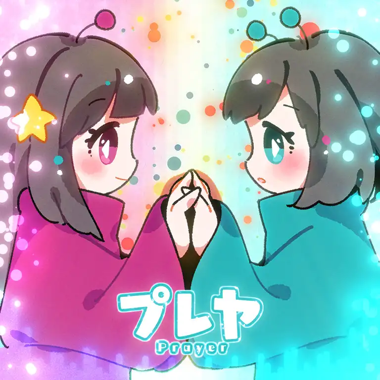 | ETR | [プレヤ](<../pack/30_Extend Archive 3－ Illusions Pack/プレヤ.md>) | Extend Archive 3－ Illusions Pack 5.10.6(24/10/24) |
| 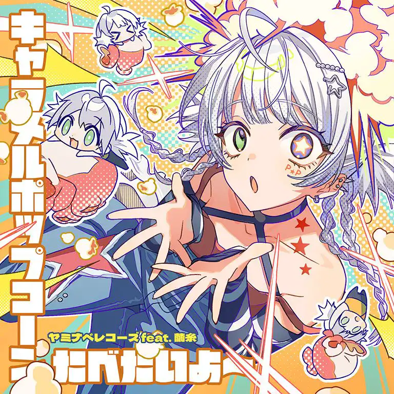 | ETR | [キャラメルポップコーンたべたいよ～](<../pack/01_Arcaea Pack/キャラメルポップコーンたべたいよ～.md>) | Arcaea Pack 6.12.10(26/02/19) |

## 9.2

| ジャケット | 難易 | 曲 | パック・初出 |
| :---: | :--- | :--- | :--- |
|  | FTR | [Lost Civilization](<../pack/01_Arcaea Pack/Lost Civilization.md>) | Arcaea Pack 1.0.5(17/03/09) |
| 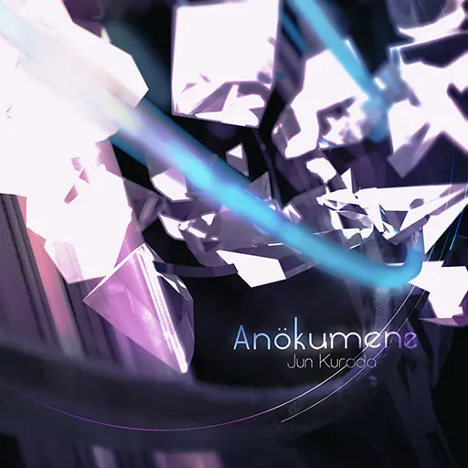 | FTR | [Anökumene](<../pack/01_Arcaea Pack/Anokumene.md>) | Arcaea Pack 1.0.10(17/04/12) |
| 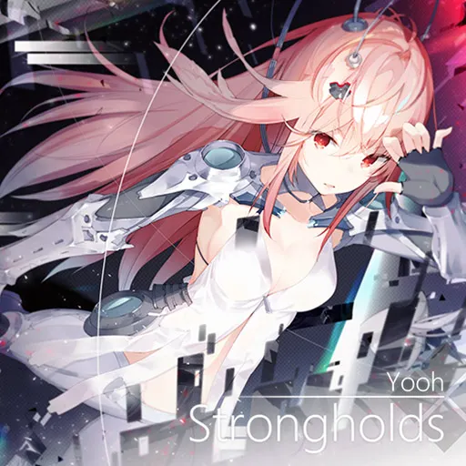 | FTR | [Strongholds](<../pack/09_Binary Enfold Pack/Strongholds.md>) | Binary Enfold Pack 1.6.0(18/03/23) |
| 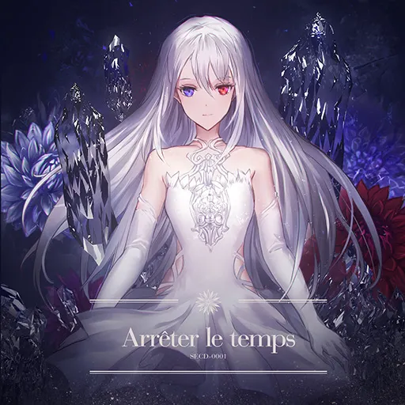 | FTR | [Rugie](<../pack/01_Arcaea Pack/Rugie.md>) | Arcaea Pack 1.8.1(18/11/08) |
| 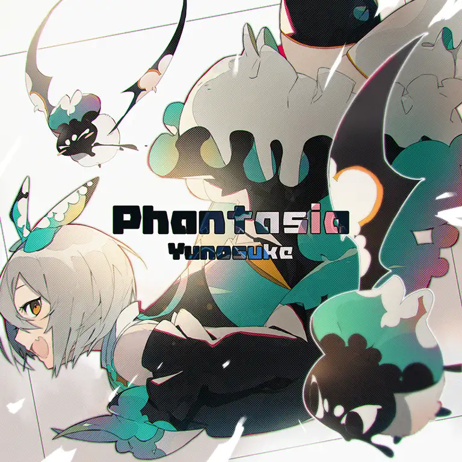 | FTR | [Phantasia](<../pack/04_Memory Archive/Phantasia.md>) | Memory Archive 1.8.2(18/11/29) |
|  | FTR | [Libertas](<../pack/04_Memory Archive/Libertas.md>) | Memory Archive 1.9.2(19/02/11) |
|  | FTR | [Alice à la mode](<../pack/19_Ephemeral Page Pack/Alice a la mode.md>) | Ephemeral Page Pack 3.3.0(20/12/03) |
|  | FTR | [ネコノテ・カリタガール](<../pack/01_Arcaea Pack/ネコノテ・カリタガール.md>) | Arcaea Pack 3.12.8(22/04/28) |
| 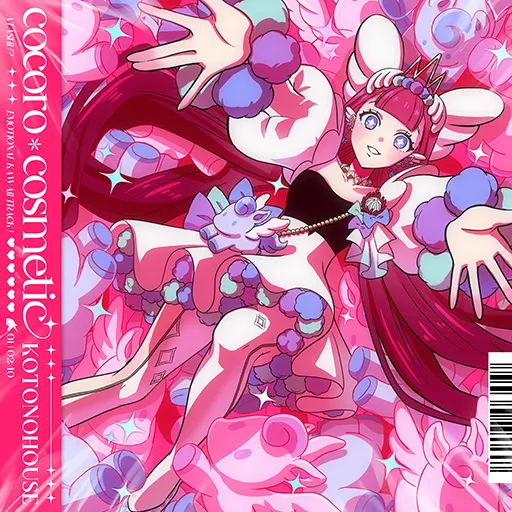 | FTR | [cocoro*cosmetic](<../pack/04_Memory Archive/cocoro－cosmetic.md>) | Memory Archive 4.1.4(22/11/10) |
|  | FTR | [Used to be](<../pack/28_Cytus II Collaboration Pack/Used to be.md>) | Cytus II Collaboration Pack 4.5.0(23/06/28) |
|  | FTR | [Leave All Behind](<../pack/30_Extend Archive 3－ Illusions Pack/Leave All Behind.md>) | Extend Archive 3－ Illusions Pack 5.6.0(24/04/26) |
|  | FTR | [Sign of "10.5km"](<../pack/12_Groove Coaster Collaboration Pack/Sign of ''10.5km''.md>) | Groove Coaster Collaboration Pack 5.8.0(24/06/27) |
|  | PRS | [ALTER EGO](<../pack/31_Absolute Nihil Pack/ALTER EGO.md>) | Absolute Nihil Pack 5.9.0(24/07/30) |
|  | ETR | [Ladymade Star](<../pack/35_DJMAX Collaboration Pack/Ladymade Star.md>) | DJMAX Collaboration Pack 6.5.0(25/05/22) |
|  | FTR | [3rd Avenue](<../pack/38_World Extend 4－ Emanations Pack/3rd Avenue.md>) | World Extend 4－ Emanations Pack 6.13.0(26/03/09) |
|  | FTR | [Cryogenic](<../pack/04_Memory Archive/Cryogenic.md>) | Memory Archive 6.13.0(26/03/09) |

## 9.3

| ジャケット | 難易 | 曲 | パック・初出 |
| :---: | :--- | :--- | :--- |
|  | FTR | [GOODTEK (Arcaea Edit)](<../pack/01_Arcaea Pack/GOODTEK (Arcaea Edit).md>) | Arcaea Pack 1.0.5(17/03/09) |
| 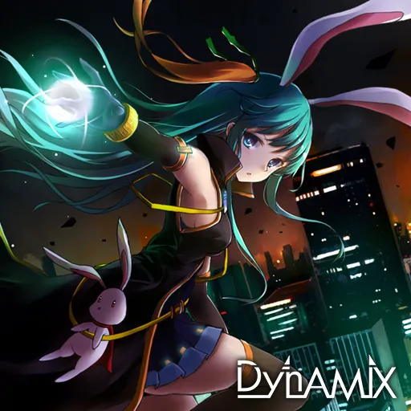 | FTR | [Oracle](<../pack/05_Dynamix Collaboration Pack/Oracle.md>) | Dynamix Collaboration Pack 1.1.2(17/06/23) |
| 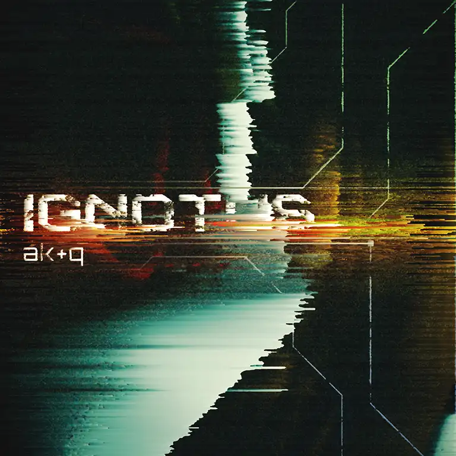 | FTR | [Ignotus](<../pack/01_Arcaea Pack/Ignotus.md>) | Arcaea Pack 1.1.3(17/07/18) |
| 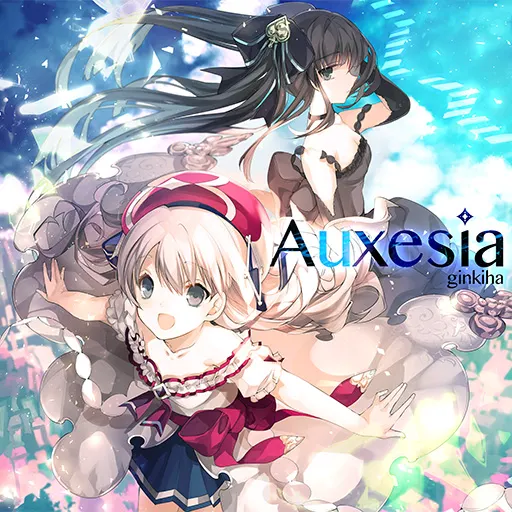 | FTR | [Auxesia](<../pack/04_Memory Archive/Auxesia.md>) | Memory Archive 1.1.4(17/08/10) |
|  | PRS | [Grievous Lady](<../pack/07_Vicious Labyrinth Pack/Grievous Lady.md>) | Vicious Labyrinth Pack 1.5.0(17/11/03) |
| 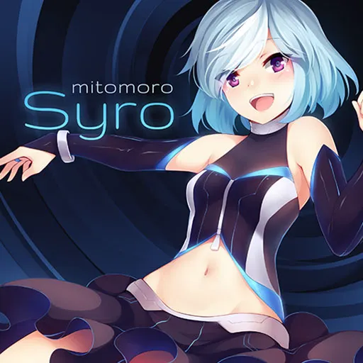 | FTR | [Syro](<../pack/01_Arcaea Pack/Syro.md>) | Arcaea Pack 1.5.3(17/12/21) |
| 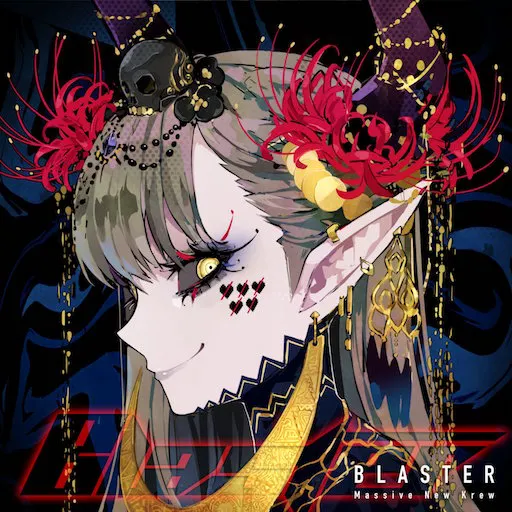 | FTR | [Blaster](<../pack/01_Arcaea Pack/Blaster.md>) | Arcaea Pack 1.5.7(18/03/09) |
|  | FTR | [Feels So Right feat. Renko](<../pack/04_Memory Archive/Feels So Right feat. Renko.md>) | Memory Archive 3.0.3(20/07/08) |
| 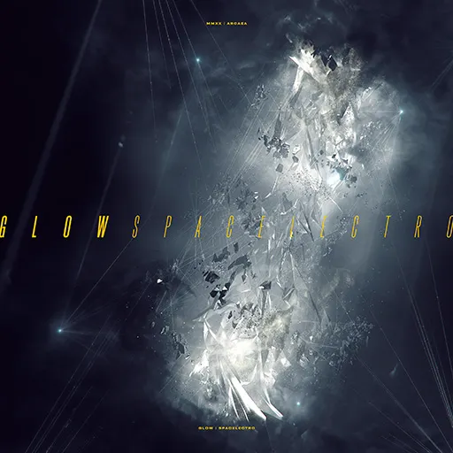 | FTR | [Glow](<../pack/17_Extend Archive 1－ Visions Pack/Glow.md>) | Extend Archive 1－ Visions Pack 3.5.0(21/01/21) |
| 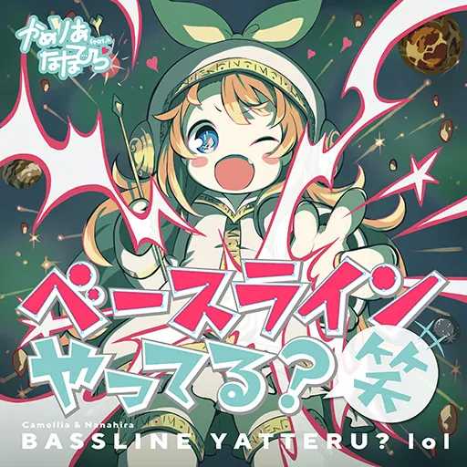 | FTR | [ベースラインやってる？w](<../pack/04_Memory Archive/ベースラインやってる？w.md>) | Memory Archive 3.5.4(21/04/09) |
|  | FTR | [Small Cloud Sugar Candy](<../pack/22_Esoteric Order Pack/Small Cloud Sugar Candy.md>) | Esoteric Order Pack 3.7.0(21/07/21) |
|  | FTR | [Blocked Library](<../pack/24_Divided Heart Pack/Blocked Library.md>) | Divided Heart Pack 3.10.0(21/12/09) |
|  | FTR | [Lost Emotion feat. nomico](<../pack/27_Extend Archive 2－ Chronicles Pack/Lost Emotion feat. nomico.md>) | Extend Archive 2－ Chronicles Pack 4.4.4(23/04/27) |
|  | FTR | [The Formula](<../pack/01_Arcaea Pack/The Formula.md>) | Arcaea Pack 5.3.0(24/01/25) |
|  | FTR | [Floating World](<../pack/04_Memory Archive/Floating World.md>) | Memory Archive 5.6.0(24/04/26) |
|  | FTR | [STARGATE EXTREME](<../pack/04_Memory Archive/STARGATE EXTREME.md>) | Memory Archive 5.8.0(24/06/27) |
|  | FTR | [Don't Fight The Music](<../pack/20_O.N.G.E.K.I. Collaboration Pack/Don't Fight The Music.md>) | O.N.G.E.K.I. Collaboration Pack 6.0.0(24/11/21) |
|  | FTR | [GOODRAGE](<../pack/04_Memory Archive/GOODRAGE.md>) | Memory Archive 6.13.0(26/03/09) |

## 9.4

| ジャケット | 難易 | 曲 | パック・初出 |
| :---: | :--- | :--- | :--- |
|  | FTR | [Party Vinyl](<../pack/03_Crimson Solace Pack/Party Vinyl.md>) | Crimson Solace Pack 1.0.11(17/05/11) |
| 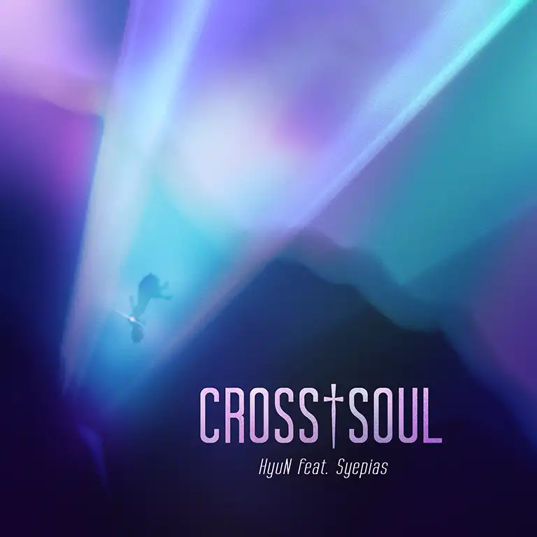 | FTR | [CROSS†SOUL](<../pack/04_Memory Archive/CROSS†SOUL.md>) | Memory Archive 1.1.0(17/06/02) |
| 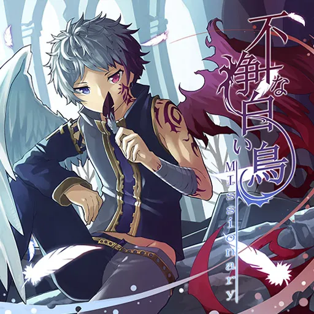 | FTR | [不浄な白い鳥](<../pack/04_Memory Archive/不浄な白い鳥.md>) | Memory Archive 1.1.3(17/07/18) |
|  | FTR | [Dreamin' Attraction!!](<../pack/01_Arcaea Pack/Dreamin' Attraction!!.md>) | Arcaea Pack 1.5.0(17/11/03) |
|  | FTR | [Red and Blue](<../pack/01_Arcaea Pack/Red and Blue.md>) | Arcaea Pack 1.5.0(17/11/03) |
| 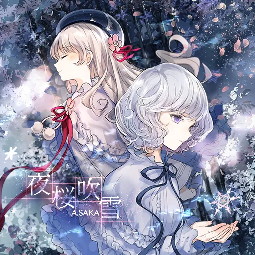 | FTR | [夜桜吹雪](<../pack/04_Memory Archive/夜桜吹雪.md>) | Memory Archive 1.5.2(17/11/24) |
| 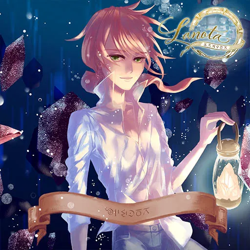 | FTR | [Specta](<../pack/08_Lanota Collaboration Pack/Specta.md>) | Lanota Collaboration Pack 1.5.5(18/02/01) |
| 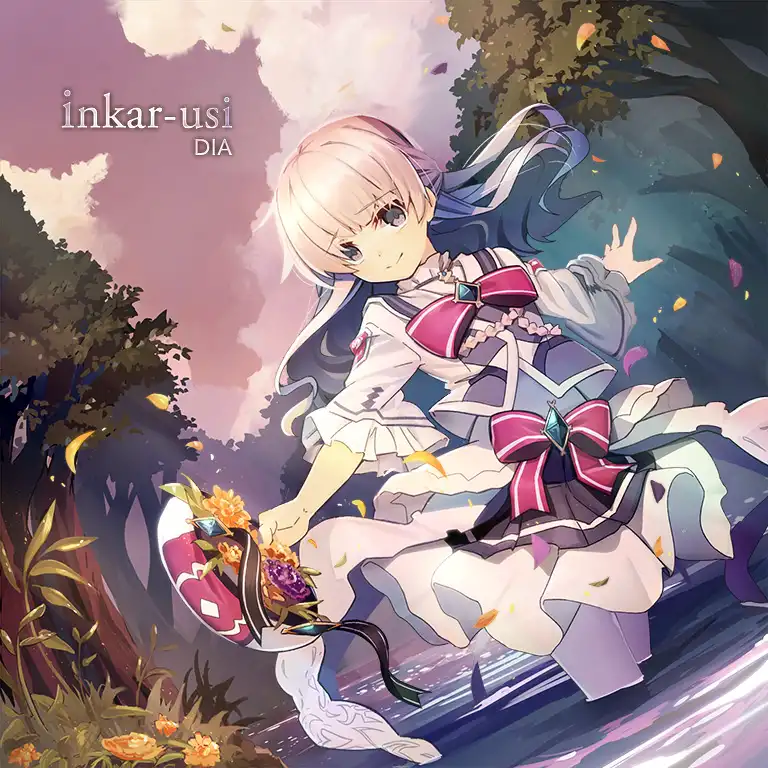 | BYD | [inkar-usi](<../pack/01_Arcaea Pack/inkar-usi.md>) | Arcaea Pack 1.6.6(18/06/22) |
| 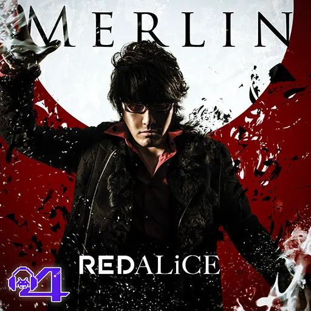 | BYD | [MERLIN](<../pack/12_Groove Coaster Collaboration Pack/MERLIN.md>) | Groove Coaster Collaboration Pack 1.9.0(19/01/09) |
| 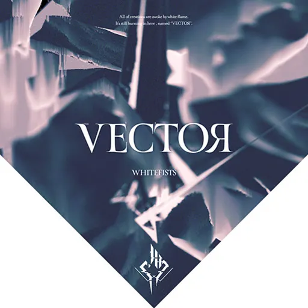 | FTR | [VECTOЯ](<../pack/01_Arcaea Pack/VECTOЯ.md>) | Arcaea Pack 2.0.3(19/05/02) |
| 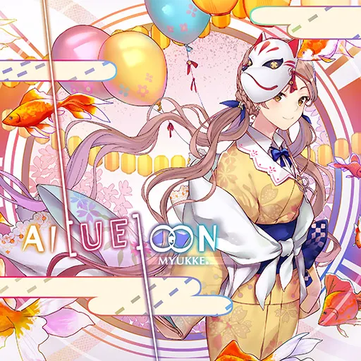 | FTR | [AI\[UE\]OON](<../pack/16_Sunset Radiance Pack/AI_UE_OON.md>) | Sunset Radiance Pack 2.3.0(19/08/22) |
| 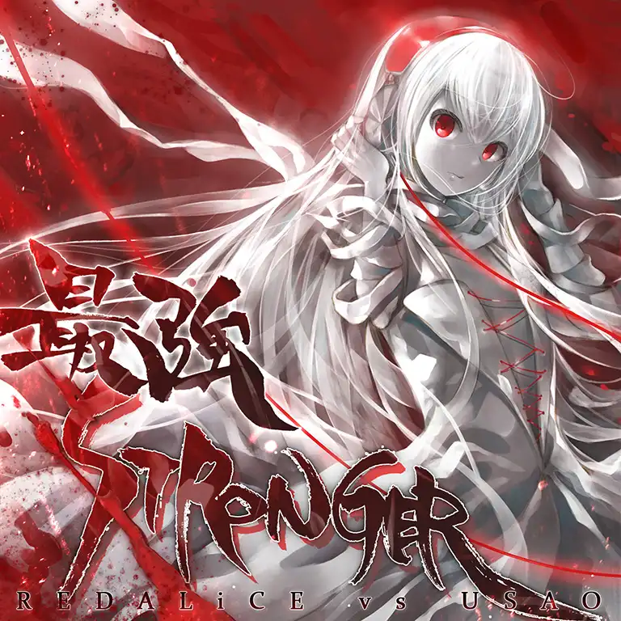 | PRS | [最強STRONGER](<../pack/04_Memory Archive/最強STRONGER.md>) | Memory Archive 2.5.0(20/01/21) |
| 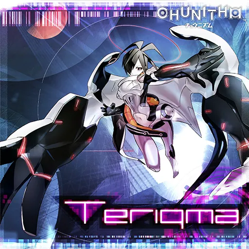 | FTR | [Teriqma](<../pack/04_Memory Archive/Teriqma.md>) | Memory Archive 3.0.5(20/07/16) |
| 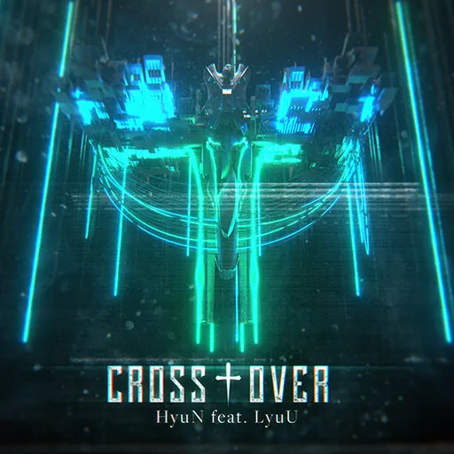 | FTR | [CROSS†OVER](<../pack/17_Extend Archive 1－ Visions Pack/CROSS†OVER.md>) | Extend Archive 1－ Visions Pack 3.2.1(20/10/07) |
| 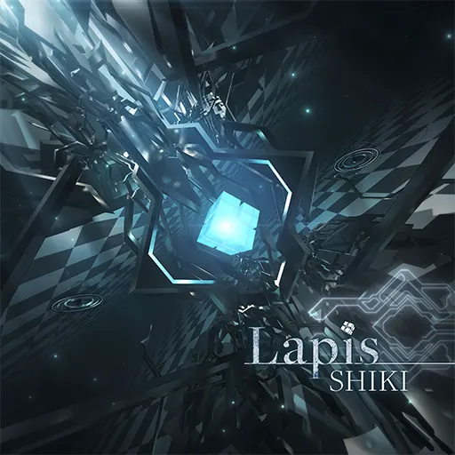 | FTR | [Lapis](<../pack/17_Extend Archive 1－ Visions Pack/Lapis.md>) | Extend Archive 1－ Visions Pack 3.2.2(20/10/30) |
|  | FTR | [Crystal Gravity](<../pack/22_Esoteric Order Pack/Crystal Gravity.md>) | Esoteric Order Pack 3.6.0(21/05/11) |
|  | FTR | [Let you DIVE! (nitro rmx)](<../pack/23_WACCA Collaboration Pack/Let you DIVE! (nitro rmx).md>) | WACCA Collaboration Pack 3.8.0(21/08/10) |
|  | FTR | [with U](<../pack/23_WACCA Collaboration Pack/with U.md>) | WACCA Collaboration Pack 3.8.0(21/08/10) |
|  | FTR | [lastendconductor](<../pack/04_Memory Archive/lastendconductor.md>) | Memory Archive 3.8.6(21/09/29) |
|  | FTR | [Final Step!](<../pack/25_Muse Dash Collaboration Pack/Final Step!.md>) | Muse Dash Collaboration Pack 3.11.0(21/12/24) |
|  | FTR | [Sakura Fubuki](<../pack/01_Arcaea Pack/Sakura Fubuki.md>) | Arcaea Pack 3.12.0(22/02/17) |
|  | FTR | [Head BONK ache](<../pack/04_Memory Archive/Head BONK ache.md>) | Memory Archive 3.12.4(22/03/23) |
| 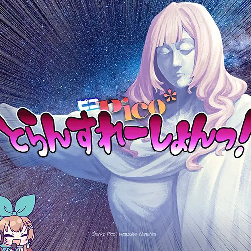 | FTR | [ピコPico*とらんすれーしょんっ！](<../pack/04_Memory Archive/ピコPico－とらんすれーしょんっ！.md>) | Memory Archive 3.12.8(22/04/28) |
| 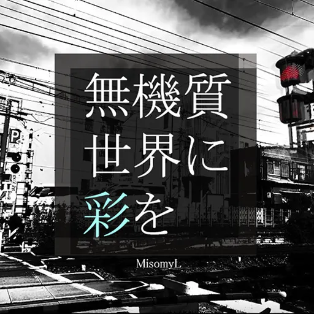 | FTR | [無機質世界に彩を](<../pack/01_Arcaea Pack/無機質世界に彩を.md>) | Arcaea Pack 4.0.0(22/07/07) |
|  | PRS | [Testify](<../pack/26_Final Verdict Pack/Testify.md>) | Final Verdict Pack 4.0.0(22/07/07) |
|  | FTR | [MANTIS(Arcaea Ultra-Bloodrush VIP)](<../pack/27_Extend Archive 2－ Chronicles Pack/MANTIS (Arcaea Ultra-Bloodrush VIP).md>) | Extend Archive 2－ Chronicles Pack 4.2.0(23/01/26) |
| 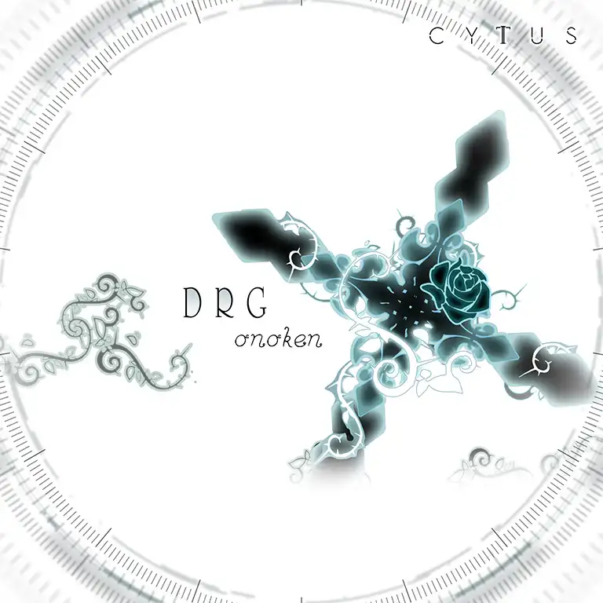 | FTR | [DRG](<../pack/28_Cytus II Collaboration Pack/DRG.md>) | Cytus II Collaboration Pack 4.6.0(23/07/19) |
| 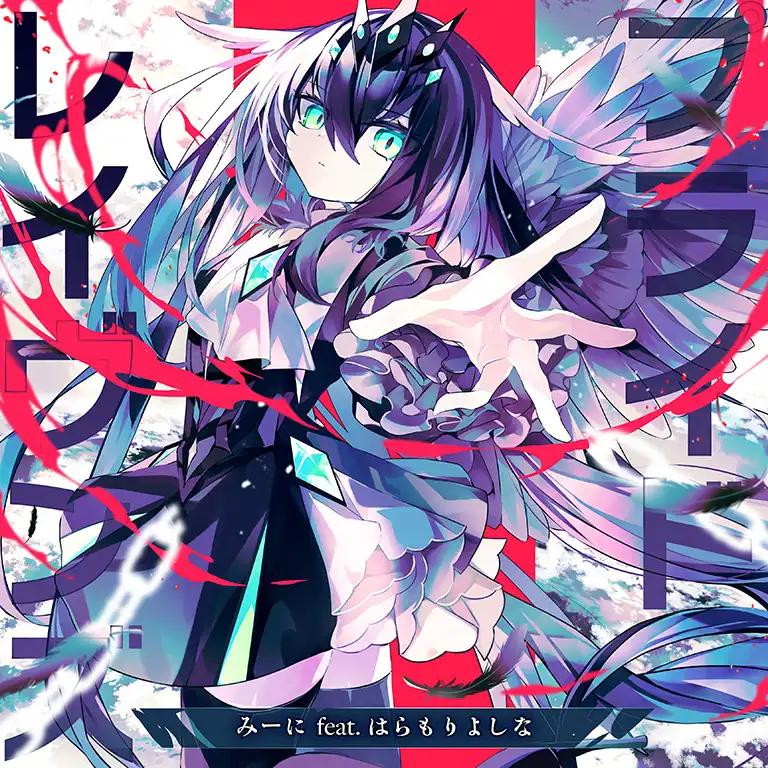 | FTR | [レイヴンズ・プライド](<../pack/29_Lasting Eden Pack/レイヴンズ・プライド.md>) | Lasting Eden Pack 4.7.0(23/08/18) |
| 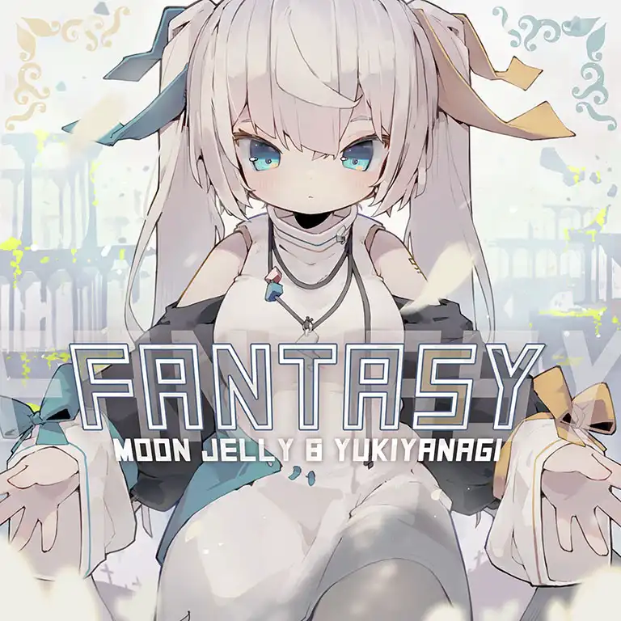 | FTR | [FANTA5Y](<../pack/27_Extend Archive 2－ Chronicles Pack/FANTA5Y.md>) | Extend Archive 2－ Chronicles Pack 5.1.0(23/10/26) |
| 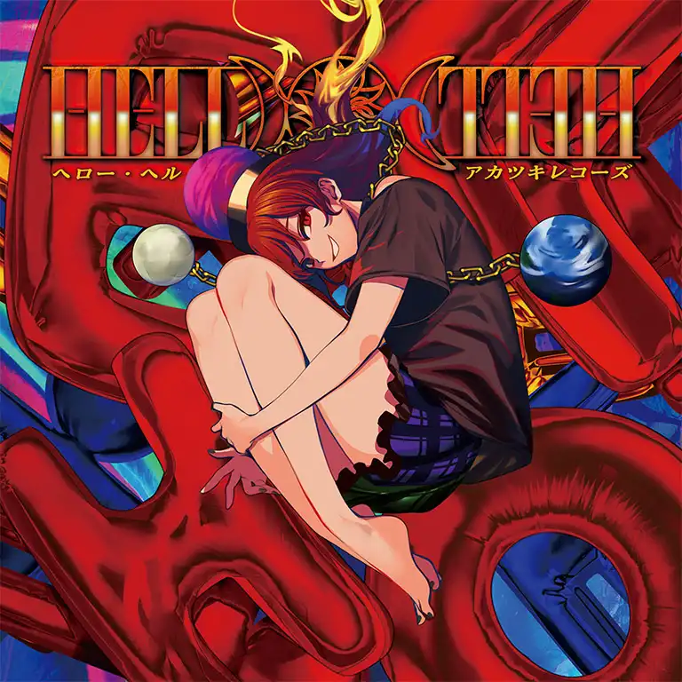 | ETR | [HELLOHELL](<../pack/30_Extend Archive 3－ Illusions Pack/HELLOHELL.md>) | Extend Archive 3－ Illusions Pack 5.5.0(24/03/25) |
| 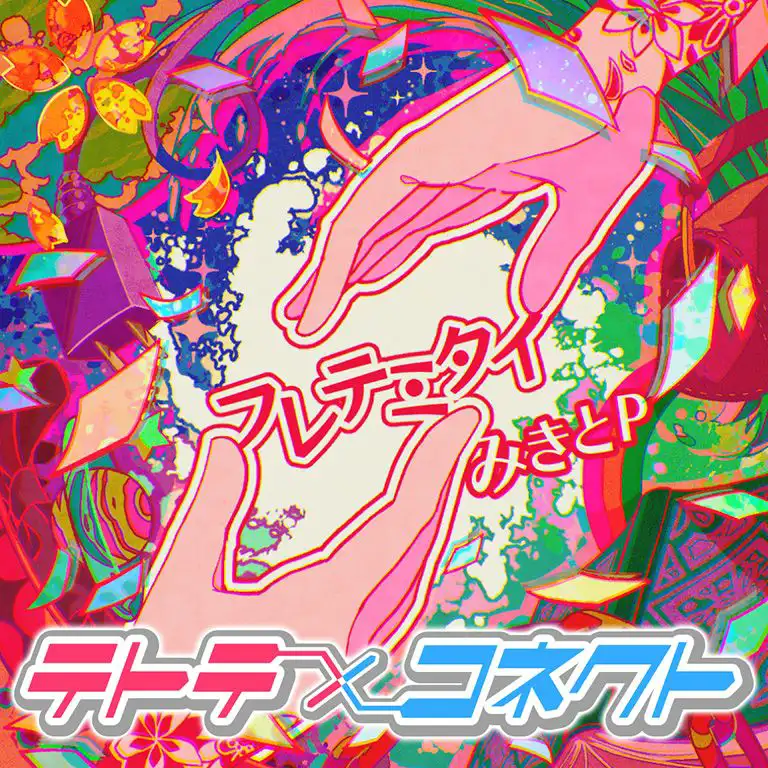 | ETR | [フレテミタイ](<../pack/30_Extend Archive 3－ Illusions Pack/フレテミタイ.md>) | Extend Archive 3－ Illusions Pack 5.10.4(24/09/26) |
|  | FTR | [Third Sun](<../pack/04_Memory Archive/Third Sun.md>) | Memory Archive 5.10.6(24/10/24) |
| 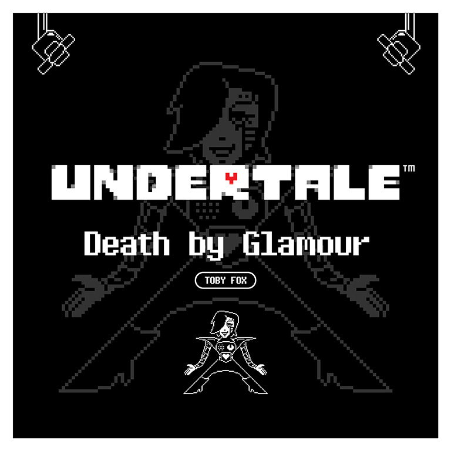 | ETR | [華麗なる死闘](<../pack/34_UNDERTALE Collaboration Pack/華麗なる死闘.md>) | UNDERTALE Collaboration Pack 6.3.0(25/03/09) |
|  | FTR | [Don't Die](<../pack/04_Memory Archive/Don't Die.md>) | Memory Archive 6.5.0(25/05/22) |
|  | ETR | [I want You](<../pack/35_DJMAX Collaboration Pack/I want You.md>) | DJMAX Collaboration Pack 6.6.0(25/06/26) |
|  | FTR | [BlythE](<../pack/35_DJMAX Collaboration Pack/BlythE.md>) | DJMAX Collaboration Pack 6.6.0(25/06/26) |
| 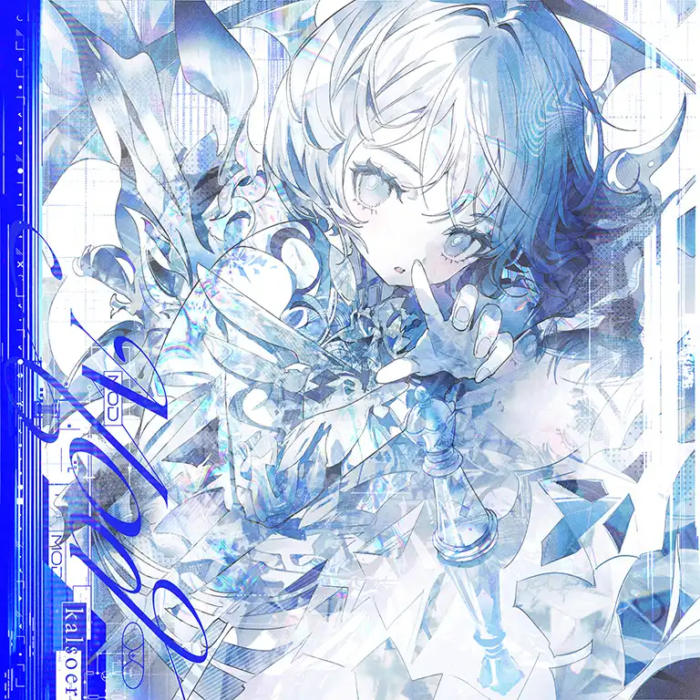 | FTR | [mod](<../pack/38_World Extend 4－ Emanations Pack/mod.md>) | World Extend 4－ Emanations Pack 6.10.0(25/10/30) |
|  | FTR | [ΛZΛLEΛ](<../pack/39_Arcaea Next Stage Pack/ΛZΛLEΛ.md>) | Arcaea Next Stage Pack 6.10.8(25/11/22) |
| 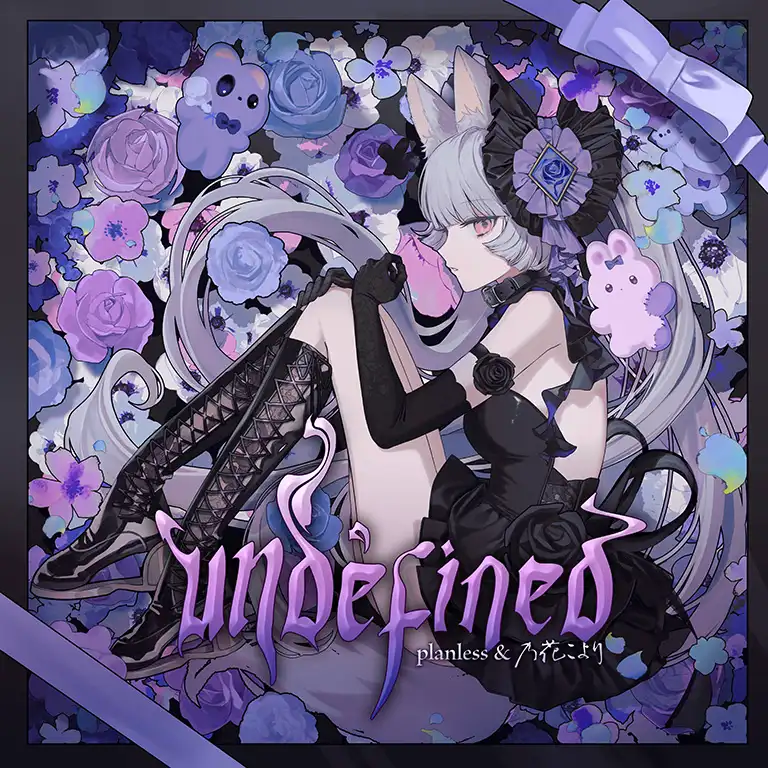 | FTR | [undefined](<../pack/38_World Extend 4－ Emanations Pack/undefined.md>) | World Extend 4－ Emanations Pack 6.11.2(25/12/24) |
| 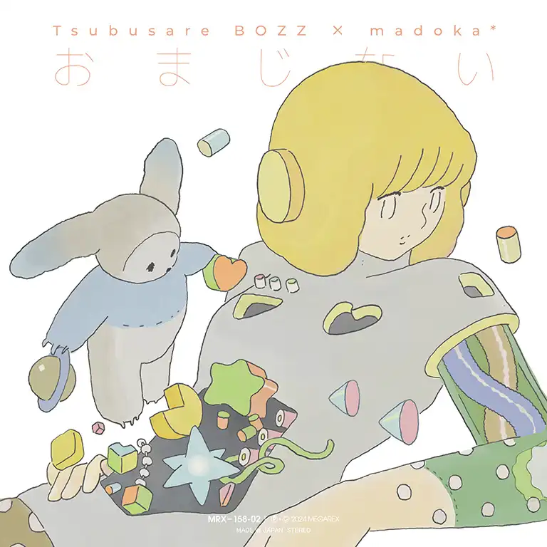 | FTR | [おまじない](<../pack/38_World Extend 4－ Emanations Pack/おまじない.md>) | World Extend 4－ Emanations Pack 6.12.0(26/01/29) |

## 9.5

| ジャケット | 難易 | 曲 | パック・初出 |
| :---: | :--- | :--- | :--- |
| 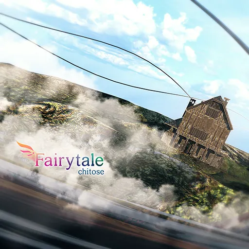 | BYD | [Fairytale](<../pack/01_Arcaea Pack/Fairytale.md>) | Arcaea Pack 1.0.5(17/03/09) |
| 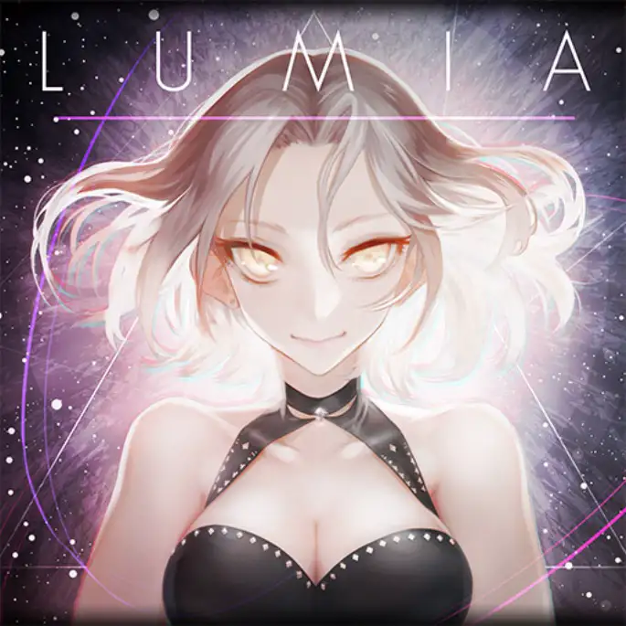 | BYD | [Lumia](<../pack/02_Eternal Core Pack/Lumia.md>) | Eternal Core Pack 1.0.5(17/03/09) |
| 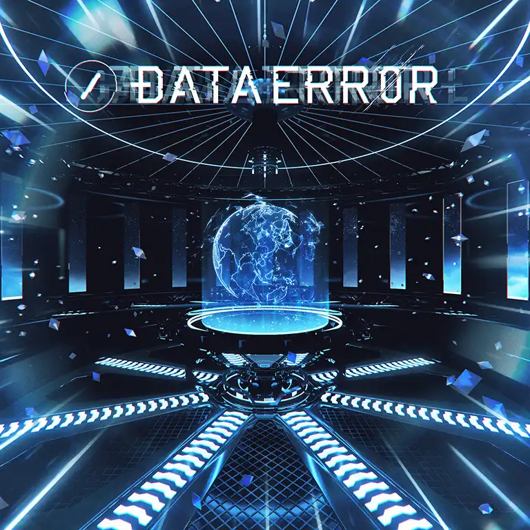 | FTR | [DataErr0r](<../pack/04_Memory Archive/DataErr0r.md>) | Memory Archive 1.1.0(17/06/02) |
|  | FTR | [Cybernecia Catharsis](<../pack/01_Arcaea Pack/Cybernecia Catharsis.md>) | Arcaea Pack 1.6.4(18/06/01) |
| 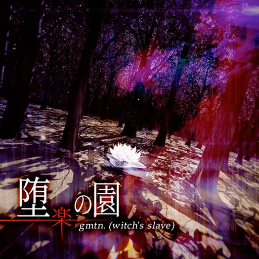 | FTR | [堕楽の園](<../pack/01_Arcaea Pack/堕楽の園.md>) | Arcaea Pack 1.7.0(18/07/16) |
|  | PRS | [Fracture Ray](<../pack/10_Luminous Sky Pack/Fracture Ray.md>) | Luminous Sky Pack 1.7.0(18/07/16) |
|  | PRS | [dropdead](<../pack/04_Memory Archive/dropdead.md>) | Memory Archive 1.7.2(18/08/13) |
|  | FTR | [STAGER (ALL STAGE CLEAR)](<../pack/11_Tone Sphere Collaboration Pack/STAGER (ALL STAGE CLEAR).md>) | Tone Sphere Collaboration Pack 1.8.0(18/10/07) |
|  | FTR | [OMAKENO Stroke](<../pack/12_Groove Coaster Collaboration Pack/OMAKENO Stroke.md>) | Groove Coaster Collaboration Pack 1.9.0(19/01/09) |
| 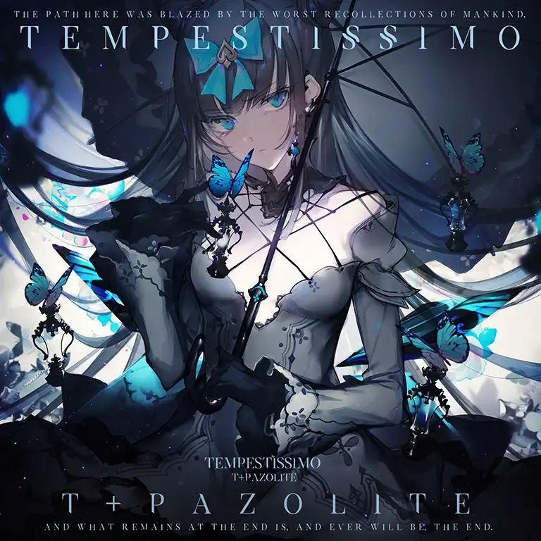 | PRS | [Tempestissimo](<../pack/18_Black Fate Pack/Tempestissimo.md>) | Black Fate Pack 3.0.0(20/05/27) |
| 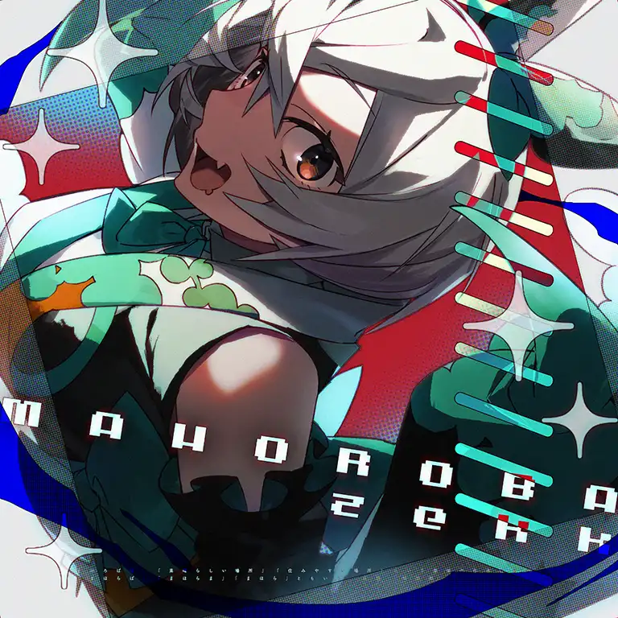 | FTR | [MAHOROBA](<../pack/04_Memory Archive/MAHOROBA.md>) | Memory Archive 3.0.6(20/08/07) |
| 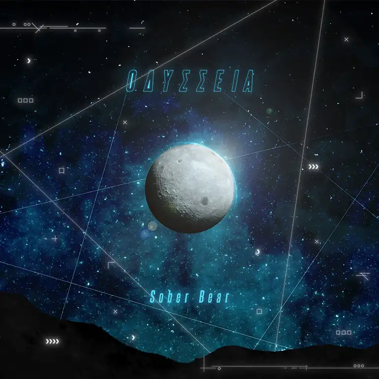 | FTR | [ΟΔΥΣΣΕΙΑ](<../pack/22_Esoteric Order Pack/ΟΔΥΣΣΕΙΑ.md>) | Esoteric Order Pack 3.6.0(21/05/11) |
| 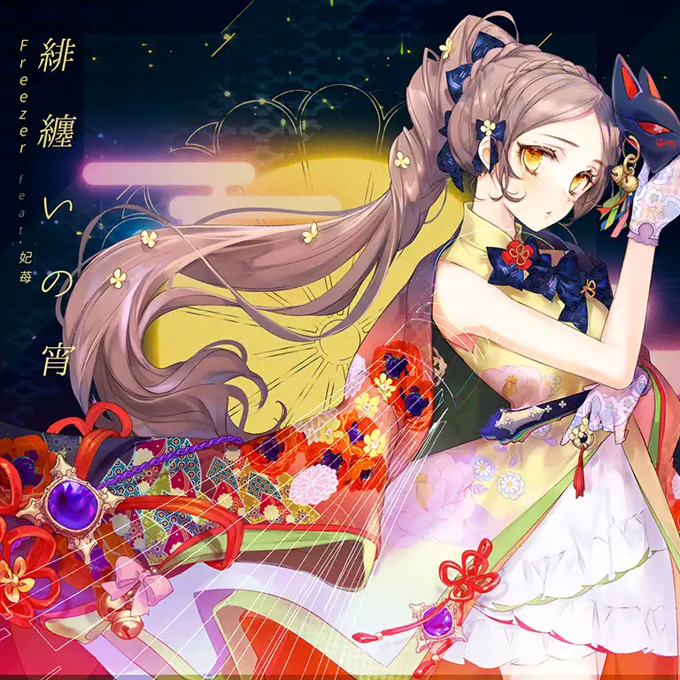 | FTR | [緋纏いの宵](<../pack/04_Memory Archive/緋纏いの宵.md>) | Memory Archive 3.8.2(21/08/24) |
| 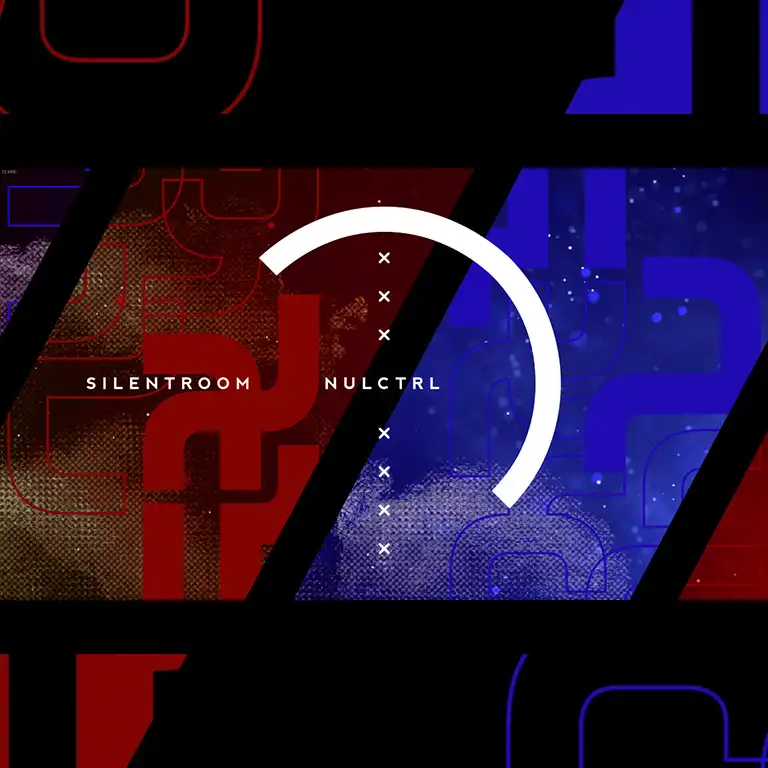 | FTR | [NULCTRL](<../pack/01_Arcaea Pack/NULCTRL.md>) | Arcaea Pack 3.12.0(22/02/17) |
| 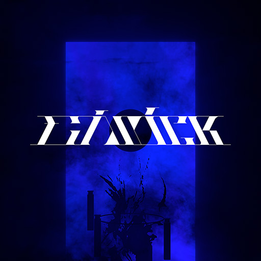 | FTR | [GIMMICK](<../pack/27_Extend Archive 2－ Chronicles Pack/GIMMICK.md>) | Extend Archive 2－ Chronicles Pack 4.4.4(23/04/27) |
| 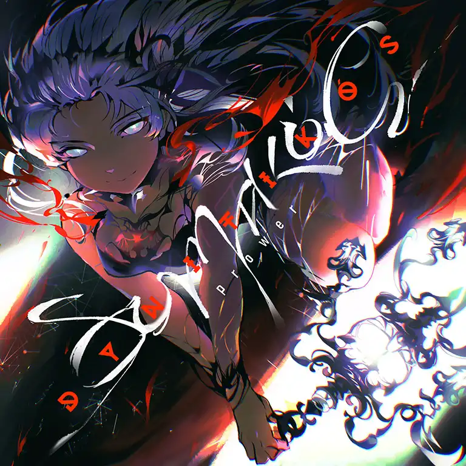 | FTR | [Dynitikós](<../pack/27_Extend Archive 2－ Chronicles Pack/Dynitikós.md>) | Extend Archive 2－ Chronicles Pack 5.0.0(23/09/27) |
|  | FTR | [Transient Space](<../pack/29_Lasting Eden Pack/Transient Space.md>) | Lasting Eden Pack 5.1.0(23/10/26) |
|  | FTR | [felys final remix](<../pack/27_Extend Archive 2－ Chronicles Pack/felys final remix.md>) | Extend Archive 2－ Chronicles Pack 5.2.2(23/12/21) |
|  | FTR | [On And On!! feat. Jenga](<../pack/27_Extend Archive 2－ Chronicles Pack/On And On!! feat. Jenga.md>) | Extend Archive 2－ Chronicles Pack 5.2.2(23/12/21) |
| 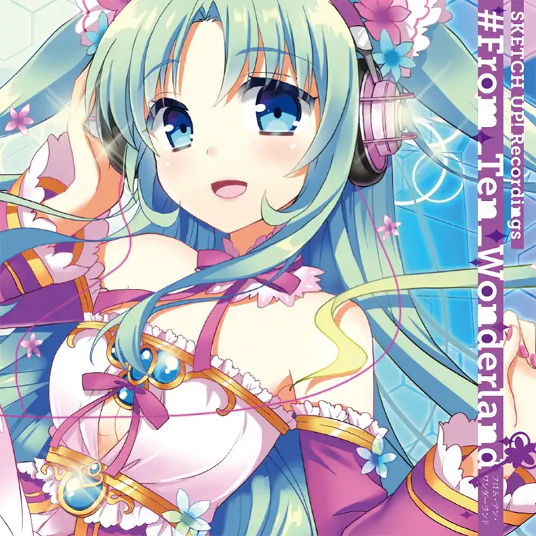 | ETR | [Jingle](<../pack/01_Arcaea Pack/Jingle.md>) | Arcaea Pack 5.4.0(24/03/08) |
| 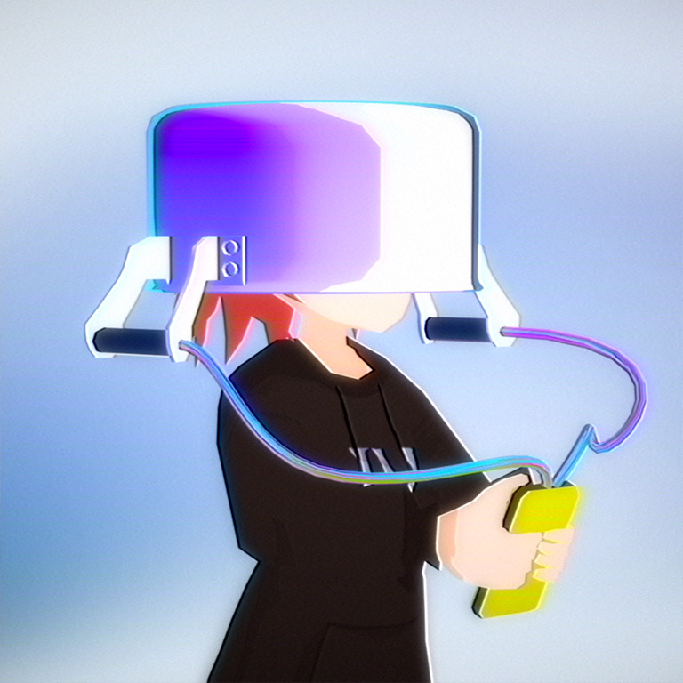 | FTR | [〇、](<../pack/30_Extend Archive 3－ Illusions Pack/〇、.md>) | Extend Archive 3－ Illusions Pack 5.5.0(24/03/25) |
|  | FTR | [黄昏の協奏曲](<../pack/04_Memory Archive/黄昏の協奏曲.md>) | Memory Archive 5.7.0(24/05/30) |
|  | FTR | [In Vain](<../pack/31_Absolute Nihil Pack/In Vain.md>) | Absolute Nihil Pack 5.9.0(24/07/30) |
|  | FTR | [Inverted World](<../pack/32_Rotaeno Collaboration Pack/Inverted World.md>) | Rotaeno Collaboration Pack 5.10.0(24/08/29) |
|  | FTR | [Rain of Conflict in aRadiant Abyss](<../pack/04_Memory Archive/Rain of Conflict in a Radiant Abyss.md>) | Memory Archive 5.10.2(24/09/12) |
|  | FTR | [Dies irae](<../pack/04_Memory Archive/Dies irae.md>) | Memory Archive 5.10.6(24/10/24) |
| 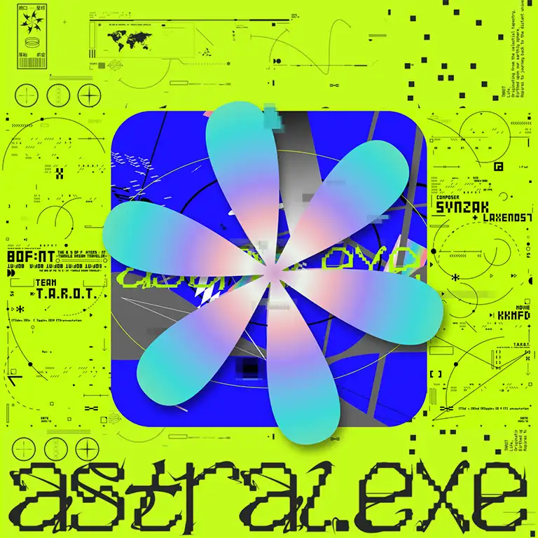 | FTR | [astral.exe](<../pack/30_Extend Archive 3－ Illusions Pack/astral.exe.md>) | Extend Archive 3－ Illusions Pack 6.0.0(24/11/21) |
|  | FTR | [8-EM](<../pack/14_CHUNITHM Collaboration Pack/8-EM.md>) | CHUNITHM Collaboration Pack 6.1.0(24/12/19) |
|  | FTR | [Straight into the lights](<../pack/21_maimai Collaboration Pack/Straight into the lights.md>) | maimai Collaboration Pack 6.2.0(25/01/23) |
|  | FTR | [MEGALOVANIA](<../pack/34_UNDERTALE Collaboration Pack/MEGALOVANIA.md>) | UNDERTALE Collaboration Pack 6.3.0(25/03/09) |
|  | FTR | [OBLIVION](<../pack/35_DJMAX Collaboration Pack/OBLIVION.md>) | DJMAX Collaboration Pack 6.5.0(25/05/22) |
| 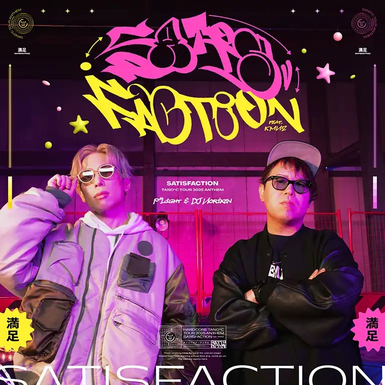 | ETR | [SATISFACTION](<../pack/01_Arcaea Pack/SATISFACTION.md>) | Arcaea Pack 6.6.0(25/06/26) |
|  | FTR | [Someday](<../pack/30_Extend Archive 3－ Illusions Pack/Someday.md>) | Extend Archive 3－ Illusions Pack 6.6.0(25/06/26) |
|  | FTR | [Dual Dependency](<../pack/36_Extant Anima Pack/Dual Dependency.md>) | Extant Anima Pack 6.7.0(25/07/24) |
|  | FTR | [Viola Illyria](<../pack/37_Liminal Eclipse Pack/Viola Illyria.md>) | Liminal Eclipse Pack 6.9.0(25/10/02) |
| 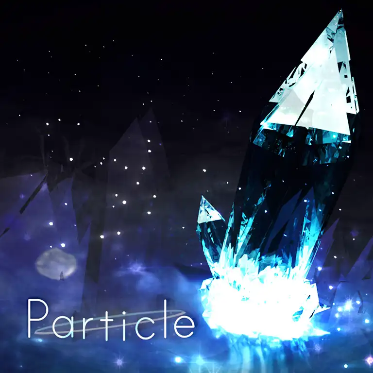 | FTR | [Particle](<../pack/38_World Extend 4－ Emanations Pack/Particle.md>) | World Extend 4－ Emanations Pack 6.10.0(25/10/30) |
| 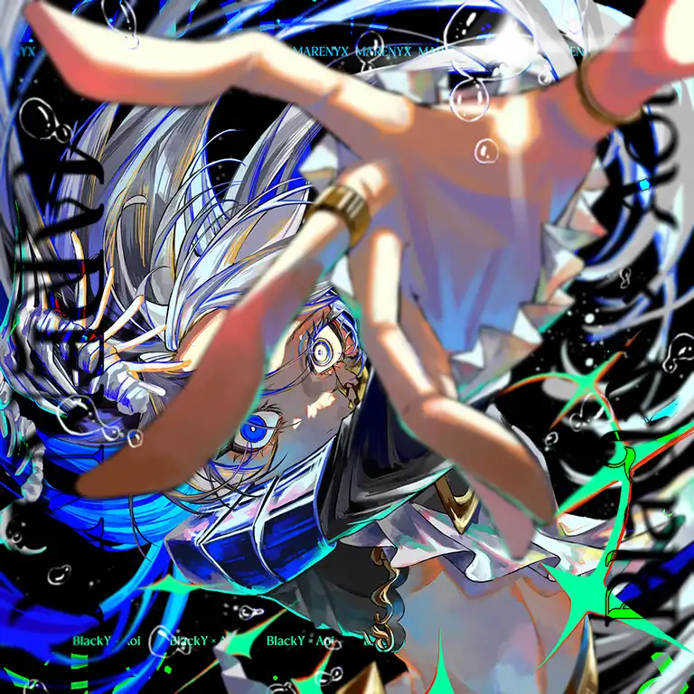 | FTR | [MARENYX](<../pack/39_Arcaea Next Stage Pack/MARENYX.md>) | Arcaea Next Stage Pack 6.10.8(25/11/22) |
|  | FTR | [zephyrlasting](<../pack/39_Arcaea Next Stage Pack/zephyrlasting.md>) | Arcaea Next Stage Pack 6.10.8(25/11/22) |
|  | FTR | [［筏］は云う。幾ら漂流すれど不撓の心さえ有れば軈て行到ると。](<../pack/04_Memory Archive/［筏］は云う。幾ら漂流すれど不撓の心さえ有れば軈て行到ると。.md>) | Memory Archive 6.11.6(26/01/07) |
|  | FTR | [One Step Closer](<../pack/40_MEGAREX Collaboration Pack/One Step Closer.md>) | MEGAREX Collaboration Pack 6.12.0(26/01/29) |

## 9.6

| ジャケット | 難易 | 曲 | パック・初出 |
| :---: | :--- | :--- | :--- |
|  | BYD | [Infinity Heaven](<../pack/01_Arcaea Pack/Infinity Heaven.md>) | Arcaea Pack 1.0.10(17/04/12) |
| 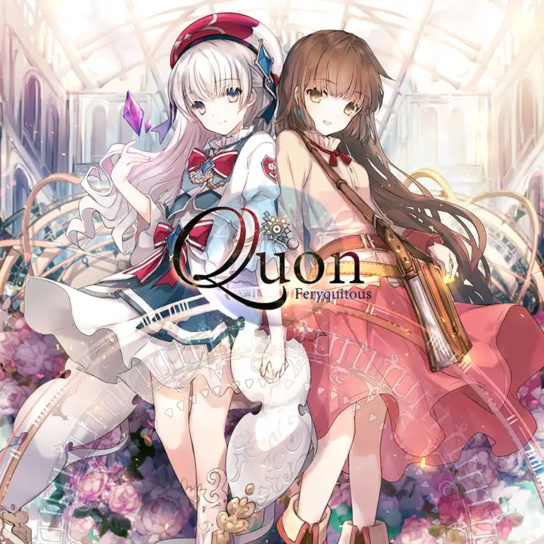 | FTR | [Quon](<../pack/08_Lanota Collaboration Pack/Quon.md>) | Lanota Collaboration Pack 1.5.5(18/02/01) |
|  | BYD | [next to you](<../pack/09_Binary Enfold Pack/next to you.md>) | Binary Enfold Pack 1.6.0(18/03/23) |
| 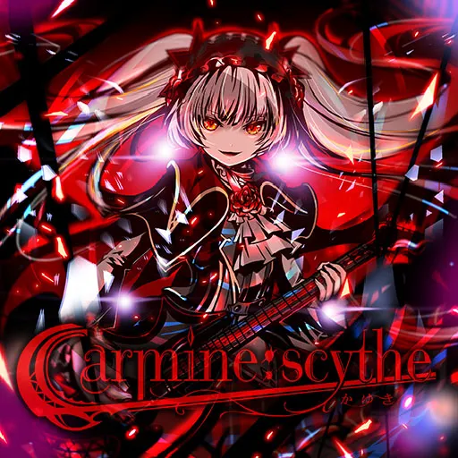 | FTR | [carmine:scythe](<../pack/04_Memory Archive/carmine_scythe.md>) | Memory Archive 1.6.2(18/04/29) |
| 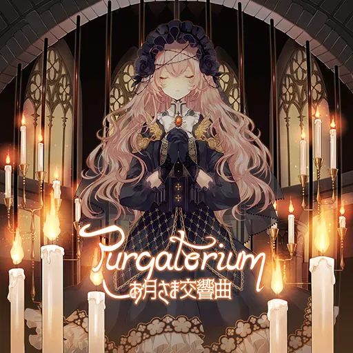 | BYD | [Purgatorium](<../pack/01_Arcaea Pack/Purgatorium.md>) | Arcaea Pack 1.7.5(18/09/17) |
|  | FTR | [Astral tale](<../pack/04_Memory Archive/Astral tale.md>) | Memory Archive 1.8.1(18/11/08) |
| 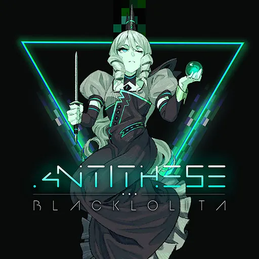 | BYD | [Antithese](<../pack/13_Absolute Reason Pack/Antithese.md>) | Absolute Reason Pack 2.0.0(19/03/21) |
| 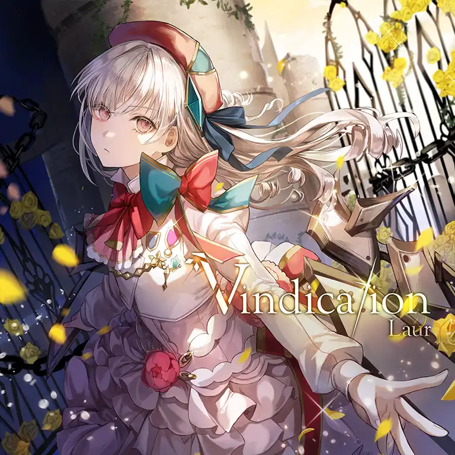 | FTR | [Vindication](<../pack/15_Adverse Prelude Pack/Vindication.md>) | Adverse Prelude Pack 2.2.0(19/07/18) |
| 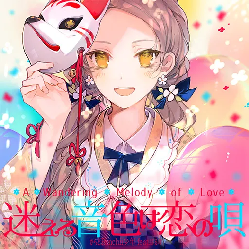 | FTR | [迷える音色は恋の唄](<../pack/16_Sunset Radiance Pack/迷える音色は恋の唄.md>) | Sunset Radiance Pack 2.3.0(19/08/22) |
|  | FTR | [Avant Raze](<../pack/04_Memory Archive/Avant Raze.md>) | Memory Archive 2.4.7(19/12/09) |
|  | FTR | [Purple Verse](<../pack/17_Extend Archive 1－ Visions Pack/Purple Verse.md>) | Extend Archive 1－ Visions Pack 3.3.0(20/12/03) |
|  | FTR | [Lazy Addiction](<../pack/20_O.N.G.E.K.I. Collaboration Pack/Lazy Addiction.md>) | O.N.G.E.K.I. Collaboration Pack 3.4.0(20/12/17) |
|  | FTR | [ENERGY SYNERGY MATRIX](<../pack/17_Extend Archive 1－ Visions Pack/ENERGY SYNERGY MATRIX.md>) | Extend Archive 1－ Visions Pack 3.8.4(21/09/08) |
| 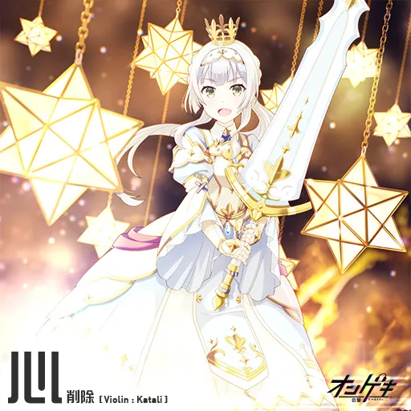 | FTR | [心](<../pack/20_O.N.G.E.K.I. Collaboration Pack/心.md>) | O.N.G.E.K.I. Collaboration Pack 4.1.0(22/10/04) |
|  | FTR | [IMPACT](<../pack/14_CHUNITHM Collaboration Pack/IMPACT.md>) | CHUNITHM Collaboration Pack 4.4.0(23/03/23) |
|  | FTR | [Remind the Souls (Short Version)](<../pack/01_Arcaea Pack/Remind the Souls (Short Version).md>) | Arcaea Pack 5.0.0(23/09/27) |
| 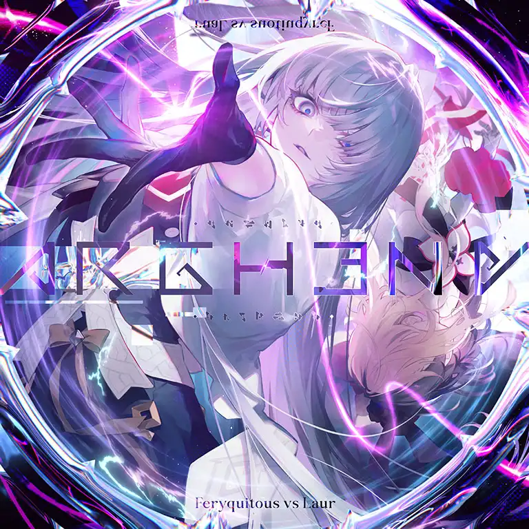 | PRS | [Arghena](<../pack/29_Lasting Eden Pack/Arghena.md>) | Lasting Eden Pack 5.0.0(23/09/27) |
| 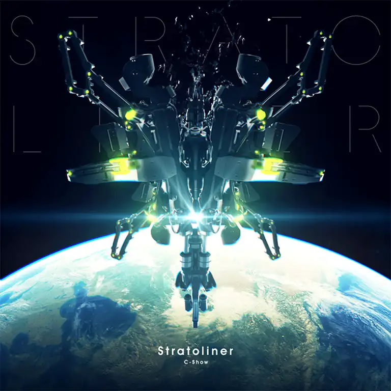 | FTR | [Stratoliner](<../pack/23_WACCA Collaboration Pack/Stratoliner.md>) | WACCA Collaboration Pack 5.2.0(23/11/30) |
| 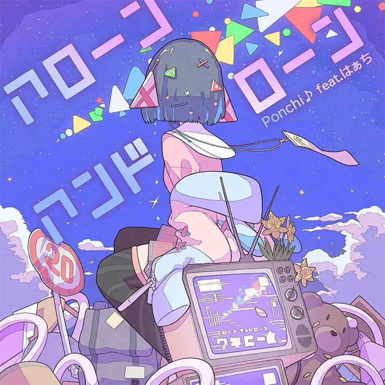 | FTR | [アローンアンドローン](<../pack/27_Extend Archive 2－ Chronicles Pack/アローンアンドローン.md>) | Extend Archive 2－ Chronicles Pack 5.2.0(23/11/30) |
|  | FTR | [Distorted Fate](<../pack/04_Memory Archive/Distorted Fate.md>) | Memory Archive 5.6.0(24/04/26) |
| 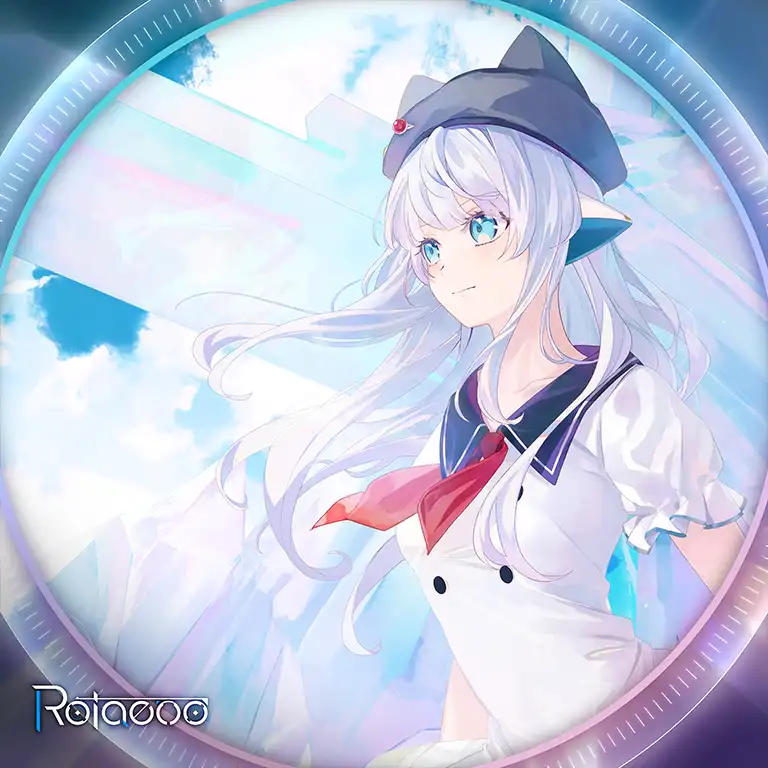 | ETR | [epitaxy](<../pack/30_Extend Archive 3－ Illusions Pack/epitaxy.md>) | Extend Archive 3－ Illusions Pack 5.10.0(24/08/29) |
|  | FTR | [Renegade](<../pack/33_Lucent Historia Pack/Renegade.md>) | Lucent Historia Pack 6.0.0(24/11/21) |
|  | PRS | [Designant.](<../pack/33_Lucent Historia Pack/Designant.md>) | Lucent Historia Pack 6.0.0(24/11/21) |
|  | ETR | [See the Lights!](<../pack/36_Extant Anima Pack/See the Lights!.md>) | Extant Anima Pack 6.7.0(25/07/24) |
| 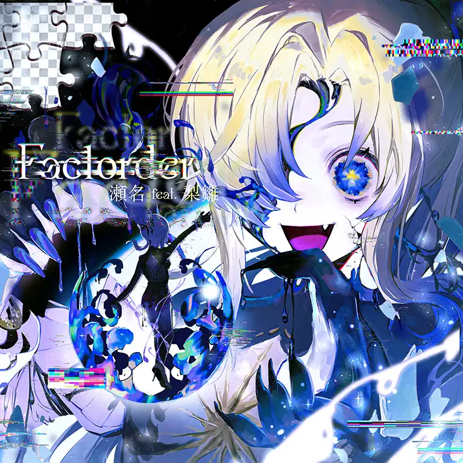 | ETR | [Factorder](<../pack/36_Extant Anima Pack/Factorder.md>) | Extant Anima Pack 6.8.0(25/08/21) |
|  | FTR | [CHAOSBLAST](<../pack/36_Extant Anima Pack/CHAOSBLAST.md>) | Extant Anima Pack 6.8.0(25/08/21) |
|  | FTR | [Eternity Break](<../pack/04_Memory Archive/Eternity Break.md>) | Memory Archive 6.8.4(25/09/24) |
|  | FTR | [Paranoid Arc](<../pack/04_Memory Archive/Paranoid Arc.md>) | Memory Archive 6.11.2(25/12/24) |
|  | FTR | [羽化する亜球体](<../pack/04_Memory Archive/羽化する亜球体.md>) | Memory Archive 6.11.6(25/12/31) |
|  | FTR | [メルティーラプソディー](<../pack/40_MEGAREX Collaboration Pack/メルティーラプソディー.md>) | MEGAREX Collaboration Pack 6.12.0(26/01/29) |

